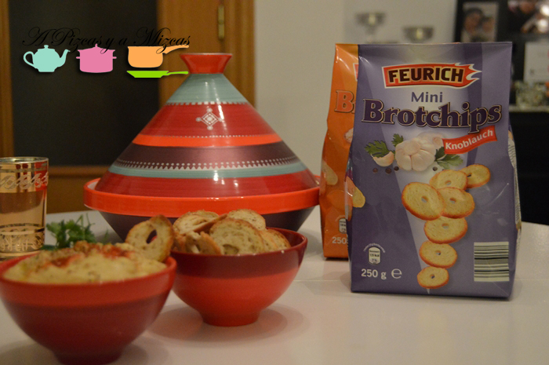
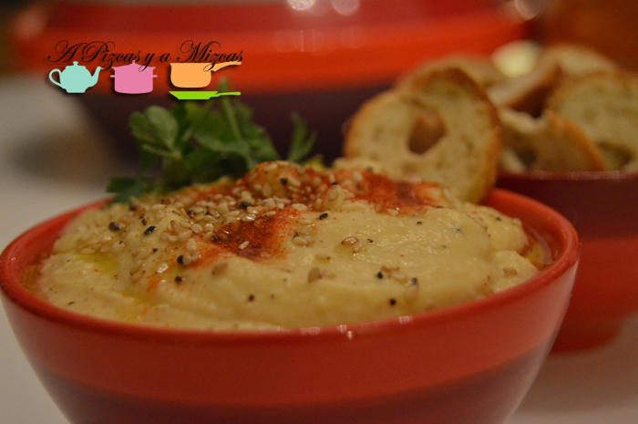
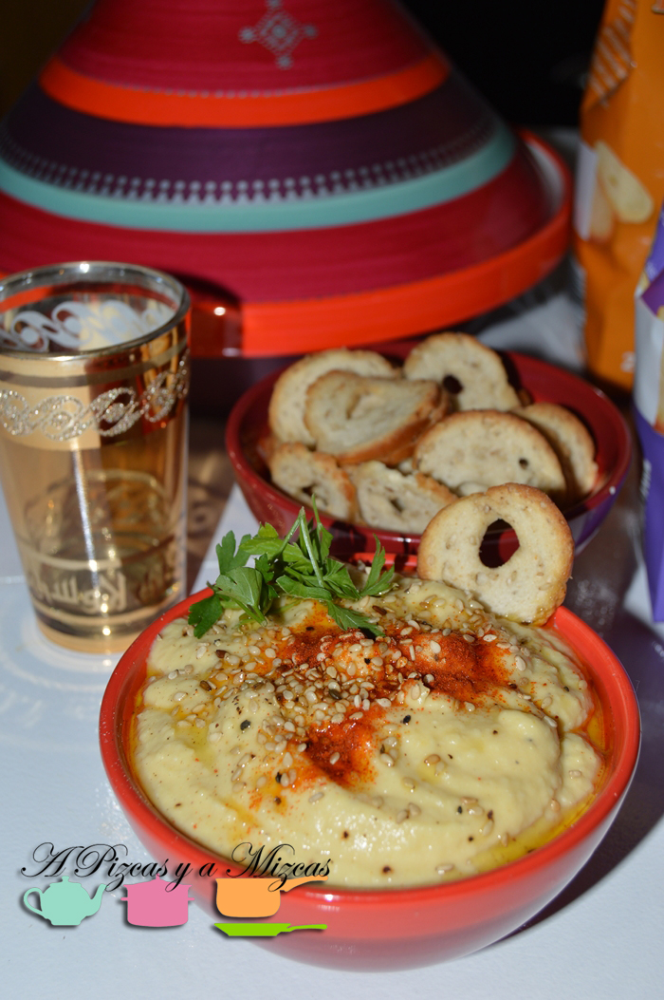

Nuestro primer contacto con el hummus fue ya hace unos cuantos años en un local de Castellón, que lo servían acompañado de unos panecillos ligeramente salados con un agujerito en medio. Desde entonces los hemos buscado pero no los encontrábamos en ningún sitio. El otro día dando una vuelta por el [Aldi](http://www.aldi.es/ "Aldi") las encontramos las galletitas para el hummus y las compramos para probarlas. Tenían tres variedades: con sésamo, con ajo y con cebolla. Nosotros cogimos las de sésamo y ajo.

## Galletitas para el hummus.

El mismo día que las compramos las acompañamos con [nuestra receta de hummus](/una-cena-desde-la-otra-orilla-del-mediterraneo-kebab-y-falafel-caseros/ "Receta de hummus")... y la verdad es que nos encanta la combinación.

Si os apetece probarlas podéis encontrarlas durante esta semana en los [supermercados Aldi](http://www.aldi.es/aldi_snack_crujiente_48_5_909_10257.html "Galletitas para el hummus").

