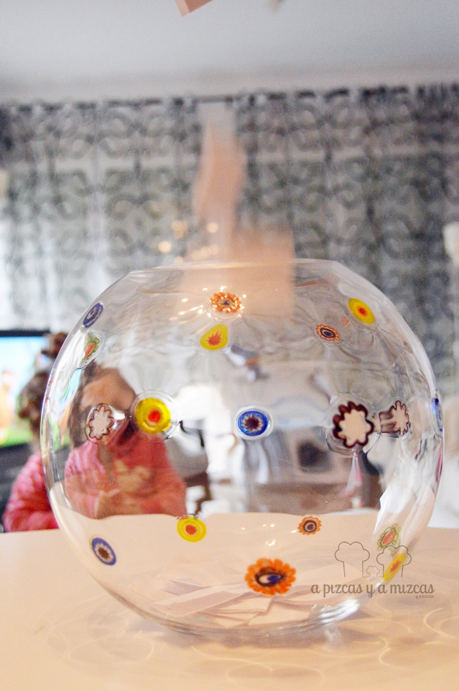
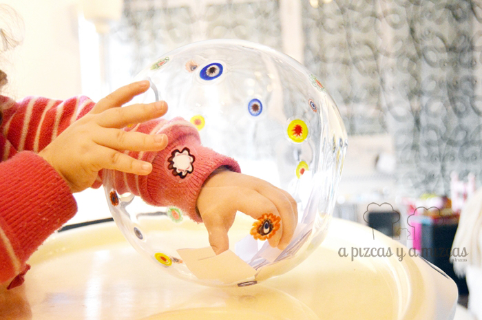
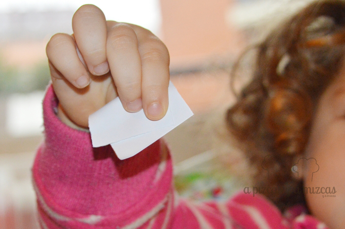
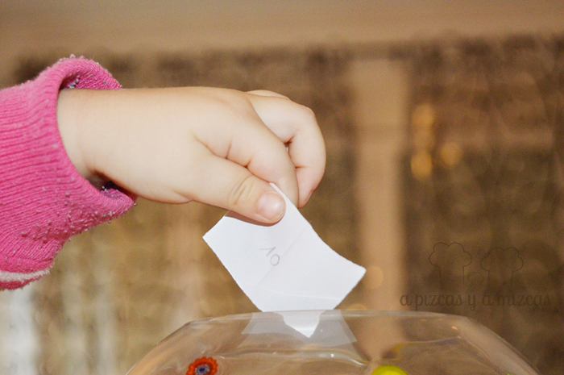

Muchas gracias a todos los participantes en el sorteo que hemos organizado con motivo de nuestro tercer cumple blog y muchas gracias a nuestros amigos de la Charcutería Casa Rodríguez, por cedernos buena parte de las cosas ricas ricas que hemos sorteado. Después de una semana con el sorteo activo hemos tenido decenas de participantes, muchos de ellos ya nos conocían y nos ha hecho mucha ilusión ver los comentarios que nos han dejado a través del formulario de participación, muchos otros nos acaban de descubrir y esperamos que sigan con nosotros en esta aventura.

Ha sido emocionante ver cómo el número de participantes crecía y crecía, pero lo mejor ha sido leer los comentarios y valoraciones que habéis hecho del nuevo pizcas. Nos encanta que nos digáis cosas, nos alegra el día y recordad que TAMBIÉN PODÉIS COMENTAR en las diferentes entradas, jeje Un comentario=una sonrisa. Vuestras opiniones nos sirven de mucho para ir mejorando el blog y hacen que el blog tenga alma.

Y ahora, sin más rollete, vamos a desvelar el nombre de la persona que se lleva el pack del sorteo, que recordad que está compuesto por:

- Un delantal para estar monísimos delante de los fogones
- Un juego de utensilios de madera customizado por nosotros mismos
- Una cuqui libreta para que os guardéis vuestras recetas favoritas
- Una chapa con el logo del #nuevopizcas
- Una chapa grande con nuestro lema: “Cocinar es mi forma de decir I love you”
- Y un lote de productos que nos ceden nuestros amigos de Charcutería Casa Rodríguez, compuesto por: una botella de cava brut nature de Castillo de Peralada, una lata de morteruelo de Cuenca, una lata de paté de perdiz, un paquete de arroz, un bote de corazones de alcachofas, una cuña de queso cheddar, salsa de higos y bayas de goji, mermelada de castañas y chocolate y mousse de pimientos.

Como ya es tradición, fue Trizcas la encargada de sacar la papeleta con el número ganador:

Fue el número 10, que se corresponde con...

\--- SILVIA GARCÍA CASTRO ---

En breve nos pondremos en contacto con ella para hacerle llegar el regalo del #nuevopizcas #tercercumpleblog.

Enhorabuena a Silvia (esperamos fotos y comentarios) y a todos los que habéis formado parte de esta semana tan interesante. Ya nos ponemos a pensar en el siguiente sorteo....

Abrazos y besos a todos.
