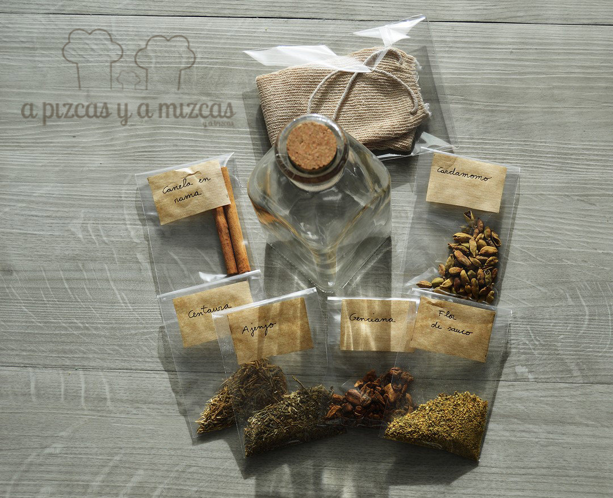
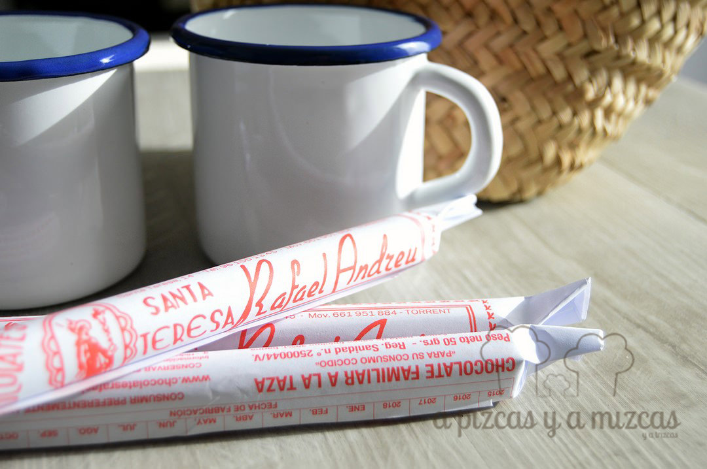
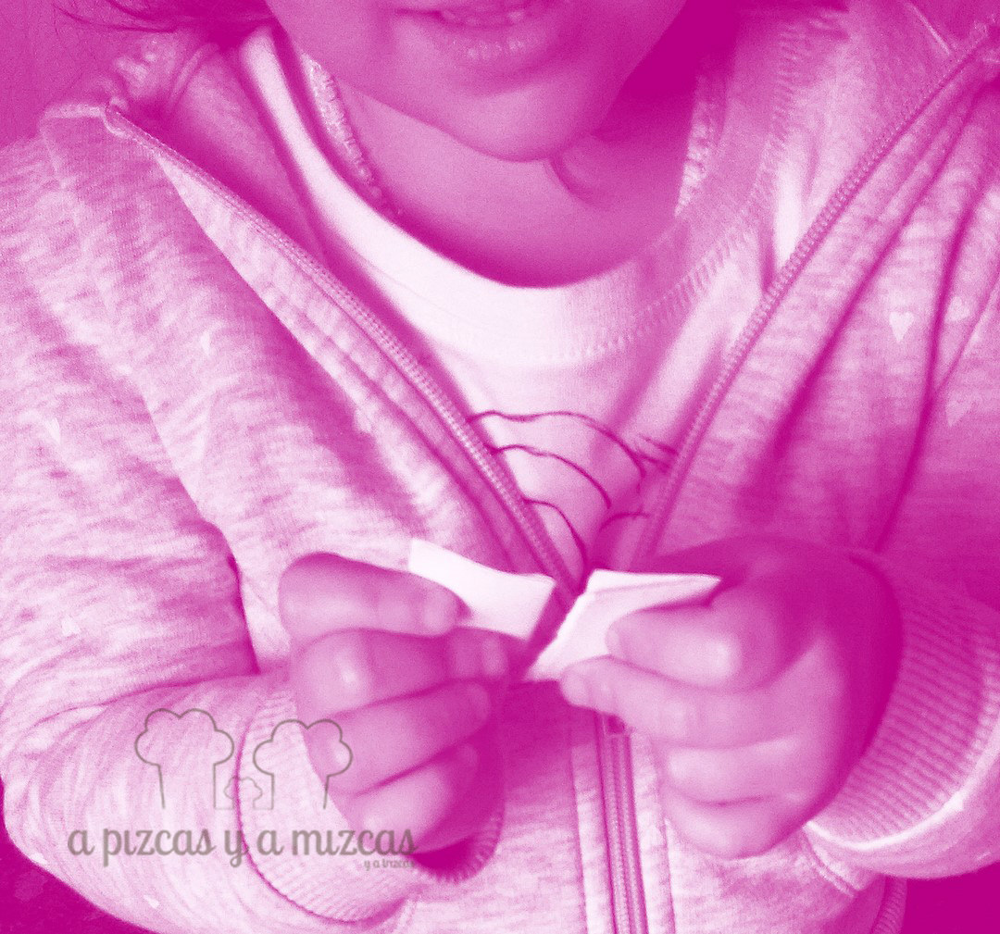

Muchas gracias a todos los que habeís participado en el sorteo cuarto cumple blog A Pizcas y a Mizcas que hemos organizado. Después de casi una semana con el sorteo activo hemos tenido muchos participantes, algunos ya nos conocían y nos ha hecho mucha ilusión ver los comentarios que nos han dejado a través del formulario de participación,  otros nos acaban de descubrir y esperamos que sigan con nosotros en esta aventura semana tras semana.

Y ahora, sin más rollete, vamos a desvelar los nombres de las personas que se llevan los packs

La **Opción Pizcas)** Un kit para hacer vermut casero (en tu propia casita y con tu propia fórmula secreta, jeje). Que incluye:

- Una frasca de vidrio para que conserves tu creación.
- Una bolsita para infusionar botánicos.
- Especias y hierbas para que tú dosifiques y crees tu fórmula.
- Nuestra receta impresa de vermut casero para que la sigas o la perfecciones

La **Opción Mizcas)**Un lote para preparar un auténtico chocolate a la taza, compuesto por:

- Tres barras de chocolate [Santa Teresa, de Rafael Andreu](http://www.chocolatesrafaelandreu.com/).
- Dos tazas de loza (como las de tu abuela).
- Un capacito para que lo puedas llevar dónde quieras.

Como ya es tradición, fue Trizcas la encargada de sacar dos papeletas con los números ganadores:

y los ganadores son...

Y los números afortunados han sido el 12 y el 27 que se corresponden con

— RAÚL AUGUSTO MARTÍNEZ — ganador de la opción Pizcas (Kit vermut)

— MAYTE MUT — ganadora de la opción Mizcas (Kit chocolate)

En breve nos pondremos en contacto con vosotros para haceros llegar los regalos del #sorteocuartocumpleblogapizcasyamizcas.

Enhorabuena a Raúl y a Mayte (esperamos fotos y comentarios) y a todos los que habéis formado parte de esta semana tan interesante. Ya nos ponemos a pensar en el siguiente sorteo….

Abrazos y besos a todos.
