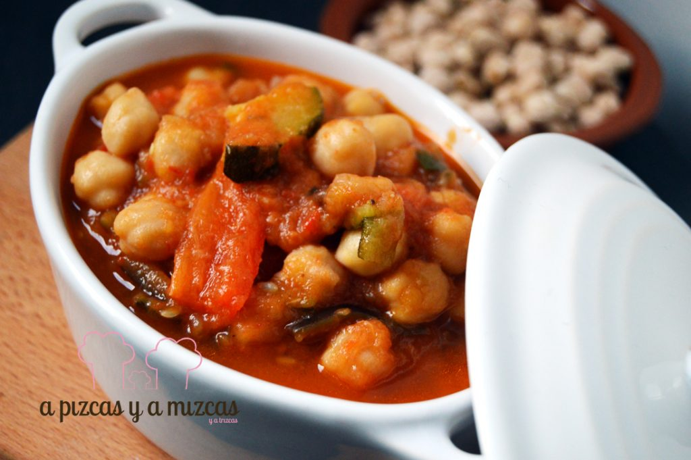
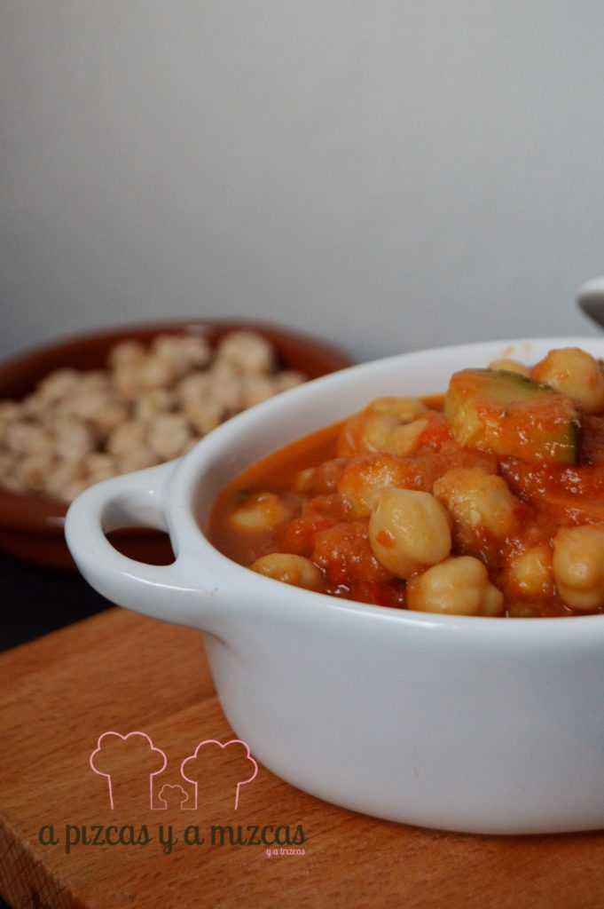

A pocos días de empezar las vacaciones de Semana Santa uno de los ingredientes protagonista de la gastronomía de estos días son: los garbanzos. En muchas casas es típico prepararlos en el tradicional [potaje con bacalao](/potaje/) o potaje de vigilia. Nosotros hemos preparado garbanzos con verduras y salsa de tomate

## Ingredientes para preparar los garbanzos con verduras (para cuatro personas)

- 200 gramos de garbanzos
- 1 cebolla
- 1 hueso de jamón
- 1 berenjena
- 1 calabacín
- 1 pimiento rojo
- 3 dientes de ajo
- 250 ml de salsa de tomate
- 1 pastilla de caldo
- aceite de oliva virgen extra
- sal
- perejil

Nosotros pusimos los garbanzos a remojo desde la víspera. En la olla exprés ponemos bastante agua y agregamos los garbanzos escurridos. Añadimos el hueso de jamón y una pizca de sal. Pelamos la cebolla y la cortamos en cuartos y la añadimos junto a los garbanzos. Ponemos también la pastilla de caldo. Cerramos la olla exprés y cocemos los garbanzos durante 20 minutos. Reservamos el caldo.

Ahora le toca el turno a las verduras. Pelamos los dientes de ajo y los laminamos. Cortamos el calabacín y la berenjena. Pelamos el pimiento rojo y cortamos en dados. Agregamos aceite de oliva virgen extra en una sartén honda, agregamos los ajos y los doramos un poco. Agregamos el resto de verduras, sazonamos y rehogamos.

Añadimos los garbanzos y la salsa de tomate. Mezclamos bien y cocinamos todo junto a fuego suave durante dos o tres minutos.

Resctificamos de sal y listo para comer!
