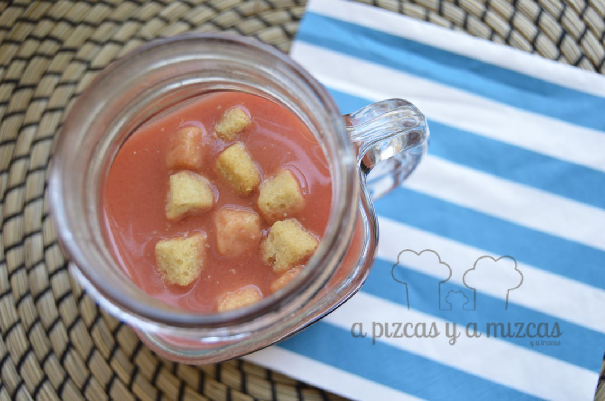
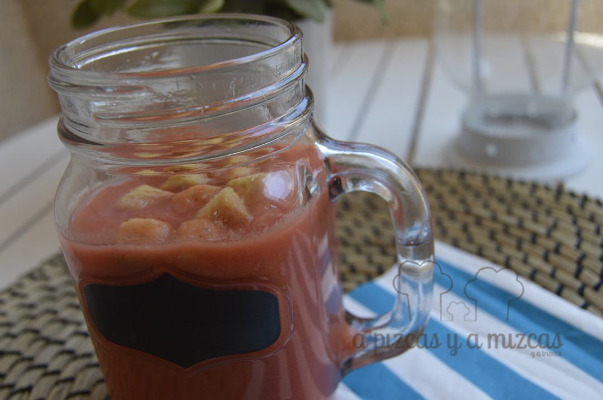
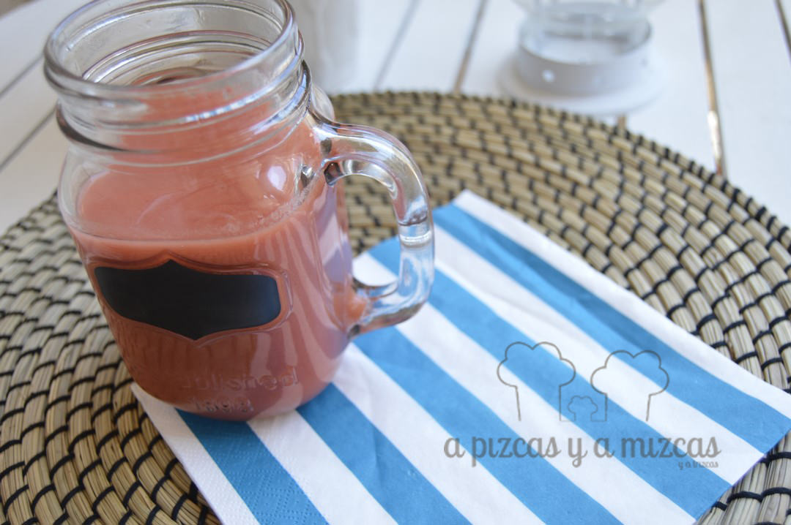

Una de las comidas que va asociada al verano es sin duda el gazpacho. En casa de Mizcas era llegar los primeros calores y ya estaba la iaia Mizcas preparándolo y nosotros hemos seguido con esta buena tradición. Mizcas prepara el gazpacho tal y como lo prepara la iaia Mizcas... en esto de preparar el gazpacho cada uno tiene sus preferencias... ji ji ji. Aunque a nosotros nos gusta añadirle un poco de remolacha y tenemos que decir que con el gazpacho de remolacha hemos conquistado a los iaios Mizcas... y nosotros más que contentos.

## Ingredientes para preparar el gazpacho de remolacha (para dos litros aproximadamente)

- un kilo de tomates de pera maduros
- un pimiento rojo
- dos pepinos
- un pimiento verde
- 180 gramos de remolacha (nosotros utilizamos de bote)
- 4 cucharadas de aceite de oliva virgen extra
- 2 cucharadas de vinagre
- litro y medio de agua fría
- sal
- Para acompañamiento: pan frito

Limpiamos los tomates y los pimientos y  los partimos a trocitos. Pelamos los pepinos y troceamos. También añadimos la remolacha. A continuación agregamos el aceite de oliva virgen extra, el vinagre y la sal. Echamos primero un litro de agua y luego iremos echando el agua restante.

Ahora le toca el turno a la batidora, batimos todo hasta que quede una textura lo más fina posible. Para evitar posibles grumos lo pasaremos por un colador hasta que se quede como una sopa fría. Con los restos que se quedan en el colador añadimos el resto del agua y volvemos a triturar... y otra vez a pasar por el colador y añadimos a la anterior mezcla para que se integre todo.

Lo pondemos en la nevera para que se enfríe y a la hora de servir el gazpacho de remolacha nosotros lo acompañamos de unos daditos de pan frito.

Gazpacho fresquito fresquito

Ahora ya podemos disfrutar del gazpacho de remolacha fresquito! ¿Cómo lo preparáis vosotros?

Al rico gazpacho
