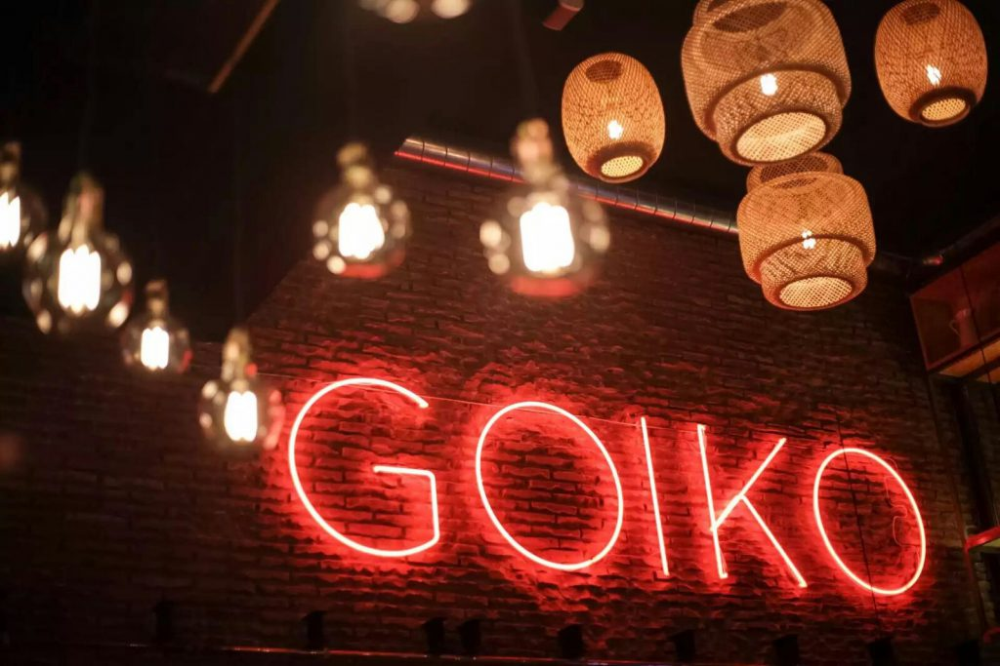
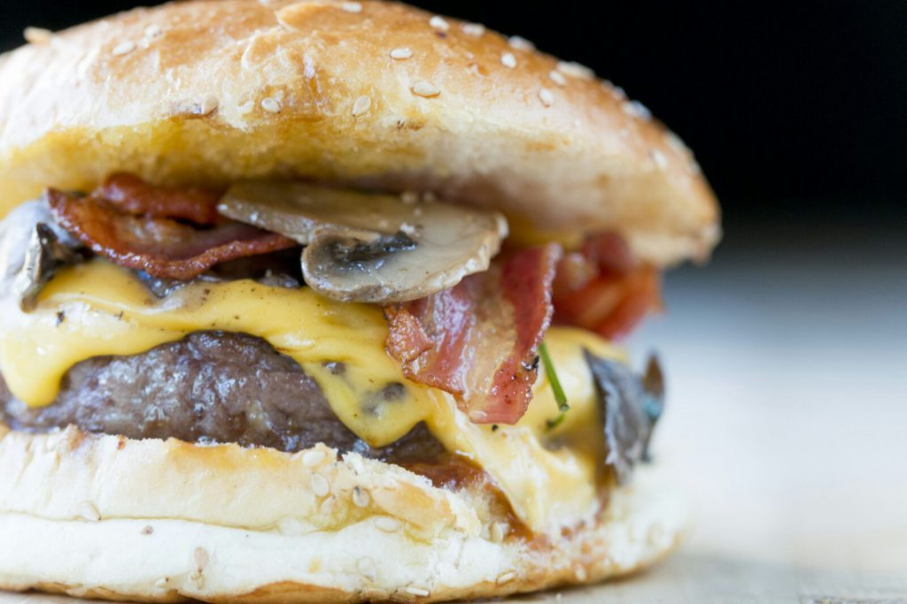
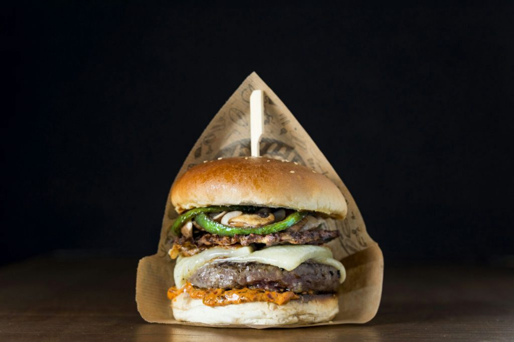

[Goiko Grill](http://www.goikogrill.com/), la conocida hamburguesería gourmet comienza su expansión nacional y lo hace priorizando la capital del Turia, “una capital hamburguesera”, y bajo el mismo espíritu que cuando comenzaron hace casi cuatro años en Madrid: de forma humilde y basándose en la Calidad, Eficiencia y el Buen Rollo.

El nuevo Goiko Grill estará ubicado en la céntrica calle Martínez Cubells 4, donde se repetirá la fórmula de apostar por un buen producto, el trato cercano y cuidado.

Andoni Goicoechea, fundador de Goiko Grill, deja claro que lo más importante es el producto, “excepcional, natural, fresco y sin conservantes”. Las hamburguesas se hacen con “carne de vaca española, muy roja, fresca, picada a diario por nuestro carnicero, con el sazón de Goiko Grill y es  cocinada al punto preferido de cada cliente”.

La historia Goiko Grill surge en plena crisis económica. Andoni es un joven venezolano de ascendencia vasca que llegó a Madrid para ejercer como Médico Interno Residente (MIR) de geriatría en el Hospital de La Paz.

El primer Goiko Grill nace después de que cerrase el sitio donde quedaba a tomar cervezas con un amigo al salir del hospital. "Pedí un poco de dinero prestado, me ayudaron. Junto a mi padre y mi hermana, diseñamos la primera carta del restaurante. Planteamos hacer una hamburguesería gourmet,con la máxima calidad, como si fuera en tu casa. Así surgió Goiko Grill".

Marcado por el carácter culinario de su padre, la influencia española y venezolana se sienten en todo lo que se puede encontrar en su carta. Desde los teques -palitos de mozzarella al estilo venezolano hasta la ‘Aita’, su hamburguesa con queso Idiazábal y pimientos del piquillo. Eso sí, la hamburguesa  estrella de la carta es la Kevin Bacon.

La Kevin Bacon se ha convertido por méritos propios en la hamburguesa gourmet más vendida de España. Su fusión de sabores la convierten en una Burger diferente que apuesta por picar la carne de la hamburguesa en la plancha y rellenarla con trozos de bacon, cebolla crunchy y queso americano. Es la más fea, pero también la más deliciosa.

Más allá de la Kevin, la Yankee se ha convertido en una de las últimas incorporaciones a la carta y es una de las burgers que más focos atrae. Y es que además de la carne de hamburguesa, viene con un mini rack de costilla de cerdo deshuesada bañada en la salsa barbacoa casera, y acompañada de lechuga batavia, queso americano y cebolla a la plancha. Suculenta, gigante, espectacular.

Además, cada Goiko Grill cuenta con una burger única, sólo disponible en ese restaurante y que ha sido creada por su staff, y en Valencia no podía ser menos. Así, estrenarán LaSenyoreta que además de carne trae alioli de ñoras, queso Roncal,​ hashbrown de batata y bacon, salteado de champiñones portobello y cebolla y pimientos fritos.

El Goiko Grill de Valencia abrirá sus puertas el miércoles 18 de enero

Abrirá de 13:00 - 17:00 y 20:00-23:30, todos los días del año (excepto navidad y año nuevo).

Y para no perderse la experiencia Goiko Grill, se recomienda reservar desde su web www.goikogrill.com/reservas o llamando a 96 116 9802.
