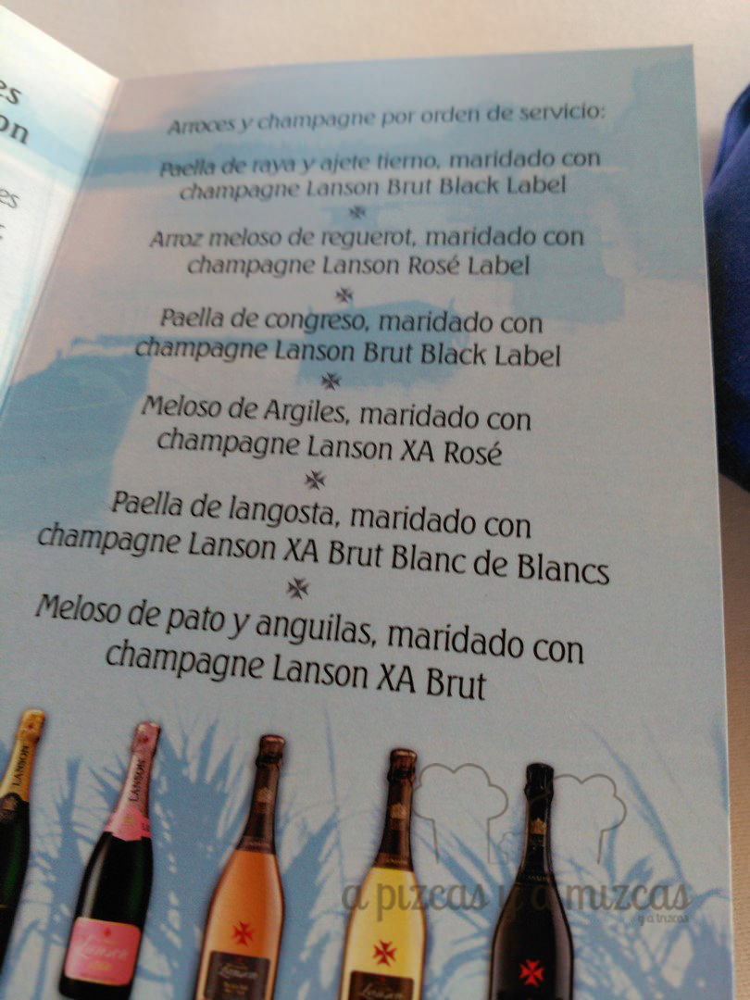
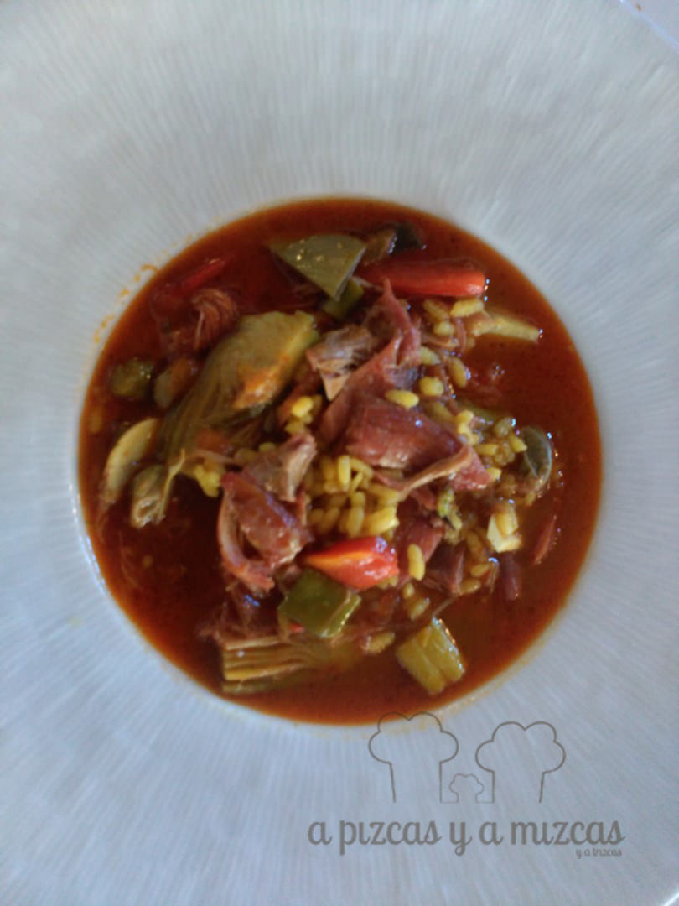

Entre Reims y Cullera (Valencia) hay más de 1.500 kilómetros de distancia, pero el pasado viernes 27 de noviembre, en el segundo maridaje de arroces y [Champagne Lanson](http://www.lanson.com/en/), esa longitud desapareció en una fantástica armonía dirigida por Salvador Gascón ([Restaurante Casa Salvador](http://www.casasalvador.com/)) y el sumiller Sergi Castro (Bodegas Torres, casa distribuidora de Lanson).

Antes del maridaje, un aperitivo en forma de historia. La casa Lanson se remonta a 1760 y es, por tanto, una de las tres maisons más antiguas de Champagne. Es proveedora ininterrumpida de la Casa Real británica desde 1900. Uno de los pioneros en elaborar champagnes rosé (cerca del 15% de su producción es rosado, cuando la media en Champagne es de un 6%) y (seña identitaria de Lanson) ninguno de sus champagnes es sometido a fermentación maloláctica, lo que debe suplir con mayor tiempo en rima, pero que, a cambio, dota a sus espumosos de una frescura y una vida increíble. Sus coupages pivotan en torno a la Pinot Noir.

## Maridaje de arroz y champagne

Ahora sí, los maridajes. Empezamos con una sabrosa paella de raya y ajete tierno. Para este arroz se propuso el Lanson Brut Black Label. Una nariz frutal (albaricoque y ciruela ácidos), notas cítricas, pan tostado. Se refuerza todo ello en una boca fresca que deja un recuerdo cítrico. Fue perfecto para este arroz, limpiando la grasa y la melosidad de la raya. Y el arroz reforzó el carácter del champagne, limando la acidez-

Siguió un arroz meloso de reguerot (con pato, habas y verduras, condimentado con hierbas aromáticas). La propuesta  de maridaje fue el Lanson Rosé Label, precioso de color y con una nariz en la que destacaríamos la fresa ácida y cítricos como el pomelo rosa. En boca mantiene una acidez viva, amplio y un ligero amargor final interesante. Aguantó muy bien a un arroz potente.

Luego Salvador propuso una paella de congreso, a base de conejo, setas y trufa. Ante un plato con tanta personalidad, Sergi Castro optó por maridarlo de nuevo con el Black Label Brut, buscando respetar al máximo los aportes del arroz y el resultado fue espléndido.

Volvimos a los arroces melosos con el arroz meloso de Argilés (verduras y marisco) (homenaje de Salvador Gascó a un amigo suyo), y aquí entró en escena el Lanson Extra Age Rosé (ensamblaje de las añadas 2022, 2004 y 2005). Tonos cobrizos elegantes y una nariz más compleja que los anteriores: frutos del bosque y torrefactos, caramelo tostado, pan tostado, flor (pétalo de rosa), confitura de frambuesa. Una boca muy fresca y delicada que refuerza la fruta. El envejecimiento durante 7 años ha domado la acidez y lo llenan de elegancia.

El maridaje siguió con una paella de langosta, que se maridó con el Lanson Extra Age Blanc de Blancs (Chardonnay de premiers crus y grands crus, de las añdas 2003 –impresionante para el Chardonnay de la zona, 2005 y 2005). Una joya dorada en copa (siete años de crianza), con un perfil floral muy marcado, pero en el que también encontramos fácilmente manzana verde, pera, aromas de bollería (pastel de manzana, brioches). Una mineralidad final lo hace muy largo. Imposible tomar solo un trago. Una elegancia que fue la pareja ideal de un arroz sabroso, pero delicado.

Por último, llegó a la mesa el arroz meloso de pato y anguilas, y para acompañarlo el emblemático Lanson Extra Age Brut (60% Pinot Noir, 40% Chardonnay, ambas de grands crus  y premiers crus, de las añadas 2000, 2002 y 2004), envejecido durante ocho años. Sus aromas son de un gran champagne. Fruta escarchada, frutos secos, tonos amielados, algo especiado, bollería y pastelería fina (tarta de limón…) La boca es elegante, carnosa, y mantiene la frescura de Lanson. Con cuerpo como para estar a la altura del pato y la anguila.

Artículo original de Vicent Escamilla publicado en [www.sevi.net](http://www.sevi.net)
