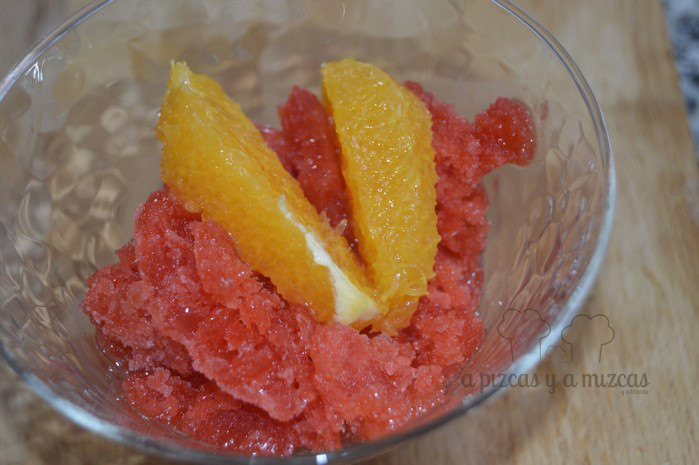

Con estos calores anticipados ya no sabemos que preparar de comida... sólo nos apetecen cosas fresquitas. Estaríamos todos los días comiendo ensaladas, gazpachos y helados. Pero como dicen eso de que "en la variedad está el gusto" se nos ocurrió que era un buen fín de comida pre-veraniega preparar un postre de granizado de fresa y naranja.

## Ingredientes para preparar el granizado de fresa con naranja

- 250 gramos de fresas
- 100 gramos de azúcar
- 200 ml de agua
- un sobrecito de azúcar avainillada
- una naranja

Para preparar el granizado. Limpiamos las fresas y las troceamos y lo batiremos en la batidora hasta que quede finito. Después lo colamos y reservamos.

Ahora preparamos el almíbar. En un cazo ponemos 200 ml de agua, azúcar y un sobre de azúcar avainillada y removemos pero sin que llegue a hervir.

Mezclamos el almíbar con las fresas y lo meteremos en el congelador al menos durante unas 5 horas.

Nosotros teníamos el granizado preparado del día anterior. Así que antes de comer lo sacamos del congelador y con la ayuda de un tenedor lo trituramos un poco hasta que conseguimos la consistencia de granizado.

Pusimos un poquito de granizado de fresa en cada uno de los cuencos y encima un par de trocitos de naranja espolvoreamos un poquito de azúcar avainillado y ya tenemos listo nuestro postre fresquito.

Postre rico y fresco... ñam
