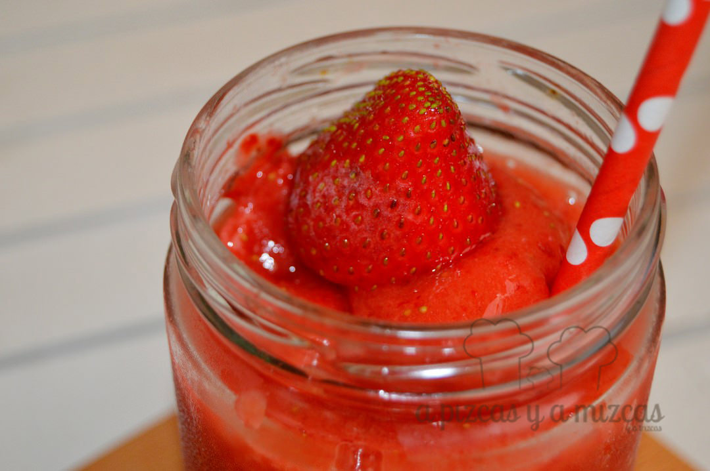
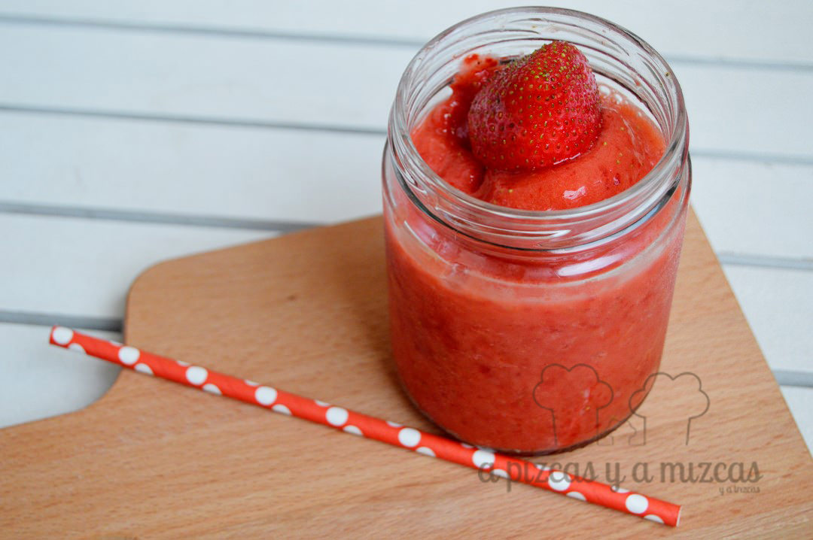
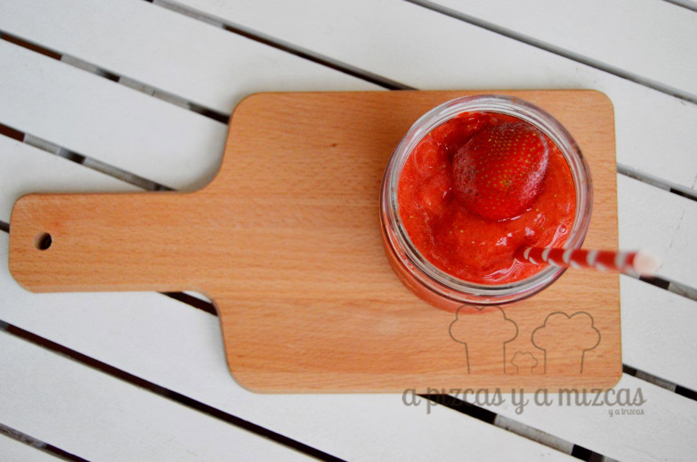

Ya no sabemos que hacer para combatir el calor... ufff! Hace unos meses cuando las fresas estaban en su mejor momento, nosotros que somos previsores, congelamos unas cuantas fresas. Así este verano hemos podido disfrutar de esta fruta que tanto nos gusta en un refrescante granizado de fresa. Ahora te explicamos cómo lo preparamos y cómo congelamos las fresas.

## Ingredientes para preparar el granizado de fresa (para dos vasos)

- 200 gramos de fresas congeladas
- un vaso de zumo de naranja
- 4 cucharadas (de las de café con leche) de azúcar

Primero os explicamos cómo congelamos las fresas. Las limpiamos bien bajo el agua y les cortamos los rabitos verdes, después las secamos con papel absorvente para eliminar el agua y las ponemos en bolsas de congelación. Y al congelador a esperar su oportunidad.

El granizado de fresa lo tendréis preparado en un abrir y cerrar de ojos. Ponemos las fresas congeladas en la batidora, agregamos el vaso de zumo de naranja y el azúcar al gusto y a triturar. Si queréis que se quede más líquido echad un poquito más de zumo de naranja.

Refrescando el verano con fruta rica

Nos encantan las fresas

Y ya está listo el granizado de fresa cien por cien natural. Todo fruta, ideal para que los peques y mayores podamos refrescarnos y combatir estos calores.

Mmmm

¿Cómo lleváis vosotros el calor? ¿Cúal es vuestra receta favorita durante el verano? hoy nos hemos levantado curiosos... ji ji ji... esperamos vuestras respuestas!
