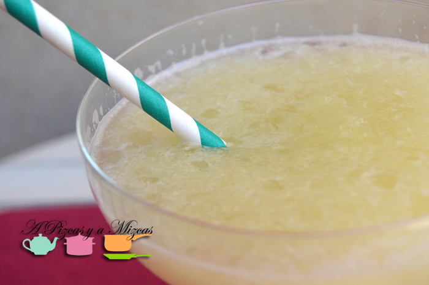
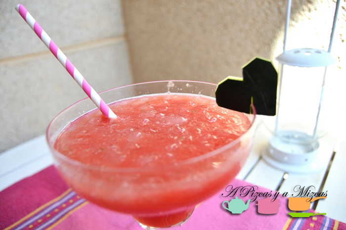
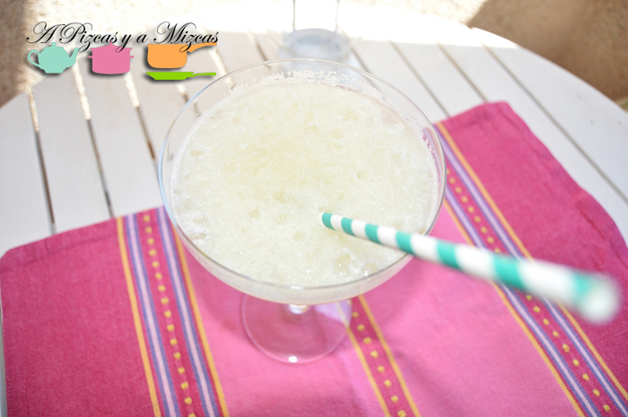
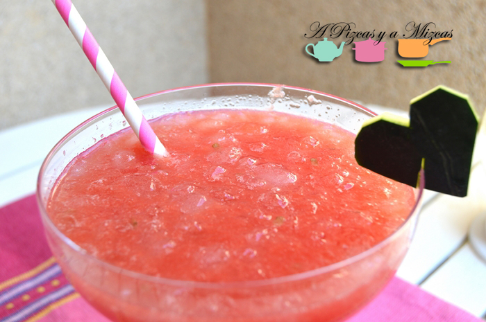
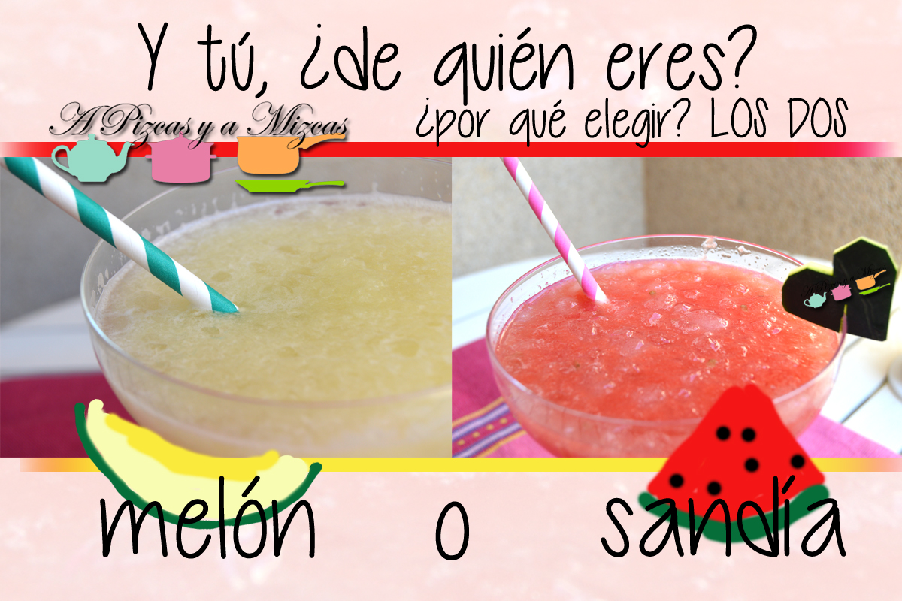

Cuando llega el calor llegan las frutas más veraniegas: el melón y la sandía. Y la verdad es que muchos preguntan cúal prefieres, pues en A Pizcas y a Mizcas nos quedamos con las dos! Así que hoy os traemos granizado de melón y os recordamos el [granizado de sandía](/granizado-de-sandia/ "Granizado de sandía") que preparamos el verano pasado.

## Ingredientes para preparar el granizado de melón (para dos vasos)

- dos cortadas de melón
- el zumo de una lima
- hielo picado

En realidad esto no es ni una receta. Pero os explicamos como preparamos el granizado. Cortamos el melón a trozos y lo ponemos en el vaso de la trituradora, a continuación exprimimos la lima. Trituramos y agregamos el hielo, trituramos otra vez y ya está listo el granizado de melón. Ideal para refrescar las tardes de agosto y para que los peque seres coman fruta. A Trizcas le encanta!

¿Y vosotros que elegís melón o sandía? Mejor quedarse con los dos!

