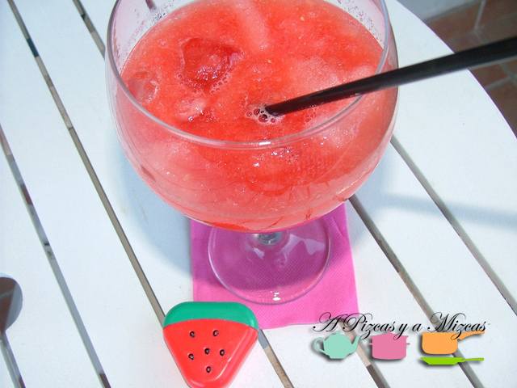

En pleno verano, no hay nada más refrescante que una buena sandía. Si además la presentamos como un rico granizado, el adiós a los sudores está garantizado. Este granizado de sandía va a encantar a todo el mundo y lo podéis tomar como merienda, postre e incluso como un fresco aperitivo.

## Ingredientes del granizado de sandía (para cuatro copas de balón grandes)

- un cuarto de  sandía sin pepitas
- Cuatro cucharadas pequeñas de azúcar
- 12 cubitos de hielo

Para empezar con el granizado de sandía, sacamos toda la carne de la fruta y la cortamos en dados. La colocamos en el vaso de la batidora y agregamos el azúcar. Trituramos la sandía hasta que esté totalmente licuada. Reservamos el zumo de sandía.

A continuación, tomamos el hielo y lo colocamos en el accesorio picador de la batidora, lo trituramos hasta que tenga la consistencia de "nieve". En una jarra vamos mezclando el hielo picado con el zumo hasta obtener el granizado de sandía con la consistencia deseada.

Nosotros servimos este refrescante granizado de sandía en unas copas de balón. Os soprenderá. Además, mediante este método podéis animaros con otras frutas (siempre que tengan bastante contenido en agua), como el melón.

Con recetas así, los calores son menos.
