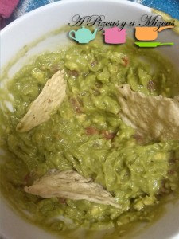

El guacamole es una salsa muy fácil de preparar y se prepara muy rápido. A Pizcas y a Mizcas no nos gustan las cosas muy picantes así que hacemos el guacamole a nuestro estilo... sin picante.

Lo utilizamos para acompañar las tortitas mejicanas o como salsa con unos doritos o galletitas saladas.

")

Ingredientes:

- 1 Aguacate maduro
- 1 tomate
- 1/2 cebolla
- Zumo de un limón
- Sal

Pelar el aguacate y aplastarlo con un tenedor, para que quede como una crema. Añadir la cebolla picada, el tomate a daditos pequeños, sal y un poco de zumo de limón, para que no se ponga oscuro el guacamole.

")")

Mezclar todo bien y plantar el hueso del aguacate en el centro del cuenco donde se irá a servir.

")

Y ya está listo para comer!
