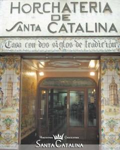
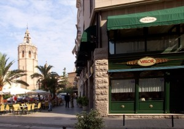

Valencia ya huele a pólvora. Desde el 1 de marzo, los masclets son los que ponen la sinfonía a la provincia entera (y parte del extranjero). En A Pizcas y a Mizcas ya llevamos el pañuelo de labrador en el cuello, tenemos la mecha encendida y vamos a cremar-ho tot! Os presentamos una entrada a modo casi de guía (para nada oficial) de las Fallas 2013, en ella os daremos algunas opiniones para disfrutar de unas fiestas fantásticas. Tal y como está la cosita, vamos a empezar con una opción low cost, para que nadie tenga excusa alguna para dejar de acudir a Valencia. La cosa está que arde!

## Ingredientes para vivir las Fallas 2013

- Un blusón fallero por persona
- Su correspondiente pañuelo
- Zapatillas andarinas
- Mochila o bandolera
- Bocadillos de A Pizcas y a Mizcas
- Petardos
- Mechero
- Mecha
- Ganas de pasarlo bien
- Paciencia
- Mucho respeto por el prójimo

Vamos con lo principal, que es salir de casa con el atuendo fallero (no de fallero, ni de fallera, sino el atuendo para vivir la fiesta). Si hay un invento que iguala a todos, a ricos y pudientes con personas más humildes, éste es, sin duda, el blusón fallero. Debajo de esta prenda (que afortunadamente ya va poco a poco abandonando el negro) da igual lo que haya: una camisa de Armani o un chándal. Así, que todos con el blusón puesto.

El complemento indispensable para las Fallas 2013 es el pañuelo, que puede ir al cuello con el cachirulo a la espalda (modo tradicional), o al pecho (en plan bandolero del Far West). Otras alternativas son en la cabeza... Con esto y unas buenas zapatillas deportivas (los taconazos dejadlos o acabaréis quemadas) ya estamos preparados para tomar las calles de la capital del Turia.

")

Hemos dicho que vamos a empezar proponiendo un plan low cost, así que prepararemos unos ricos bocadillos que introduciremos en nuestra mochila, así entre falla y falla, entre mascletá y pasacalle, decidiremos cuándo y dónde hacer una paradita para reponer fuerzas. Aquí tenéis nuestras propuestas de bocadillos de Fallas 2013:

1. Lomo con cebolla y tomate: Un clásico. Pochamos la cebolla cortada en tiras y montamos el bocadillo con tomate rallado, lomo a la plancha, un poco de parmesano rallado y la cebolla. A nosotros nos gusta en pan de chapata.

")

1. Mollete de pechuga de pavo y feta: Algo más elaborado, pero muy rico. Lo primero es preparar una salsa de yogur, con yogur griego, aceite de oliva virgen extra, sal, pimienta y un poco de vinagre. Nosotros empleamos molletes, que van al horno primero. Los partimos, untamos en una mitad la salsa, ponemos unas hojas de brotes tiernos de ensalada, las lonchas de pechuga de pavo enrolladas, queso feta cortado en tiras gruesas y un par de tomates secos.

")

Con las provisiones listas (no os olvidéis del agua) empezamos nuestro paseo. Está es nuestra ruta típica: Accedemos al centro histórico de Valencia cruzando por el Pont de Fusta, por las Torres de Serranos. Girando a la derecha y siguiendo el río llegaremos a la [falla Na Jordana](http://www.najordana.es/index.php/es/), una de las fallas de Sección Especial más auténticas y con un ambiente muy sano y valenciano. Sin darnos cuenta estaremos ya de pleno en el Barrio del Carmen, puedes dejarte llevar por el río de gente y seguro que acabas viendo las fallas más importantes, como la del [Pilar](http://www.falladelpilar.com/), la de la [Mercè](http://www.lamerce.net/), ambas en el mismo barrio. De camino podrás descubrir infinidad de fallas más modestas, pero que representan el espíritu de esta fiesta. De aquí, a ver la Falla del Ayuntamiento y la de [Convento Jerusalén](http://www.fallaconventojerusalen.com/fallaconventojerusalen/Inicio./Inicio..html).

")

")

")

En este entorno, junto a la Lonja, no dejéis pasar la oportunidad de tomar unos buñuelos de viento, o los de calabaza, en en la plaza Dr. Collado. Mucho mejores que los de la mayoría de los puestos ambulantes que encontraréis por toda la ciudad. Estos son buñuelos take away. Si queréis sentaros, pero sin renunciar a los dulces típicos falleros, las opciones que os recomendamos son Santa Catalina y Chocolates Valor, en la plaza de la Reina.

")

")

Seguro que el reloj se acerca ya a las 14.00 horas. Bastante antes de ese momento ya tendríais que haberos hecho con un hueco en la plaza del Ayuntamiento, pues es el momento de la mascletá. Ya sabéis, casi una hora o más de espera, rodeado de una multitud, y cinco minutos maravillosos de pólvora y ruido. Cuando termine, tranquilo, la plaza se vacía, así que mejor esperar un poco. Buscamos sitio tranquilo y desenfundamos los bocadillos que con esmero hemos preparado. Si no queréis ir cargados con panes, os recomendamos que compréis en el Mercado Central raciones para llevar en el Racó de Feri (puestos 173 174 E), delicias griegas fantásticas.

")

")

Cuando hayáis descansado, la tarde la podemos dedicar a tirar petardos (amb coneixement) y ver fallas del Ensanche, como [Antiguo Reino de Valencia-Duque de Calabria](http://falladelregne.com/) o [Almirante Cadarso-Conde Altea](http://fallaalmirantecadarso.fallas.com/portada/portada.htm). Y luego las del [barrio de Ruzafa](/tag/ruzafa/ "Ruzafa"), como [Cuba-Literato Azorín](http://www.fallacubaliterato.com/) (que ha sido la ganadora  del primer premio en iluminación de las fallas 2013) y Sueca-Literato Azorín. La llegada a este último barrio tiene que ser ya con la luz del día despedida, pues son las calles que casi siempre ganan los premios a la iluminación: un espectáculo. Además, el barrio tiene mucha vida y os permitirá tomar un tentempié o una cena rápida en locales de moda y modernos.

La noche ya está aquí y eso en fallas es sinónimo de verbena ([aquí](http://fallas.levante-emv.com/verbenas-en-fallas-2013) puedes consultar a cual quieres ir cada noche)! A estas horas seguro que agradecéis llevar esas zapatillas andarinas. A partir de aquí, lo que aguante cada uno y recordad que las Fallas duran cuatro días y hay que dosificarse!
