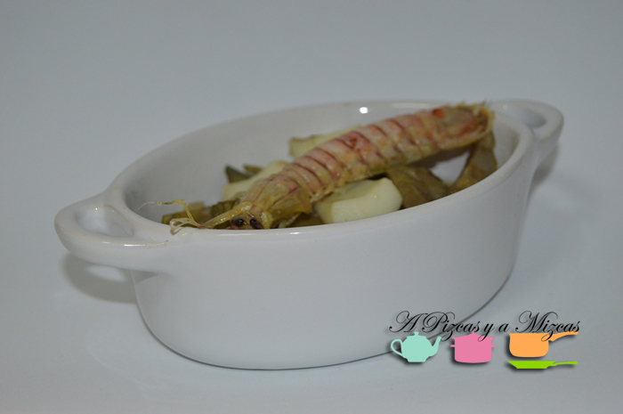
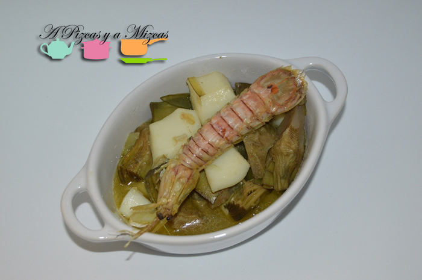

Hoy rescatamos este guiso de alcachofas, sepia y galeras que teníamos pendiente de subir al blog desde hace bastante tiempo. Todavía podéis conseguir las últimas alcachofas de temporada por lo que creemos que es una opción a tener en cuenta. A nosotros nos gustó mucho cuando lo preparamos. Es un guiso muy gustoso y sabroso.

## Ingredientes para el guiso de alcachofas, sepia y galeras (cuatro raciones)

- Seis alcachofas
- Una sepia mediana
- Seis galeras
- Dos dientes de ajo
- Aceite de oliva virgen extra

El primer paso para nuestro guiso de alcachofas, sepia y galeras es pelar bien las alcachofas. Les retiramos la pelusilla interior y las cortamos en octavos. Las ponemos a hervir durante 10 minutos (se terminará de hacer más tarde). Reservamos junto con su caldo de cocción.

Mientras le damos la primera cocción a las alcachofas, limpiamos la sepia. Guardamos los tentáculos para otra ocasión (para un arroz, o para hacerlos encebollados, por ejemplo). La cortamos en pedazos de unos dos centímetros.

Limpiamos las galeras, pasándolas por el grifo de agua fría.

Pelamos los ajos y los fileteamos. En una sarten calentamos el aceite de oliva virgen extra. Freimos las galeras y las reservamos. En el mismo aceite, freimos los ajos hasta que esten dorados. Agregamos la sepia en trozos. Rehogamos y añadimos las alcachofas escurridas.

Rehogamos y añadimos unos tres o cuatro cucharones del caldo de coccion de las alcachofas. Dejamos cocer 5 minutos a fuego medio. Añadimos las galeras y dejamos cocer otros 5 minutos.

](/wp-content/uploads/DSC_0072-pizcas1.jpg)  [

Está riquísimo y mejora todavía más si reposa algo de tiempo.

