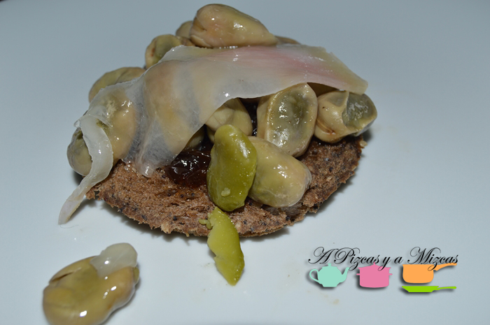
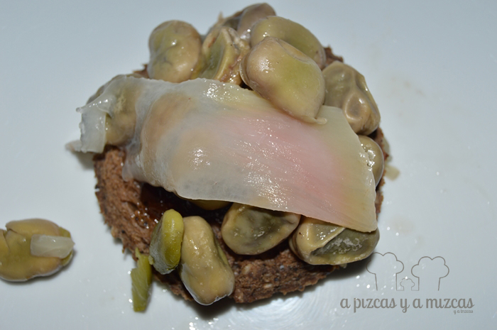

Hay sabores que, inmediatamente, te trasladan a la Comunitat Valenciana. Las habas son unas de las guarniciones más tradicionales en estas tierras nuestras. Habitualmente, incluso, los agricultores suelen plantar habitas en sus huertos, aunque se dediquen a otros cultivos, como los naranjos. Así, en un rincón del huerto reservan un rincón para este manjar, que, cuando es tierno, está rico incluso crudo. Hoy adaptamos el tradicional bocadillo de habitas con embutido y lo presentamos como un montadito de habitas, panceta y cebolla caramelizada.

## Habitas, panceta y cebolla caramelizada (seis montaditos)

- Habas (un puñado de habas ya peladas por persona), mejor si son frescas, pero también podéis emplear las congeladas.
- Dos cebollas dulces.
- Panceta o tocino ibérico.
- Sal.
- Azúcar.
- Aceite de oliva virgen extra.
- Pan de centeno de molde.

El primer paso para nuestros montaditos de habitas, panceta y cebolla caramelizada es preparar la base, de pan de centeno. Para ello, cogemos un vaso grande o un molde redondo y cortamos las rebanadas de pan en forma redonda. Es un paso estético que os podéis saltar.

En caso de que sean habas frescas, las pelamos y en una cazuela ponemos a pochar una cebolla cortada en juliana con abundante aceite de oliva virgen extra y sal. Cuando empiece a ponerse transparente, añadimos las habas y las rehogamos durante unos 12 minutos o hasta que estén tiernas (id probándolas). Rectificamos de sal.

Mientras se cuecen las habas, podemos caramelizar la cebolla. Para ello, cortamos la cebolla en tiras y la pochamos en una sartén a fuego suave. Cuando esté bien, bien pochada, subimos el fuego al máximo y añadimos una cucharadita de azúcar y dejamos que se caramelice junto con los jugos propios de la cebolla.

Luego, con un cuchillo bien afilado, cortamos seis finas lonchas de panceta o de tocino. Ahora, vamos a preparar nuestros montaditos de habitas, panceta y cebolla caramelizada: calentamos una plancha y tostamos ligeramente los panes; sobre cada uno de ellos colocamos en este orden, una cucharada de cebolla caramelizada, un puñado de habitas calientes y las lonchas extrafinas de panceta (para que con el calor se cocine ligeramente).

A triunfar con estos montaditos de habitas, panceta y cebolla caramelizada.

