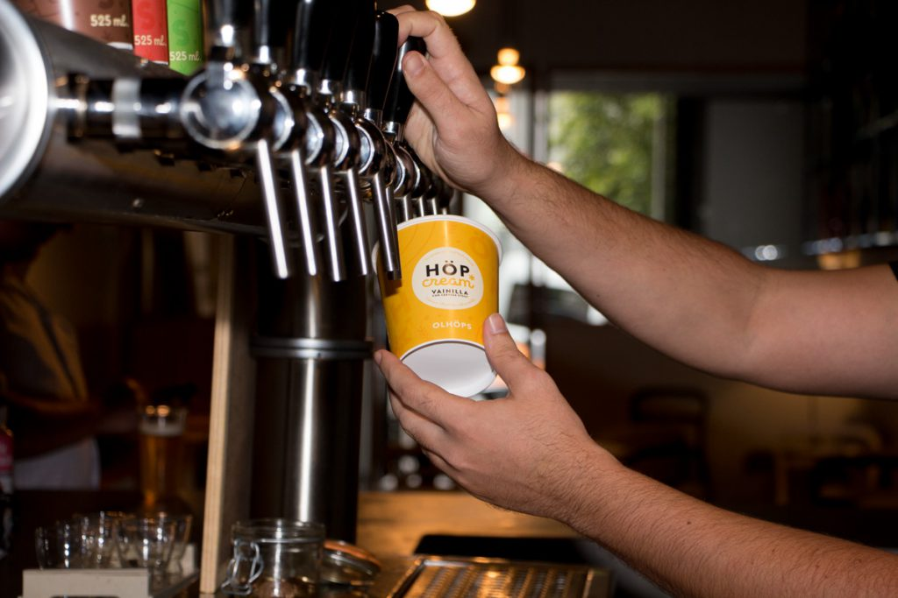
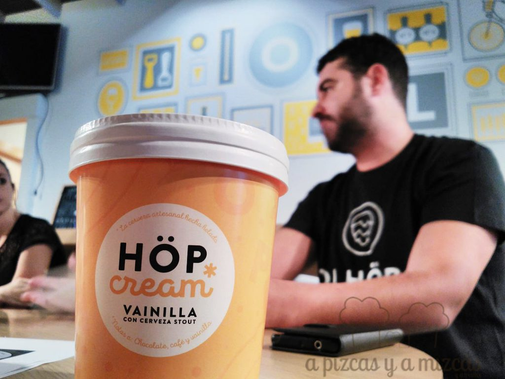
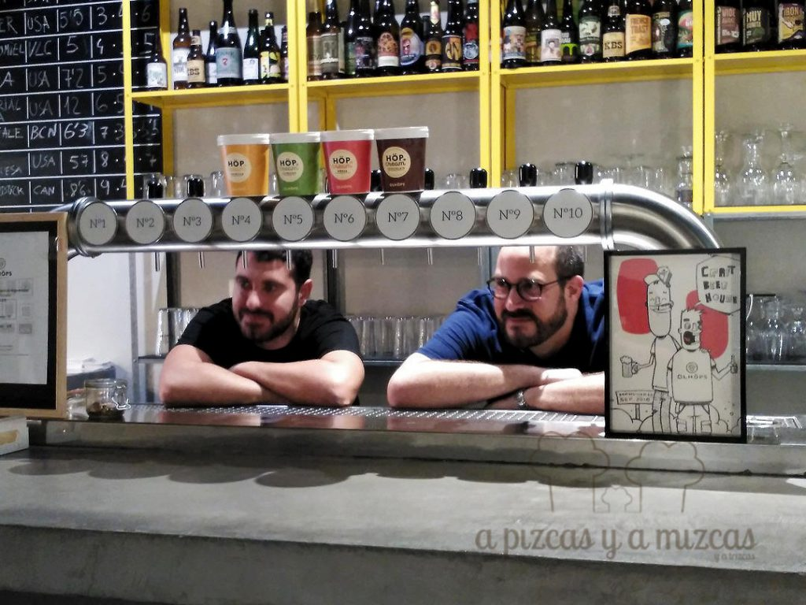
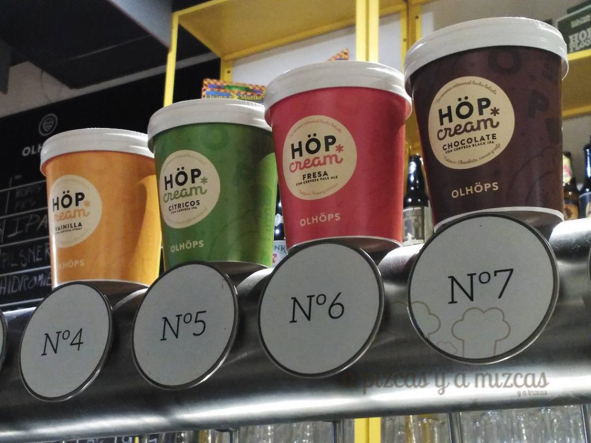
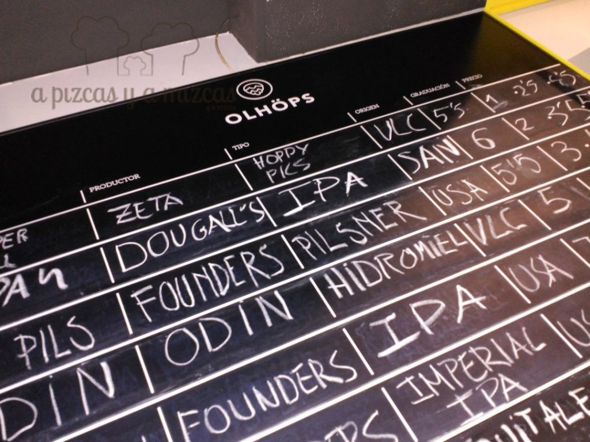

Hace prácticamente un año que [Olhöps](http://www.olhops.com/house/) es uno de los templos sagrados para los valencianos cerveceros. Una iniciativa que tuvo primero la forma de tienda online, y que ahora, en la calle Sueca de Valencia, en el corazón de Ruzafa, es un beer bar donde poder disfrutar de las mejores cervezas artesanas de todo el mundo. Sus impulsores han dado un paso más que no dejará frío a nadie... ¿o sí? Han creado el helado de cerveza Höpcream y os aseguramos que sabe a lúpulo y cebada malteada.

## ¿Es una locura emprender con un helado de cerveza?

Sí y es que no hay que asustarse. Höpcream es helado de cerveza, no cerveza helada. Una de la magia es la acertada combinación de sabores de helado, con diferentes tipos y estilos de cerveza artesanal. Y para ello, Olhöps se nutre de la rica tradición heladera de la Comunitat Valenciana. Para conseguir el helado de cerveza Höpcream se han asociado con el maestro heladero José Montejano, que ha trabajado con ilustres de la cocina como Paco Torreblanca, Ricard Camarena o en restaurantes como El Celler de Can Roca.

El helado de cerveza estará disponible ya a partir del jueves 29 de septiembre, al principio en el local de Olhöps en Ruzafa, pero ya se está trabajando en tener una red de distribución mucho más amplia. Nosotros tuvimos la fortuna de conocerlos unos días antes y nos explicaron que a la gama inicial de cuatro sabores (vainilla con cerveza stout, chocolate con cerveza black IPA, fresa con cerveza pale ale y cítricos con cerveza IPA) le seguirán muchos otros (la combinatoria es infinita) y que su misión es combinar con diferentes sabores las mejores cervezas artesanales y convertirlas en helados e "introducir el mundo de cervezas artesanales al público que no lo conozca". Eso sí, hay que tener en cuenta que estos helados cuentan con un porcentaje de alcohol que ronda del 3,5% al 4,5%.

Al equipo original de Olhöps se ha unido en esta ocasión Elliott Konig, un norteamericano proveniente de Miami, quien ha aportado su visión de un país donde el sector de la cerveza artesanal está mucha más avanzado, aportando un toque fresco e innovador a Höpcream. De hecho, ya está programada una sesión de trabajo en Miami para que este producto valenciano ponga una pica en USA.

El helado de cerveza Höpcream está rico por sí solo. Los amargos de la cerveza lo hacen muy particular. Invita a tomarlo. Pero, además tiene muchas potencialidades, combinados con granizados o con cervezas heladas, en postres más complejos... Todo un camino por recorrer.

