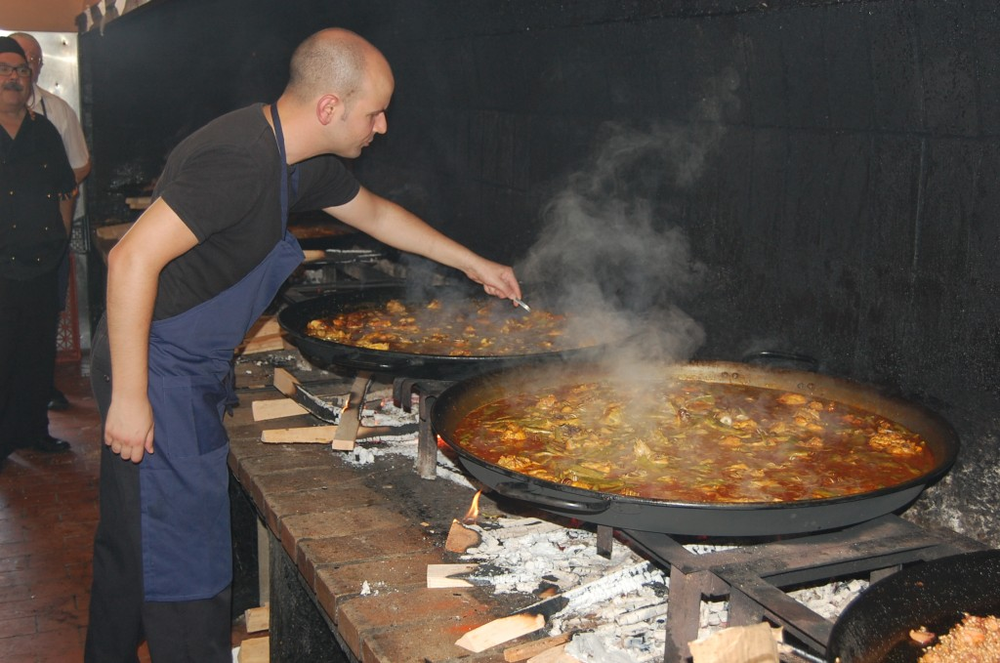
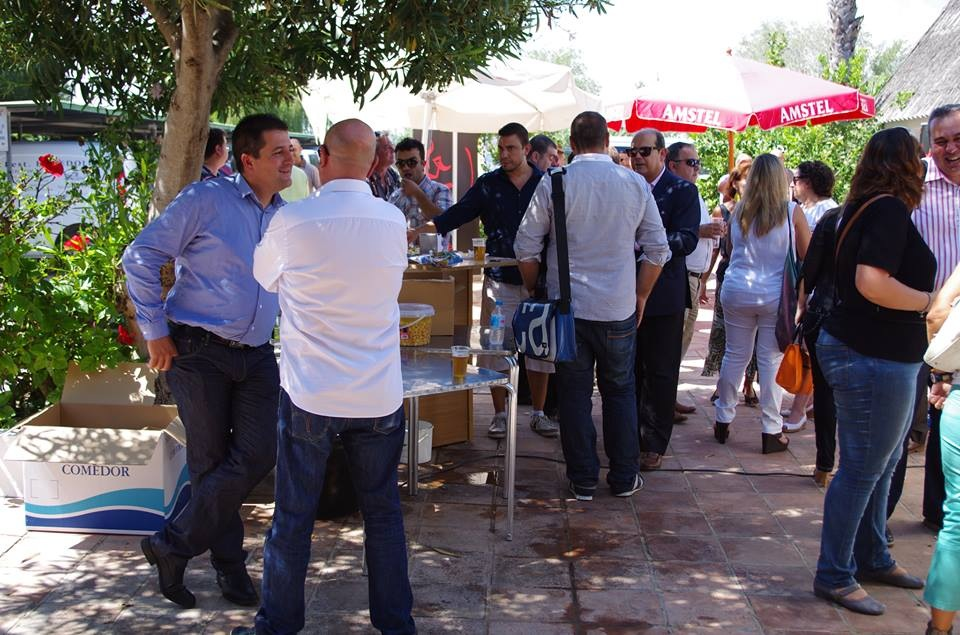

El Palmar rindió homenaje el miércoles, 4 de septiembre, a las dos formas más populares que tienen de cocinar el arroz en paella: La Paella Valenciana y el “Arròs del Senyoret”

## Paella Valenciana en el Palmar

Una exhibición donde se ejecutaron ocho paellas siguiendo las recetas de la zona. En el transcurso del evento se hizo entrega de las distinciones avaladas por “[Wikipaella.org](http://lebotonarmy.com/wikipaella/ "Wikipaella")” a 24 restaurantes de esta localidad. Se trata del primer evento itinerante de la iniciativa surgida de las redes sociales a principio de año, y que ha elegido El Palmar por distinguirse en su constante promoción de la cocina valenciana en general y de la paella en particular.

“Wikipaella.org” nace de forma espontánea en las redes sociales para proteger y divulgar el bien más preciado del patrimonio gastronómico de la Comunidad Valenciana, la Paella. El acto conducido por el periodista y escritor gastronómico, Paco Alonso co-fundador del movimiento junto a la “Comunidad de la Paella” el periodista incidió en el valor de la Paella como síntesis de la dieta mediterránea y anunció una serie de eventos que se celebrarán en el transcurso del mes de septiembre.

El Homenaje contó con la presencia del director general de la Agencia Valencia de Turismo, Sebastián Fernández, que destacó el auge del turismo gastronómico en nuestra tierra, y el valor de iniciativas como esta que buscan mejorar y divulgar los valores de la cocina tradicional, que junto a cocineros estrella como Quique Dacosta y Ricard Camarena y otros de primer nivel, sitúan a la gastronomía de la Comunidad Valenciana en el mejor momento de su historia.

También asistió al acto el alcalde de Sueca y representantes de la organización del “Concurso Internacional de Paellas” que celebra su 53ª edición el próximo día 15 de septiembre. Con esta acción se busca lanzar un mensaje común desde las poblaciones vinculadas con el cultivo del arroz y que más se han distinguido por la proyección de la paella en el mundo.

La cocinera Pepi Montoro (Rte. El Redolí) se encargó de hacer la paella valenciana vía streaming, que fue vista en países como Brasil, Venezuela, EE.UU, Reino Unido, Noruega, Francia, Panamá y Costa Rica, entre otros.

EL PALMAR – VALENCIA.

Es una pedanía de la capital que pertenece al distrito de los poblados del sur y situado en el Parque Natural de la Albufera.

Por el año 1250 vecinos de Ruzafa se instalaron en la isla de El Palmar, y fueron los primeros pescadores reconocidos. El Palmar siempre ha estado vinculado a la pesca y al cultivo del arroz.
