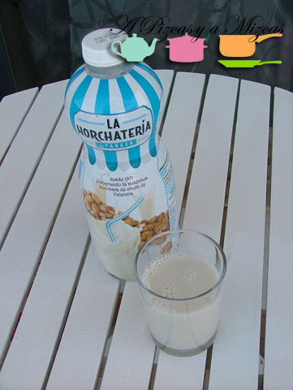

La horchata es uno de los sabores que más asociamos al verano, aunque la tomamos todo el año. Nosotros tenemos la fortuna de vivir relativamente cerca de Alboraya (la cuna de la horchata) y allí hay verdaderos "templos" de este refresco natural. Su compañía natural son los fartons, según el establecimiento los podemos encontrar más hojaldrados o menos, pero lo fundamental es que se "coman" la mayor parte de la horchata, que tengan capacidad de absorción, de ahí su denominación. Si no podemos acudir a una horchatería, existen las horchatas pasteurizadas y las concentradas. Normalmente, las embotelladas no tienen ni punto de comparación con la "fresca", pero el otro día descubrimos en el supermercado la Horchatería de [Horchatería Panach](http://www.horchatapanach.com/) y al probarla nos sorprendió muy gratamente.

Esta horchata está elaborada con chufa con Denominación de Origen Chufa de Valencia y esto es importante. En el resto de horchatas preparadas, si no incluyen el distintivo, lo más seguro es que el ingrediente principal sea la chufa africana.

Os resumimos aquí algo de la historia de esta horchatería (extraído de su página web):

Labrador de toda la vida, José Panach Riera, cultivaba y secaba chufas en Alboraya, tareas ambas tradicionales en aquel tiempo y lugar. Basándose en la experiencia acumulada en su trabajo cotidiano, desarrolla, construye y registra el 21/10/70 con el número 376.214 de patente de invención, la primera «máquina para recolectar chufas» del mundo. En 1971 abre al público la «Horchatería Panach» para ofrecer al público horchata que tiene dos características: El respeto por la tradición de la fórmula magistral de la horchata, transmitida durante generaciones en lengua vernácula; y  la cuidadosa selección de las mejores chufas cosechadas en sus propios campos, destinando el exceso sobrante para venta a la industria.

 Cultivo de la chufa en los campos de Panach.

Salvando todas las lógicas distancias, la horchata envasada de Panach se asemeja bastante a la original, tanto en sabor como en textura. Nosotros la tomamos sola y también con café y lo cierto es que está riquísima. Tan sólo hay que seguir una regla esencial: que esté bien fresquita, incluso granizada!!

