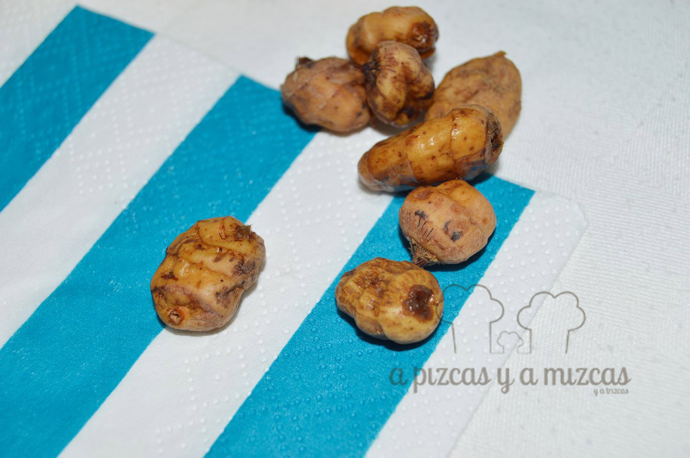
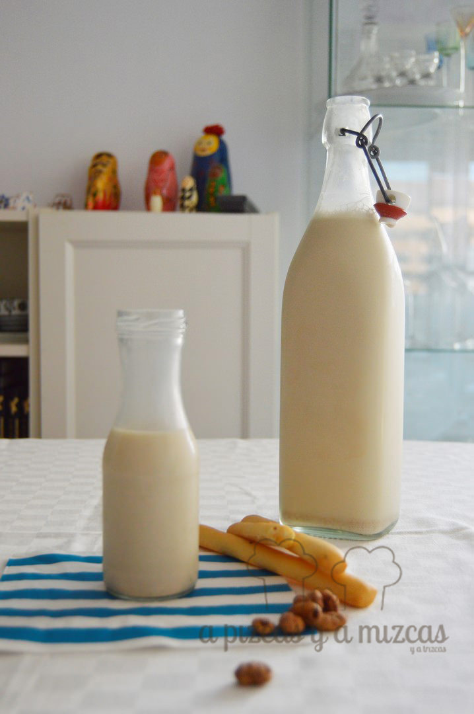
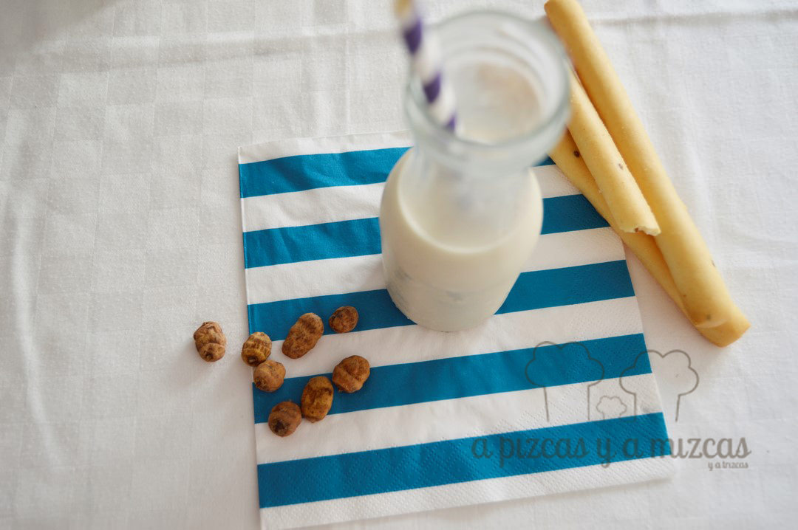
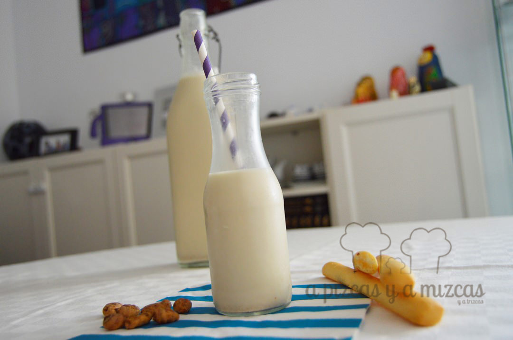

Hay ocasiones en las que todo parece apuntar a una cosa, en este caso a un producto: la chufa y la horchata. Hace ya tiempo que teníamos pensado publicar un post para enseñaros cómo la hacemos en casa y justo entonces nos invitaron para participar en el [Symposio sobre la D.O. Chufa de Valencia](/el-symposio-horchata-y-chufa-nuevos-retos/), del que ya dimos cuenta. Ahora no podemos postergar más esta entrada y más aún con el calor que estamos viviendo estos días. ¿Os apetece una buena horchata natural artesana hecha en casa?

La horchata en casa, si está bien hecha no tiene nada que envidiar a la de las horchaterías tradicionales. Con básicamente tres ingredientes (chufa, agua y azúcar) podéis disfrutar de una gran horchata en casa. Líquida, granizada, mixta, en polo, con coca de llanda, con fartóns, con rosquilletas...

## Ingredientes para hacer horchata en casa (1 litro a 1,25 litros aprox)

- 350 gramos de chufa (podéis incrementar la cantidad hasta unos 400 gramos)
- 1,25 litros de agua mineral
- 6-8 cucharadas soperas de azúcar
- Un pedazo de piel de limón (opcional)
- Una ramita de canela (opcional)

La chufa es un tubérculo que, tras su recolección, es lavado y secado. La horchata es, básicamente, una bebida obtenida de la rehidratación de la chufa.

Chufa de Valencia

Como veréis el proceso para tener una horchata en casa digna de horchatería de renombre es muy sencillo. Las chufas las podéis conseguir en tiendas de frutos sectos y ya es común encontrarlas en grandes superficies. Eso sí, fijaos en que sean chufas con D.O. Chufa de Valencia, un sello que os otorga una calidad garantizada.

En primer lugar, debemos rehidratar la chufa. Para ello, colocamos las chufas en un bol amplio o ensaladera y las cubrimos con abundante agua del grifo. Las dejamos a remojo durante 12 horas como mínimo.

Transcurrido ese tiempo, las escurrimos y las frotamos bien bajo el grifo. Las volvemos a colocar en el bol con abundante agua del grifo y 1/4 de vaso de lejía común, durante unos 10 minutos. Enjuagamos bien, lavamos y escurrimos. No os preocupéis que la lejía no deja gusto en la chufa y con este paso garantizamos la desinfección total.

Con las chufas ya hidratadas, limpias y desinfectadas, las colocamos en un bol donde triturarlas. Añadimos la mitad del agua mineral y trituramos todo durante unos 4 o 5 minutos. Añadimos el resto del agua menos un vaso que reservamos y volvemos a triturar unos 2 minutos.

Ahora vamos con nuestra horchata en casa a la nevera, cubierta y la mantenemos durante al menos cuatro horas, para que macere bien. En este punto se puede añadir un trocito de piel de limón o un palo de canela, o ambas cosas, o ninguna de ellas, según gustos. Pasado ese tiempo, removemos bien la mezcla y la colamos con un colador muy fino, si es de tela incluso mejor. Al residuo seco que queda (los restos de chufa triturada) le añadimos el vaso de agua mineral que teníamos reservado y volvemos a triturar unos 2 minutos más. Colamos esa horchata casera y la añadimos a la anterior.

Horchata líquida lista para disfrutar

Es el turno del dulzor. De 6 a 8 cucharadas soperas de azúcar, bien removidas. Ya tenemos la horchata en casa lista. Sólo queda que se enfríe bien. Un truco es congelar directamente parte de la horchata casera que hemos hecho. Luego, a la hora de servir, sólo hay que picar esa horchata congelada y mezclarla con la líquida que tendremos en la nevera.

Fartons, rosquilletas o coca de llanda... los compañeros perfectos!

Ahora seguro que hay disputas. ¿Con qué acompañas la horchata? ¿Coca de llanda? ¿Fartons? ¿Rosquilletas? Las combinaciones son infinitas y lo cierto es que nada refresca más que una buena horchata.

