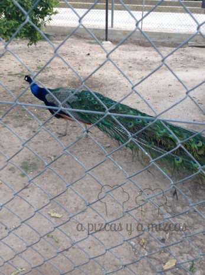
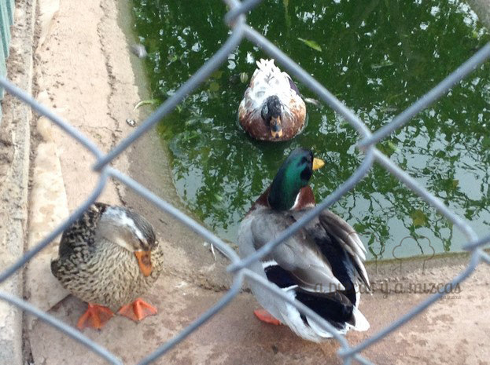
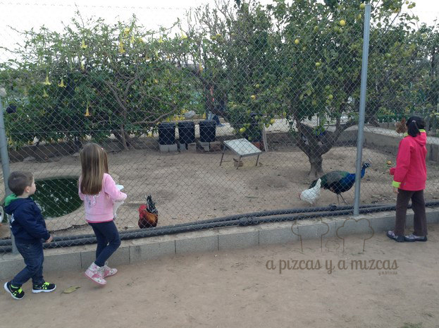
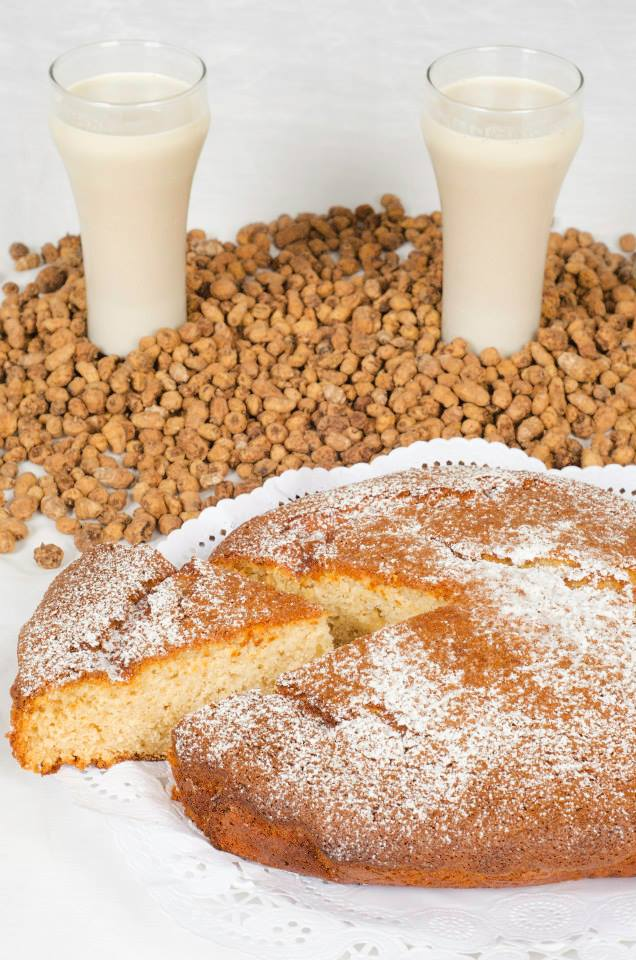
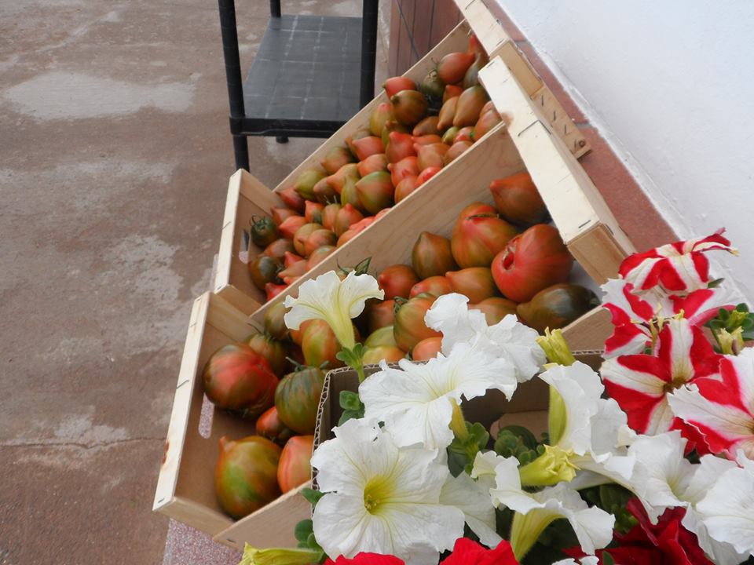
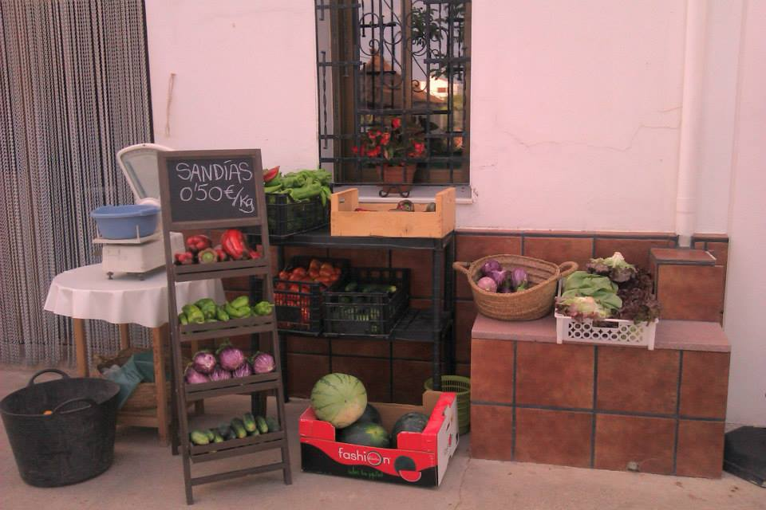
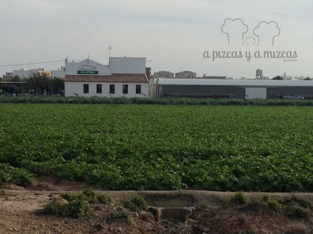

En cuanto parece que llega el calor.... Mizcas empieza a decir que es hora de tomarse una buena horchata. Y ése fue uno de los planes que hicimos con Trizcas durante los días de Semana Santa. Pasamos la tarde en la [Horchatería Vida](https://www.facebook.com/horchateriavida/timeline "Facebook Horchatería Vida"), está muy cerquita de Alboraya, en medio de la huerta valenciana. Ubicada en la Partida Saboya, 6 en Alboraya. Además de horchata tiene cosas muy especiales. ¿Quieres saber más?

La horchatería Vida es una alquería valenciana de las de toda vida. Una casa grande con su jardín, su corral con animales y rodeada de huerta. Nos encanta ir porque podemos disfrutar de una buena horchata mientras Trizcas puede correr por el cesped y ver a las gallinas, conejos, perdices, pavos reales...

## Nuestra valoración de la Horchatería Vida

- **Comida**: ⭐⭐⭐⭐
- **Local**: ⭐⭐⭐⭐
- **Servicio**: ⭐⭐

Tenemos que decir que la horchata de Vida está muy buena, muy del gusto nuestro, intensa y con mucha chufa; y los fartons artesanos muy recomendables, junto con sus cocas (de llanda, de calabaza...). La única pega es que el servicio en días festivos falla un poco y enseguida están un poco desbordados. Para esos días una buena opción es pedir la merienda y tomarla en el jardín mientras los peques juegan. De lo contrario, toca armarse de paciencia. Sin duda una visita a Horchatería Vida es un plan genial para toda la familia.

Además de merendar puedes comprar la verduras y hortalizas que cultivan en su huerta y llevártelas  a casa. Del campo a la mesa y todo fresquísimo y de temporada.

En resumen: una Horchatería para ir con niños, pues ellos son los que más disfrutan. Hay que evitar ir en días de mucha gente si no queréis desesperaros!

