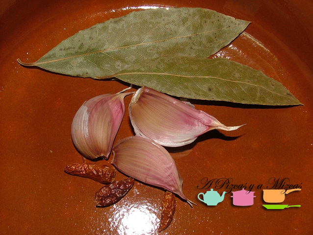
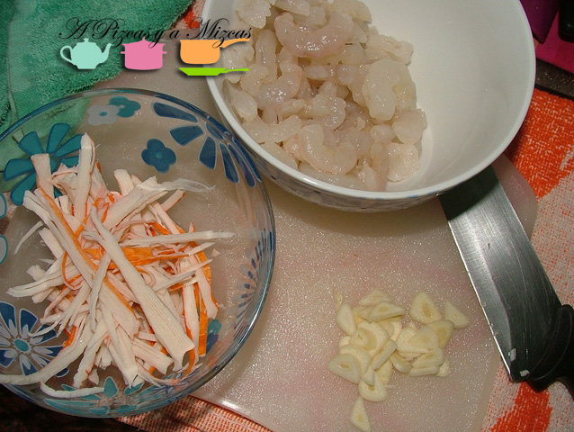
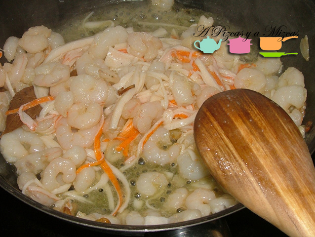
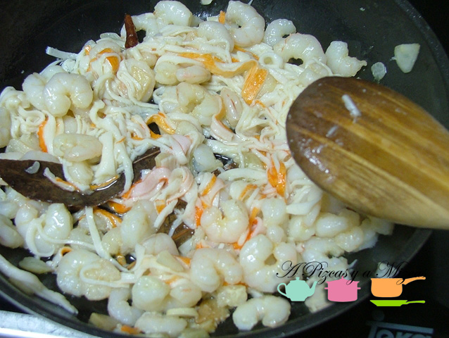
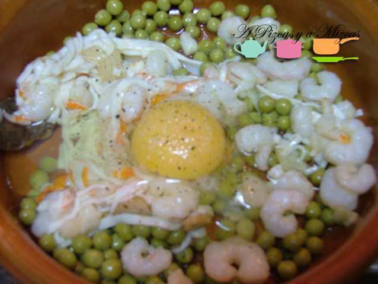
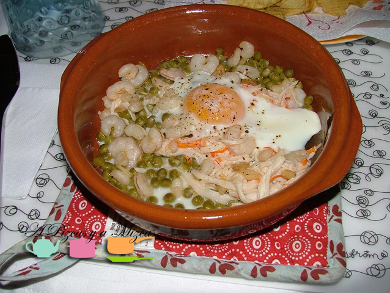

El otro día preparamos un plato que creemos que merece ser compartido. El resultado nos gustó mucho y fue una cena rápida muy agradable: unos sencillos huevos al plato con gambas y palitos de surimi. En un principio íbamos a preparar unas gambas al ajillo, pero al final cambiamos de idea con unos poquitos ingredientes más lo que hubiera sido una tapa acabó siendo un plato único perfecto.

## Ingredientes para los huevos al plato con gambas (dos raciones)

- Dos huevos grandes
- 300 gramos de gambas medianas peladas congeladas
- Tres dientes de ajo (podéis reducir la cantidad si no os gusta mucho su sabor)
- Dos guindillas
- Cuatro palitos de cangrejo (surimi)
- Un bote pequeño de guisantes
- Dos hojas de laurel
- Sal
- Pimienta
- Aceite de oliva virgen extra

En primer lugar, para preparar los huevos al plato con gambas, pelamos los ajos (les podemos quitar el germen central, para evitar que sean indigestos y que repita su sabor). Los palitos de cangrejo los cortamos en juliana.

En una sarten, calentamos unas tres cucharadas soperas de aceite de oliva virgen extra. Cuando esté fuerte, añadimos los ajos laminados y las guindillas. Dejamos que se doren los ajos e incorporamos las gambas descongeladas, el surimi y el laurel. Si no queremos que los huevos al plato con gambas queden demasiado picantes, podemos retirar las guindillas al poco de añadir las gambas.

Cuando veamos que las gambas cambian de color (muy rápidamente, pues luego irán al horno), retiramos la sartén del fuego y rectificamos de sal si fuera necesario. Ahora, en dos cazuelitas de barro de tamaño individual colocamos los guisantes y sobre ellos las "gambas al ajillo" a mitad de hacer. Cascamos un huevo en cada cazuela, salpimentamos y lo llevamos al horno que tendremos precalentado a unos 200 grados hasta que veamos que la clara está ya totalmente blanca.

Un vino riesling seco fresquito le va que ni pintado. Que aproveche!

