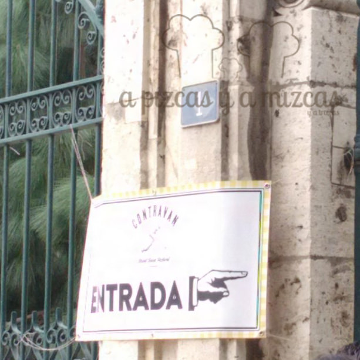
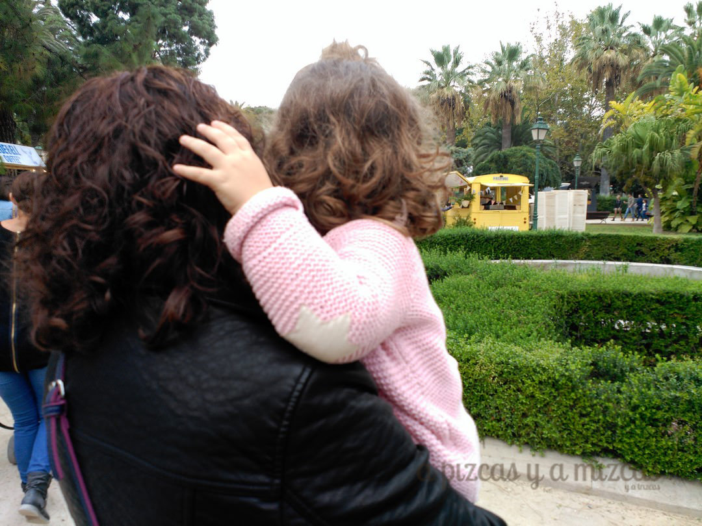
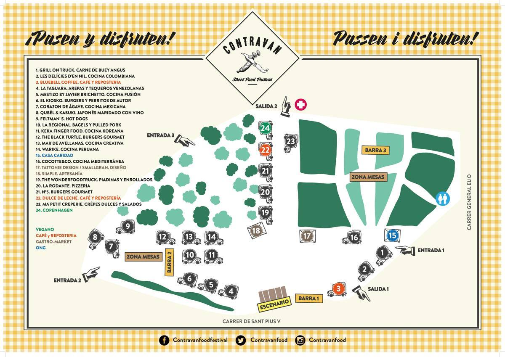
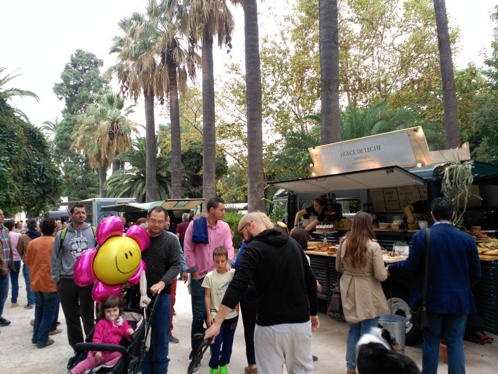

Este fin de semana ha sido un no parar... nos lo hemos pasado genial. Han sido dos días cargados de cosas molonas por hacer... y aunque hoy estemos un poco cansados... todos los findes podrían ser así. El sábado Mizcas se escapó al concierto de Hombres G y no paró de bailar y cantar.... que recuerdos! Y el domingo nos fuimos Pizcas, Trizcas y Mizcas a los Jardines de  Viveros a la II Contravan Street Food Festival. Ahora os contamos lo que probamos y lo que descubrimos....

# II Contravan Street Food Festival

Esta es la segunda edición del Contravan Street Food Festival, la primera edición fue en Las Naves el pasado mes de mayo y nosotros nos quedamos con la ganas de acudir. Esta vez se celebró en los Jardines de Viveros así que resultaba un plan perfecto para ir con los peques el domingo.

Mizcas y Trizcas preparadas.... :)

Lo primero que hicimos es dar una vueltecita y por el camino descubrir todos los Food Trucks... había mucha gente y muy buen ambiente. Nosotros como acudimos a horario infantil hicimos alguna cola, pero bastante soportable. Conforme avanzaba la mañana el recinto se llenaba y las colas más largas.

En nuestro paseo pudimos ver a los amigos de [Vino Tinto](/agradable-sopresa-en-el-restaurante-vinotinto-valencia/), [Cocotte and Co](/restaurante-cocotte-co-en-valencia/), Dulce de Leche, [Black Turtle](http://theblackturtle.es/), [La Regional](/retro-party-street-food-ruzafa/), Copenhaguen... y descubrimos otros como La Taguara, [Mar d´Avellanes](http://mardeavellanas.com/)...

Con el paseíto nos entró hambre y empezamos por compartir unos trocitos de pizza de la Pizzería La Rodante y de ahí al siguiente objetivo! Mizcas se decantó por una arepa "Sifrina" de [La Taguara-Arepería](http://www.lataguara.es/index2.html). Una arepa rellena de queso y una mezcla de aguacate y pollo que estaba muy bueno. Y Pizcas eligió del food truck de Vino Tinto un enrollado "varoufakis"  con salmón.

Nuestros amigos se decidieron por probar una hamburguesa de buey de Mestizo by [Javier Brichetto](http://www.jbrichetto.com/) (el ganador del programa de televisión española [Cocineros al Volante](http://www.rtve.es/television/cocineros-al-volante/)) y también se atrevieron con la cocina koreana de Keka Finger Food

Y en el primer paseo ya habíamos fichado el postre en el puesto de [Dulce de Leche](/el-brunch-de-dulce-de-leche-en-ruzafa/)... y allí que nos fuímos a hacer cola. Y ante el escaparate de tantas cosas buenas.... nos costó decidir. Al final cogimos un rollito de canela, strudel de manzana con pepitas de chocolate, milhojas de dulce de leche y brownie de chocolate.... casi nada... ji ji ji

Haciendo cola en el food truck de Dulce de Leche

Nos lo pasamos muy bien y disfrutamos de un día distinto. A esperar la siguiente edición del contravan street food.
