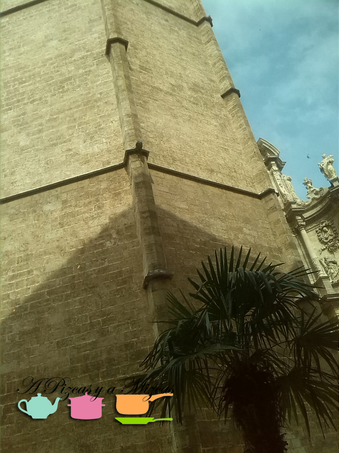

La semana pasada Pizcas tenía una reunión de trabajo por el centro y aprovechamos para comer por ahí. Desde fallas habíamos pasado un montón de veces por los pies del Miguelete y ya nos había llamado la atención [Il Ristorantino](https://www.facebook.com/pages/Ristorantino-Valencia/647321935314966?fref=ts "Facebook Ristorantino")... Un italiano muy coqueto, pequeñín y con una imagen bastente cuidada, así que no lo pensamos dos veces y nos fuimos ahí directos.

Il Ristorantino está en pleno centro de Valencia, como hemos dicho antes, a los pies del Miguelete. Concretamente en la Calle Bordadores, 10.

## Nuestra comida en Il Ristorantino

Antes de nada tenemos que decir que llegamos un pelín tarde, el trabajo a veces no entiende de horarios. A pesar de eso no hubo ningún problema, nos atendieron, pasadas las tres de la tarde, perfectamente. Fuimos con Trizcas que estuvo andando de un lado a otro del salón... je je je

Después de ojear la carta, decidimos probar el menú. Pizcas decidió probar la scamorza al horno y Mizcas la ensalada griega para empezar.

De plato principal Mizcas se decantó por la parmigiana al horno y Pizcas eligió los chitarrine al ragú. Ambos platos riquísimos y con ese toque especial casero de la mamma italiana

Y de postre... no nos podíamos ir sin probar el tiramisú... y la verdad que no nos defraudó... mmmmmmm riquísimo.

Sólo podemos recomendar Il Ristorantino, el servicio impecable y la comida buenísima. Ya estamos deseando volver!

Nos pareció uno de esos locales con encanto en lo que te sientes casi casi como en casa. Además, comer a los pies del Miguelete es inmejorable!
