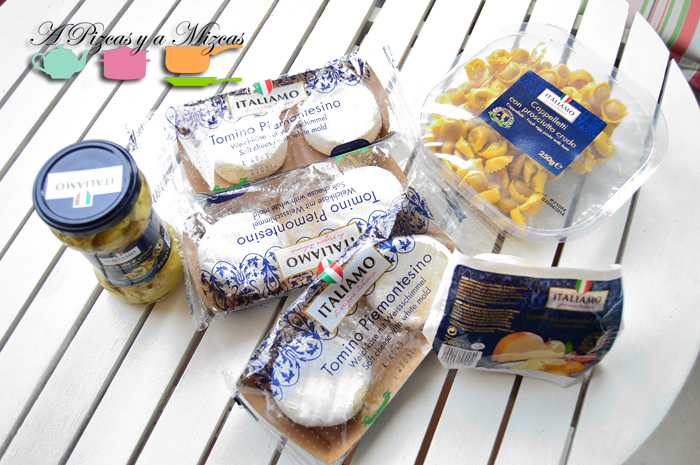
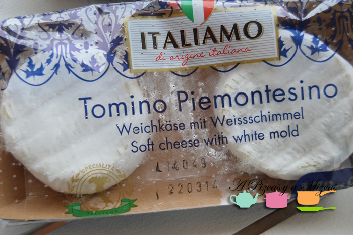
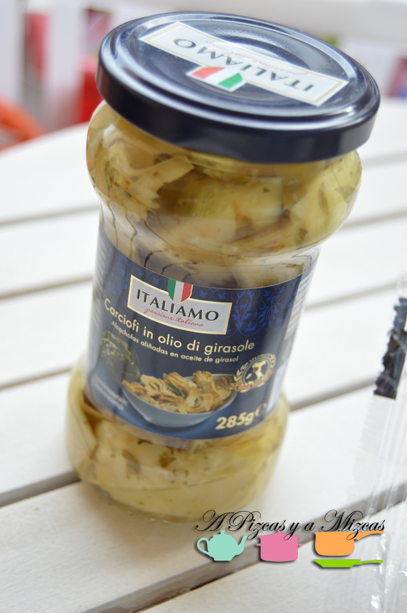
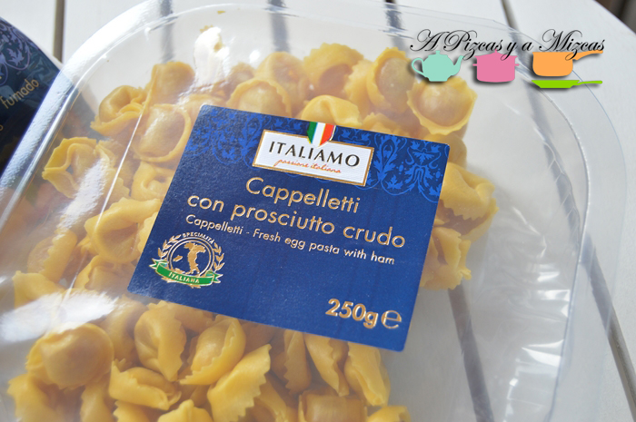
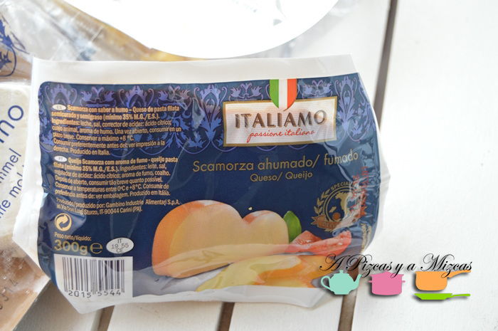

No nos podemos resistir. Es ver el catálogo del [Lidl](http://www.lidl.es/cps/rde/www_lidl_es/hs.xsl/index.htm) la promoción "Sabores de Italia" y sales corriendo a comprar cosas riquísimas. Esta semana nos hemos "aprovisionado" de [Italia en Lidl](http://www.lidl.es/cps/rde/SID-AEC5E10E-D4F62B5D/www_lidl_es/hs.xsl/Promociones.htm?id=137) os presentamos nuestra compra.

## Nuestra compra de Italia en Lidl

Lo primero que nos sorprendió fue ver los tominos piamontesinos. Nosotros hemos cargado con varios paquetes y aunque no sabemos si es muy ortodoxo los que no nos comamos en breve los congelaremos. Siguiendo con los quesos compramos una pieza de scamorza. Está bastante rico con un sabor ahumado bastante intenso, mejora mucho al dejarlo airearse unos minutos, es mejor no comerlo recién sacado de su envase.

En nuestra cesta también se coló un bote de alcachofas en aceite, aún no las hemos probado pero la pinta que tienen es bastante buena. Y en este viaje a Italia al Lidl lo último que cogimos fue un paquete de pasta rellena de jamón. A ver si se nos ocurre alguna salsa rica casera para acompañar la pasta. Ya os contamos.

¿Cuáles han sido vuestras compras de Italia en Lidl?
