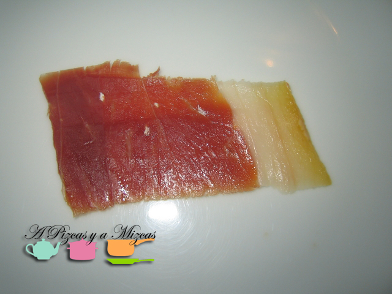
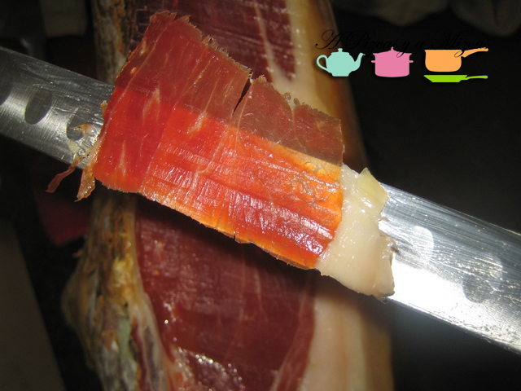
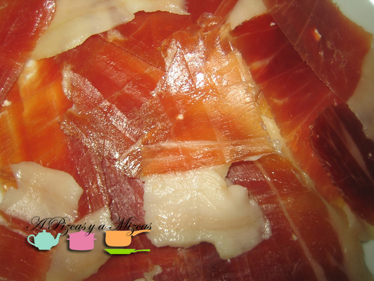
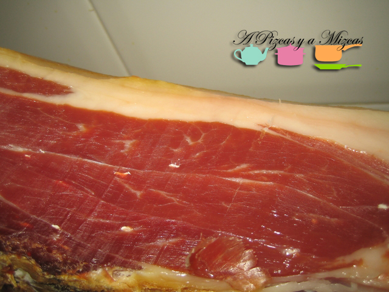

El jamón es exquisito, ¿no creéis? Seguro que si se tratara de un alimento francés, o italiano, sería inasequible, pero tenemos la ventaja de que jamón en España hay, y mucho. Además, existen calidades y tipologías de jamón serrano infinitas. En la cocina de A Pizcas y A Mizcas intentamos que no falte. Hasta ahora preferíamos, por comodidad, que nos lo cortaran en la charcutería, pero últimamente nos hemos animado a comprar jamones enteros y a practicar el arte del corte. Nosotros nos proveemos siempre en [Charcutería Casa Rodríguez](https://www.facebook.com/CharcuteriaCasaRodriguez?ref=tn_tnmn), en el barrio de Benimaclet (Valencia).

Pedro nos explicó, brevemente cómo empezar un jamón para consumo doméstico (nos durará bastante el jamón). Os lo resumimos en este video.

## Cómo empezar un jamón

http://www.youtube.com/watch?v=Jo5g2i2nECU&feature=youtu.be

Una de las claves es tener un buen cuchillo jamonero (solo para las lonchas) y luego otro cuchillo bien afilado para retirar las partes del jamón que no nos interesen (corteza, parte del tocino), así como para hacer incisiones en los huesos y permitir que las lonchas del jamón salgan fácilmente.

A nosotros cortar jamón nos relaja, es como tocar el violín y es un arte, lo más parecido a ser samuráis en el siglo XXI.

