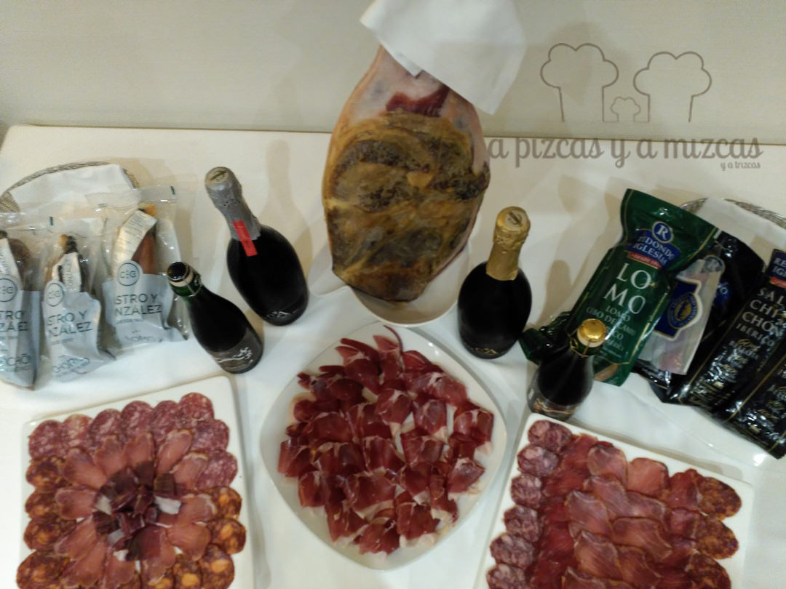
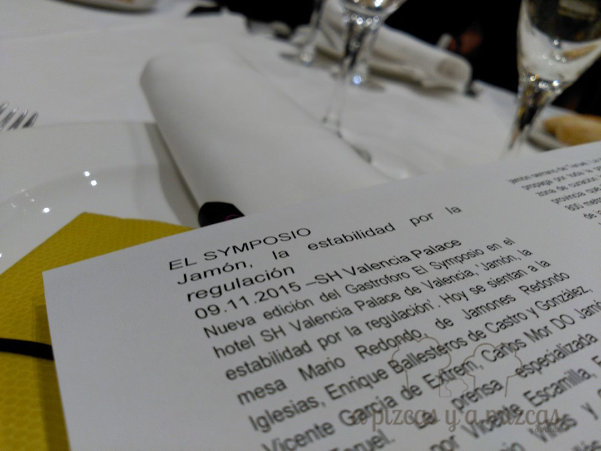
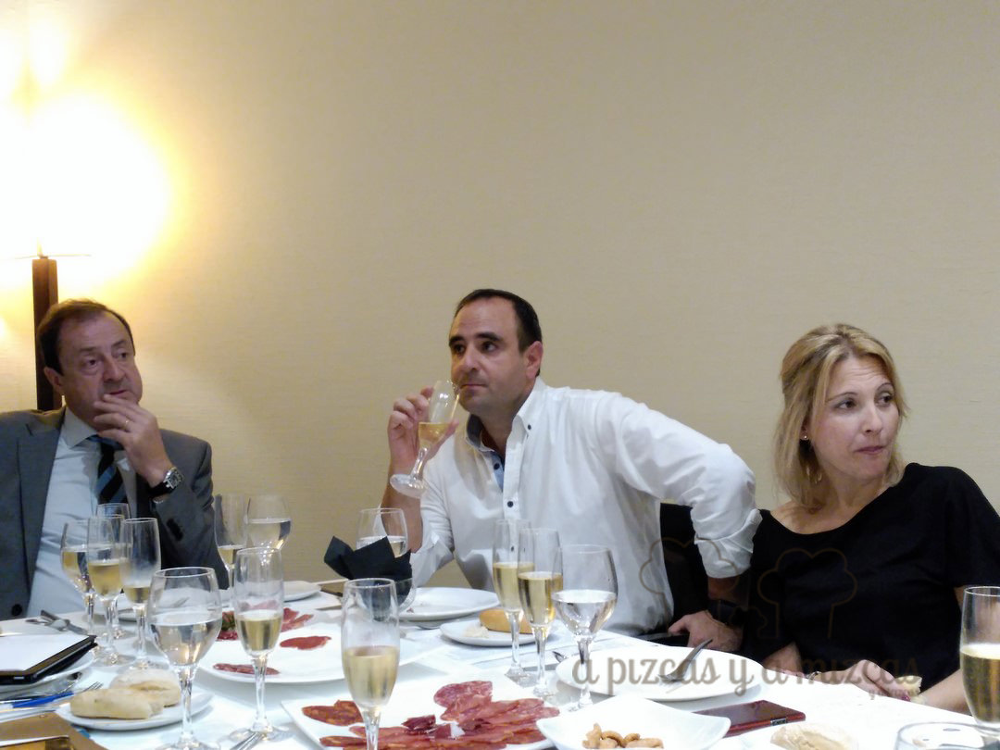
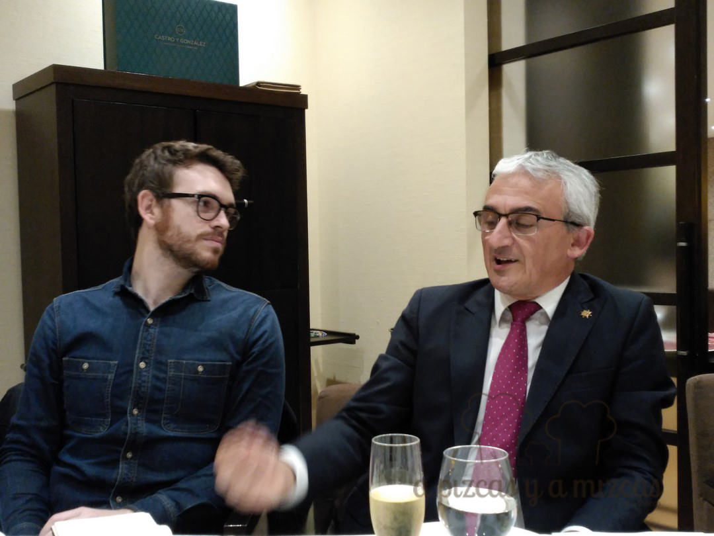
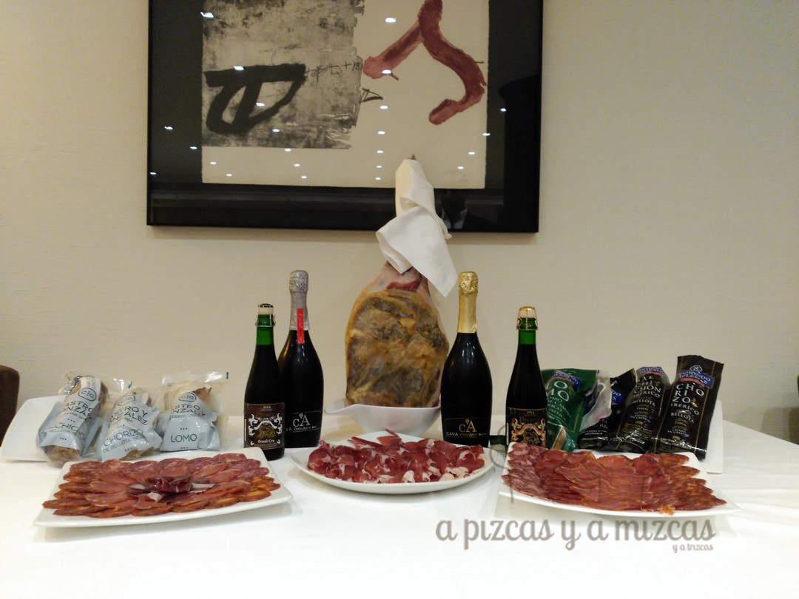

Jamón, quo vadis? (¿adónde vas?) Así podríamos resumir el objetivo del debate que se vivió en la última edición del gastroforo El Symposio, celebrado el pasado 9 de noviembre como siempre en el [SH Valencia Palace](http://www.hotel-valencia-palace.com/es/index.html). El jamón, tanto de cerdo blanco, como el ibérico, las ha pasado “canutas” con la crisis y algunos destacados operadores nos contaron cómo les ha afectado la situación vivida en los últimos años, en la que parece que empieza a verse la luz. Sigue leyendo y siéntate con nosotros en la mesa de El Symposio “Jamón, la estabilidad por la regulación”.

Vaya por delante nuestro agradecimiento por poder participar en El Symposio, un gastroforo organizado por el hotel [SH Valencia Palace](http://www.hotel-valencia-palace.com/es/index.html) y convocado por el periodista Chema Ferrer, de [Las Provincias](http://www.lasprovincias.es/). En esta ocasión compartimos mesa, debate y buenas viandas con Mario Redondo, de [Jamones Redondo Iglesias](http://www.redondoiglesias.com/); Enrique Ballesteros, de [Castro y González](http://castroygonzalez.es/); Carlos Mor, presidente del C.R.D.O. Jamón de Teruel; los periodistas Emili Piera, Silvia Soria y Eugenio Viñas. Estaba invitada también la firma Extrem, pero su silla quedó vacante. Presidieron la mesa Javier Vallés y el chef Alejandro del Toro.

El jamón es uno de los productos enseña de la gastronomía española, pero quedó patente que, como en muchos otros alimentos de los que somos potencia mundial (como el vino o el aceite de oliva), el consumidor no tiene una cultura suficiente. Por tanto, la vinculación entre el consumo y el precio de venta es muy fuerte, pasando por encima en ocasiones de valores como la calidad.

Durante la crisis económica, el sector del jamón vivió situaciones tan kafkianas como que en los lineales de la gran distribución jamones ibéricos presentaran precios similares a los de jamones de cerdo blanco. Muchos productores se hundieron y desaparecieron, pero, como suele suceder, lo que no te mata te hace más fuerte y prueba de ello son los casos de Jamones Redondo Iglesias y de Castro y González. En su opinión, esos precios “low cost” de productos de gran calidad sirvieron para “democratizar” el jamón ibérico y que mucha gente que nunca lo había probado lo conociera. Parece que la situación se va normalizando y los precios vuelven a ser un buen indicador de calidad.

El jamón ibérico también ha visto como ha entrado en vigor una nueva normativa, precisamente con el objetivo de evitar la confusión al consumidor (veremos si lo consiguen). Así, la etiqueta debe incluir la denominación de venta del producto, reduciendo a tres designaciones (según la alimentación del animal) de bellota, de cebo de campo y de cebo (desaparece el recebo). Además el etiquetado debe indicar el porcentaje de ciento de raza ibérica, cuando se trate de animales 100% ibérico, y en lugar destacado de la misma en los demás casos. Uno de los aspectos más llamativos es el código de colores, así se reserva el negro, para el jamón de bellota 100% ibérico (jamones de cerdos 100% Ibéricos criados en libertad en las dehesas y alimentados durante su última fase de engorde de pastos naturales, hierbas aromáticas y bellotas). El distintivo rojo queda para el jamón de bellota ibérico (jamones que no son 100% ibéricos, criados en dehesa y alimentados durante su última fase de engorde de pastos naturales, hierbas aromáticas y bellotas). La etiqueta verde identifica al jamón de cebo de campo ibérico (de cerdos que no son 100% ibéricos, criados en libertad en las dehesas y alimentados de pastos naturales, hierbas aromáticas y piensos). El color blanco es para el jamón de cebo ibérico (jamones que no son 100% ibéricos, alimentado con piensos y criados en establos). Los productos identificados con los colores rojo, verde y blanco, la etiqueta deberá indicar el porcentaje de raza ibérica (siempre al menos un 50%).

Pero no solo hablamos de jamón ibérico en El Symposio. Carlos Mor, de Jamón de Teruel, demostró que en esta D.O. se está viviendo una auténtica “revolución” tanto en materia administrativa, como de trazabilidad. Habrá que seguirle la pista.

En resumen, tres modelos con la calidad como referente. Por un lado Redondo Iglesias, en defensa de un estricto cumplimiento de la reglamentación y el valor de la marca propia; Castro y González, apuesta por la marca propia como primera garantía; y la D.O. Jamón de Teruel, por la trazabilidad incluso en manos del consumidor final.

Al margen de las palabras, el condumio fue interesante:

- Cortezones de ibérico
- Pinchos de melón con jamón
- Chacinas y jamones de los productores presentes
- Consomé de jamón
- Pincho de jamón con dátil y almendra
- Royal de alcachofa con huevo poché y crujiente de jamón

Para acompañar los primeros platos, el cava demostró que marida a la perfección con ellos. Se sirvieron los cavas Coto de Arcís Brut Especial y Coto de Arcís Brut Nature, ambos de [Bodegas Sebirán](http://sebiran.es/). El primero se conjugaba genial con los pinchos, mientras que el Brut Nature, a nuestro juicio, hizo mejor pareja de baile con el jamón comido “a dedo” y con el consomé. Para el plato principal se optó por las cervezas belgas de barrica Prearis, de [VLC on Tap](https://www.facebook.com/vlcontap), una trabajada con barrica de bourbon y otra de cognac. Exquisitas ambas.

