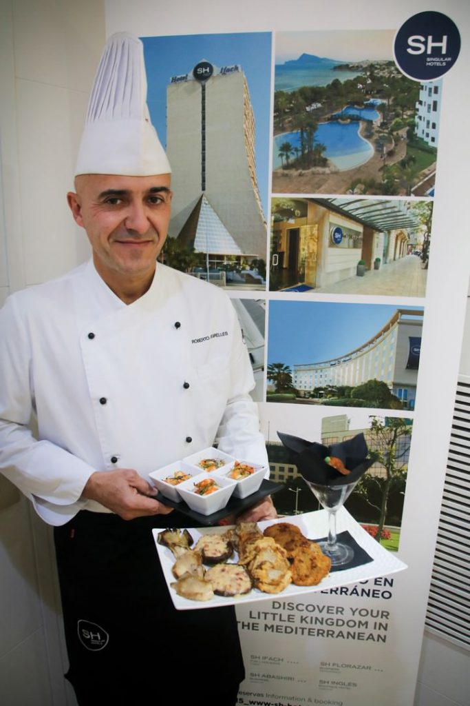

Las setas son los frutos por excelencia del otoño, con su sabor inconfundible y su profundidad. En cocina representan uno de los ingredientes más versátiles, con infinidad de matices, texturas y posibilidades. Hasta el próximo 18 de noviembre, el Restaurante Le Marquis, del hotel SH Inglés Boutique, de Valencia (justo enfrente del hermoso Palacio del Marqués de Dos Aguas) celebra sus segundas Jornadas Gastronómicas, iniciativa del Grupo SH Hoteles. Además, cuentan con el apoyo de la Sociedad Micológica Valenciana (Somival), que ha trabajado codo con codo con el chef Roberto Segrelles. El resultado es un menú impresionante a un precio increíble.

## Las setas combinan mejor en otoño en el Restaurante Le Marquis

A través de un menú degustación muy especial con las setas como estrella, el pasado 8 de noviembre pudimos conocer un verdadero abanico de aromas y texturas para el paladar. Es un menú bastante largo, que se ofrece a un precio de 19 euros (IVA incluido), más las bebidas.

Roberto Segrelles propone, para el centro de la mesa, como entrantes:

- Setas ostra a la parrilla con polvo de ajo y aceite de oliva
- Seta ostra gabardina con virutas de jamón
- Ostra rellena con parmesano
- Seta Shitake gratinada
- Pastel de mix de setas
- Croquetas de hongos con crema pomodoro
- Salteado de seta Eryngii con langostinos al cebollino

Luego, cada comensal puede elegir un plato principal de entre:

- Rissoto de hongos con seta Eryngii y Shiitake al fumet de gamba roja
- Canelones de setas de cardo con champiñón laminado, carrillera a la antigua y parmesano
- Setas Enoki con tofu de caldo y mejillones
- Salteado de láminas de secreto ibérico con rebollones y ajetes tiernos
- Bacalao a baja temperatura con hummus de setas mixtas y juliana de champiñón
- Fideo meloso de Shiitake, Eryngii y Enoki con mix de verduras

Las setas en el menú del Restaurante Marquis están hasta en el postre, con un falso bizcocho de chocolate relleno de mix de setas caramelizadas y crema de arroz con leche.

Roberto Segrelles ha conseguido homenajear a las setas, dando a conocer sus propiedades, atendiendo a las recomendaciones de la Sociedad Micológica, divulgando sus virtudes y beneficios más importantes, apostando por la elaboración de un menú sencillo, a la vez que muy completo nutricionalmente y con los sabores de siempre impresos en cada uno de sus platos.

Si te gustan las setas, no lo puedes dejar escapar.

