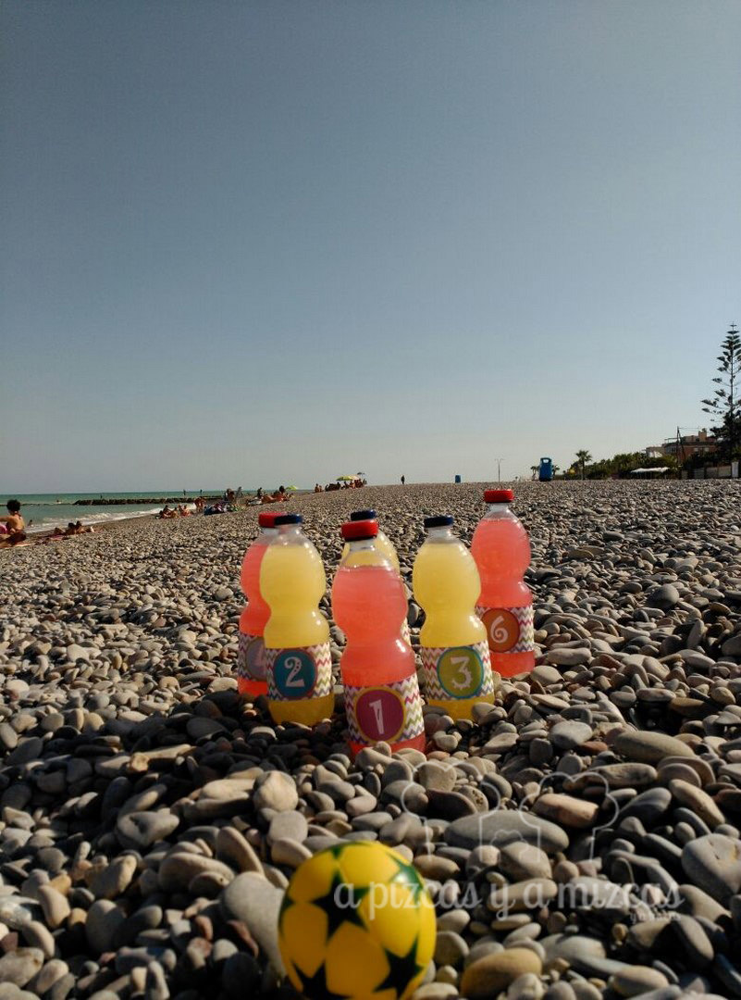
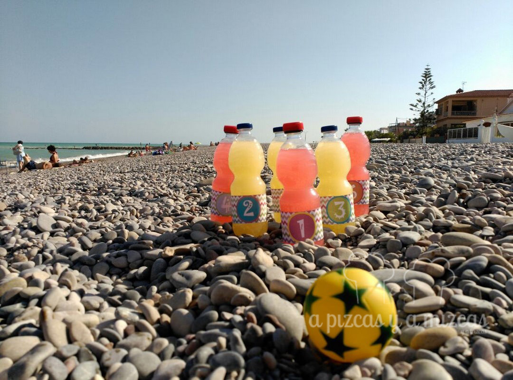

Hola pizqueros! Os presentamos hoy un "briconsejo" para poder preparar una partida de juego de bolos en la playa, o dónde queráis, de la forma más sencilla imaginable. ¿Cómo? Con unos elementos muy sencillos, que nosotros hemos decorado un poquitín para que a Trizcas le gusten más. Veréis qué sencillo.

## Materiales para el juego de bolos

- Botellines de 1/2 litro de agua o similar (nosotros empleamos seis, pero si queréis hacerlo profesional, podéis utilizar 11)
- Etiquetas impresas (una por "bolo")
- Una pelota con cierto peso
- Ganas de jugar sin complejo

La idea es que los botellines de agua hagan las veces de bolos. Para eso y para dotar de peso a nuestro juego de bolos, debemos rellenarlos. Podéis dejarlos llenos de agua, pero hay otras alternativas: arena de playa, sal coloreada con polvo de tiza, agua coloreada con colorante...

Para que el juego de bolos tuviera más vida, medimos las etiquetas originales de las botellas y preparamos unos diseños súper coloridos y númerados, pero aquí también vuestra imaginación tiene innumerables alternativas: pintar toda la botella con pintura acrílica, dejar que los peques pinten las etiquetas, presentarlos sin etiquetas...

Empieza el juego!

Ya tenemos el juego de bolos listo, sólo nos queda una pelota de con un cierto peso para que sea capaz de tumbar los bolos, eso sí, si la puntería nos acompaña, je, je, je

El verano es para pasarlo bien!
