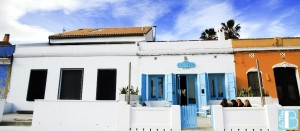
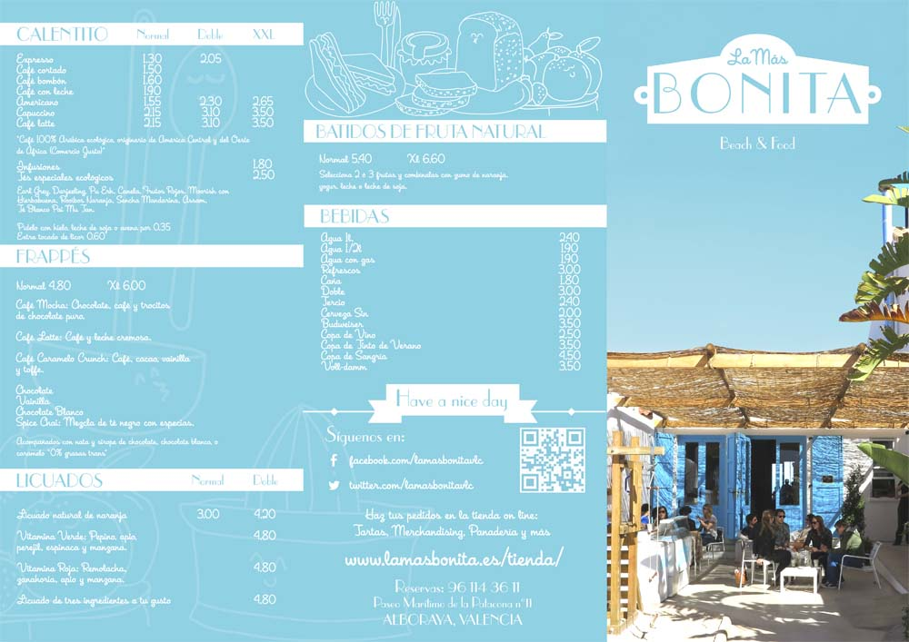
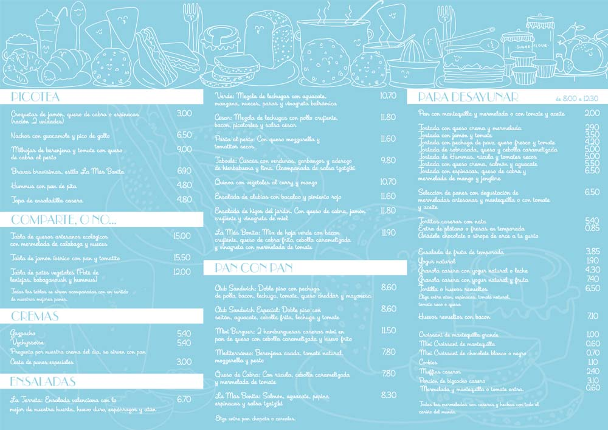
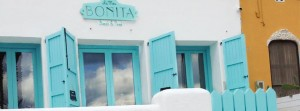

Este verano hemos descubierto un pedacito de paraíso muy cerquita de casa. Se trata de '[La más bonita](http://www.lamasbonita.es/ "La más bonita")', en el paseo marítimo de la playa de la Patacona (Alboraya, Valencia). Es como si un trocito de Formentera se hubiera descolgado de la isla y las mareas lo hubieran arrastrado hasta Valencia. Aunque dicen que sus desayunos son de fábula (volveremos para contaroslo), nosotros fuimos para cenar y quedamos muy satisfechos. Sin duda, es 'La más bonita', solo hace falta ver su decoración, totalmente inspirada en los clásicos mediterráneos, con tonos en blanco y azulón. Todo super cuidado, detalles encantadores y una carta sencilla, pero bien resuelta.

## La más bonita

A continuación os contamos algunas cosas de este establecimiento, que ya esta de moda en Valencia y alrededores. En [este enlace podéis hacer una visita virtual](https://maps.google.es/maps?q=LA+MAS+BONITA%2C+Alboraya&hl=es&ll=39.485164%2C-0.324955&spn=0.037692%2C0.092955&sll=39.407785%2C-0.361511&sspn=0.60375%2C1.487274&oq=LA+MAS+BONI&t=h&hq=LA+MAS+BONITA%2C&hnear=Alboraya%2C+Valencia%2C+Comunidad+Valenciana&z=15&layer=c&cbll=39.485173%2C-0.325121&panoid=o6l8bzjl4iUy6ulbAIAYyw&cbp=12%2C276.15%2C%2C0%2C4.82 "Visita virtual a La más bonita") del local. ¿A que es una pasada? A nosotros nos encantó.

Reservamos por teléfono (961 143 611) apenas unas horas antes de cenar, pues fue "pensat i fet", como decimos en Valencia. Íbamos con Trizcas y, por tanto, con su carricoche. Pero no hubo problema. Eso sí, ya no quedaban mesas libres en las terrazas (disponen de dos, una exterior que da a la playa; y otra interior que es mucho más "cuqi"). Nos reservaron una mesa en el interior y no estuvimos mal, pues no era una noche excesivamente calurosa.

Si venís desde la playa de las Arenas de Valencia, es de los primeros locales que ya pertenecen a Alboraya (Paseo Marítimo de la Patacona, n 11) (seguid el paseo de las Arenas hacia el sur y os deslumbrará su encanto).

En el interior los espacios entre mesas de 'La más bonita' no son excesivamente amplios, cosa que mejora en las terrazas, pero es el "precio" que hay que pagar. Pizcas se sentó en el sofá y no era demasiado cómodo, pero con ayuda de unos cojines se solucionó.

Como hemos dicho la carta de 'La más bonita' no es nada pretenciosa, pero ahí está la gracia. Está muy bien resuelta, sin alardes gastronómicos, pero todo correcto y servido en un tiempo perfecto.

Nosotros hicimos el siguiente pedido en 'La más bonita':

- Nach0s con guacamole y pico de gallo
- Bravas bravísimas estilo La más bontia
- Bocadillo: La más bonita salmón, aguacate, pepino, espiacas y salsa tzatziki
- Bocadillo: Queso de cabra con rúcula, cebolla caramelizada y mermelada de tomate
- Postre: Tarta cheesecake

En total, con las bebidas que consumimos, la cuenta subió a 40 euros.

Los nachos no eran caseros, pero las salsas sí, al menos lo parecían. El pico de gallo estaba muy rico y la cantidad es abundante.

Las patatas bravas, correctas. Bravísimas, eso sí. No esperéis patatas con mayonesa, estas pican.

Los bocadillos muy ricos. Combinaciones muy acertadas de sabores y un buen pan.

Lo mejor, la tarta. Nos decidimos por esta, pero todas tenían una pinta fantástica.

Ya estamos pensando cuando volvemos a 'La más bonita'. Para la próxima visita pretendemos que sea en horario de desayuno, para probar todas las cosas dulces que vimos.

Nota: Las imágenes que hemos empleado en esta entrada corresponden a la página web de La más bonita (www.lamasbonita.es) y a su cuenta de Facebook (facebook.com/lamasbonitavlc)
