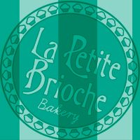
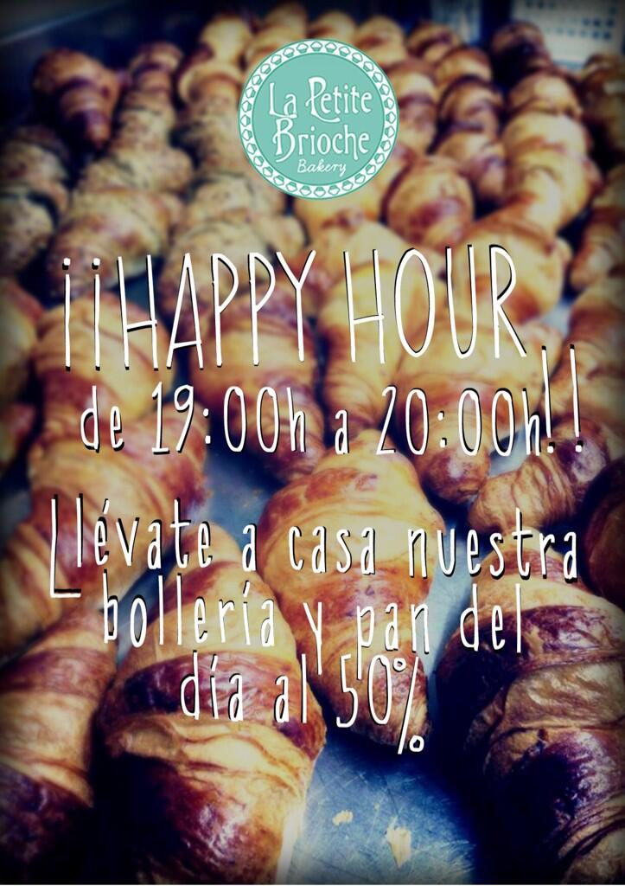
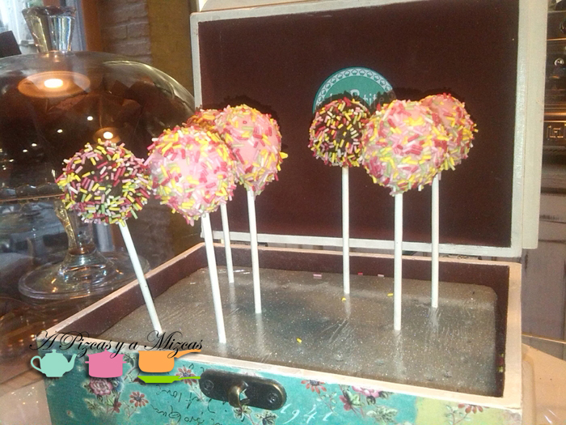
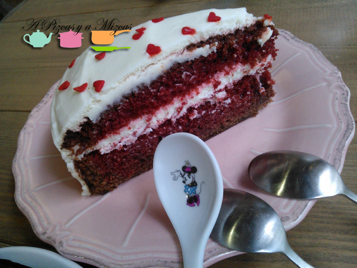
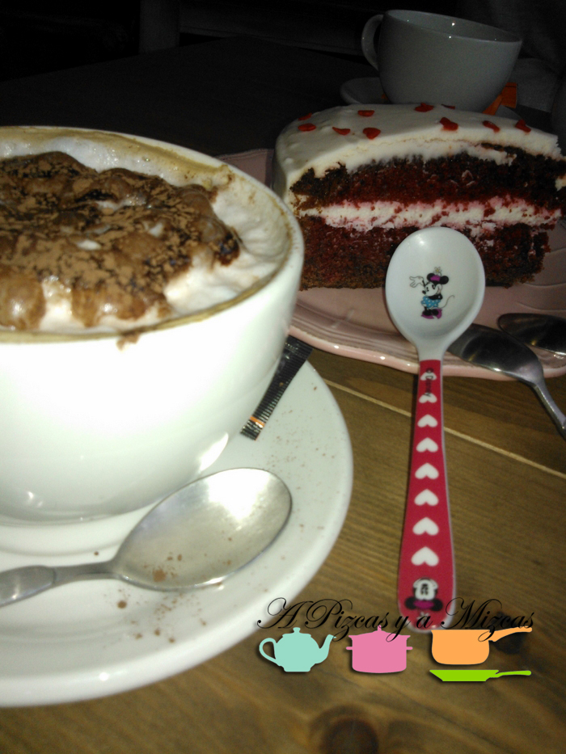

Ya sabéis que nos encanta descubrir sitios nuevos... y ultimamente no paramos de encontrar sitios chulísimos para merendar. Cuando vas con peques seres la hora de la merienda es sagrada así que poco a poco nos vamos conociendo los locales con más encanto de Valencia... mientras Trizcas merienda... nosotros disfrutamos de unas tartas riquísimas.

Uno de los últimos locales que hemos descubierto es La Petite Brioche... en cuanto te acercas a la barra y diriges la mirada hacia la derecha... ya estás perdido!!.

Situado en pleno centro de Valencia en la calle Sorní, 28. Abren todos los días. Entre semana de 8 de la mañana a 20:00. Y los sábados y domingos de 9:00 a 14:00 y de 17:00 a 20:00. Además de 19:00 a 20:00 puedes aprovechar su "happy hour" toda la bollería y pan del día al 50% de descuento.

Puedes ver todas las noticias sobre la Petite Brioche en su página de [facebook](https://www.facebook.com/LaPetiteBrioche "Facebook La Petite Brioche") y de t[witter](https://twitter.com/LaPetiteBrioche "Twitter La Petite Brioche")

## Nuestra merienda en la Petite Brioche

El local es pequeñito pero muy acogedor con una decoración que recuerda a un establecimiento americano de los años 50 o 60 con las paredes de madera. Con gran variedad de tartas y pastelitos  dulces... y un amplio surtido de quiches saladas.

Nosotros, como era la hora de la merienda, decidimos compartir la famosa tarta red velvet. Mizcas la acompañó con un té verde y Pizcas con un capuccino. Hasta Trizcas metió su cuchara en la tarta para probarla... no quedó ni una miguita.

Nos hemos quedado encantados con la Petite Brioche... ya estamos buscando hueco para repetir!
