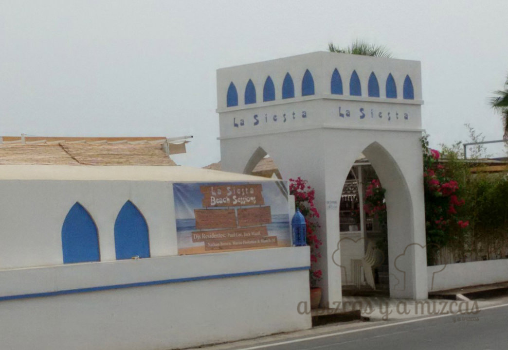
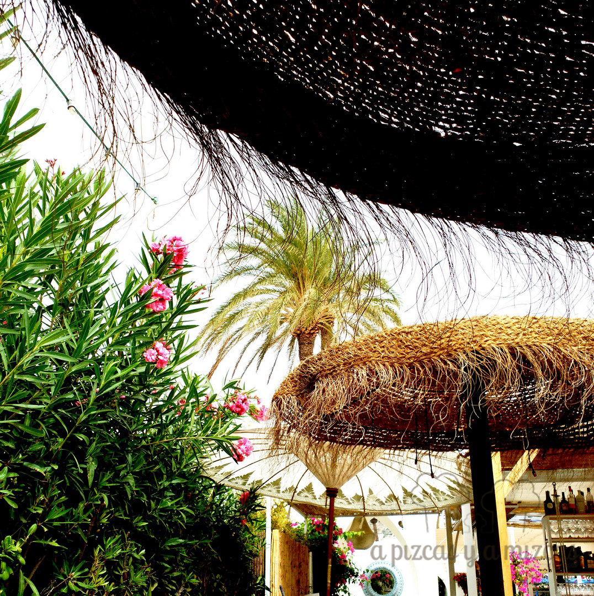
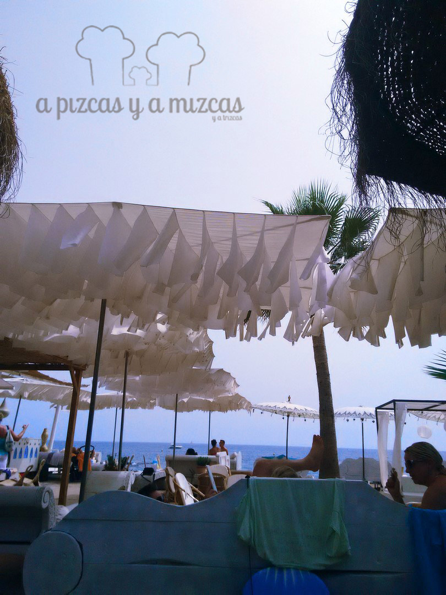
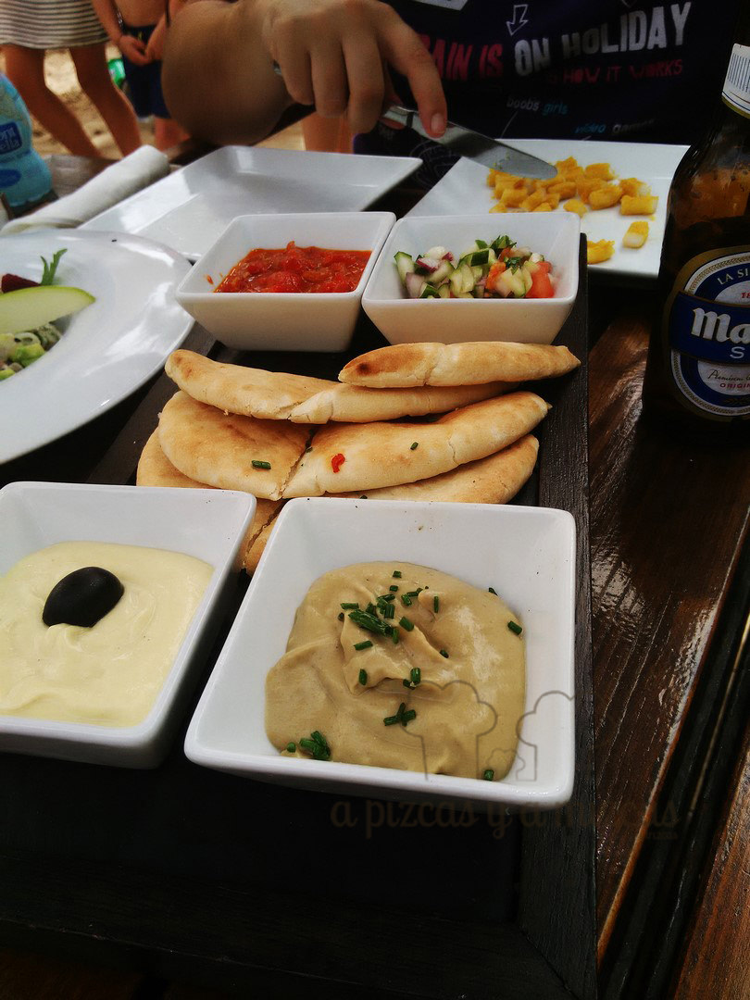
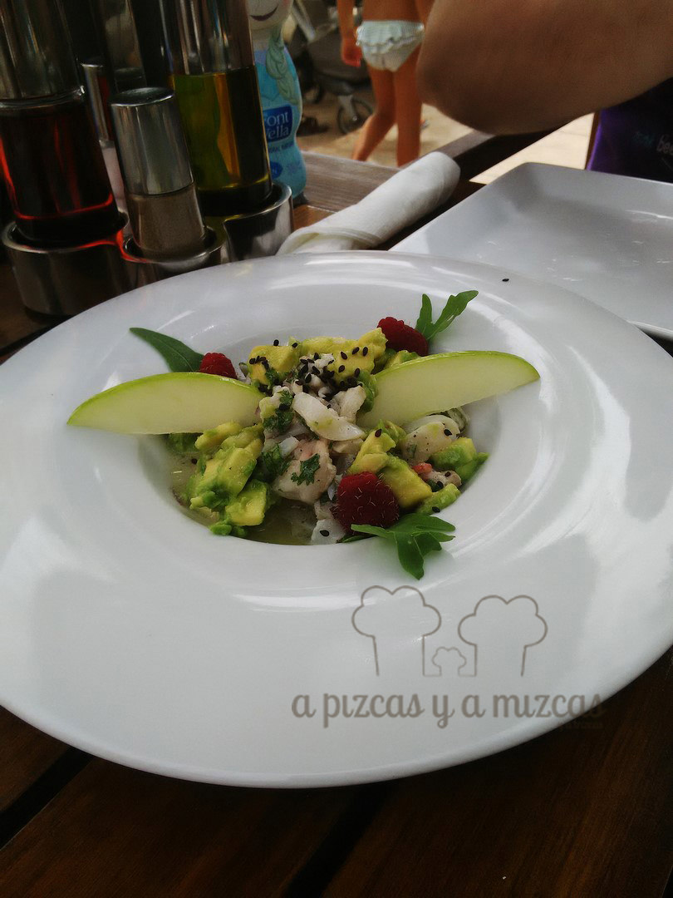
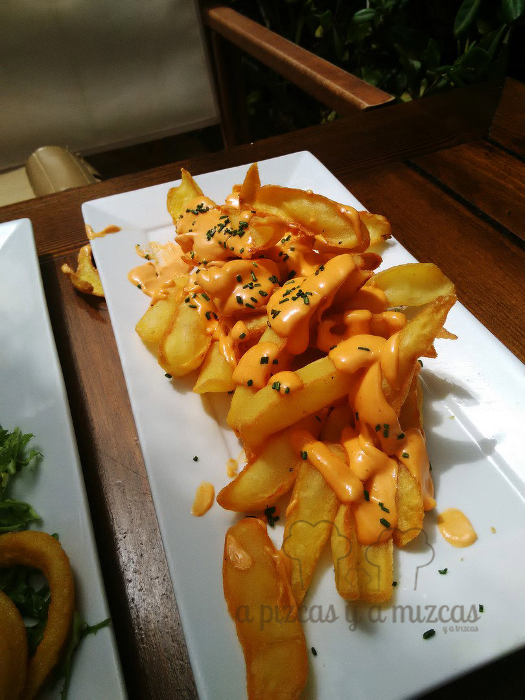
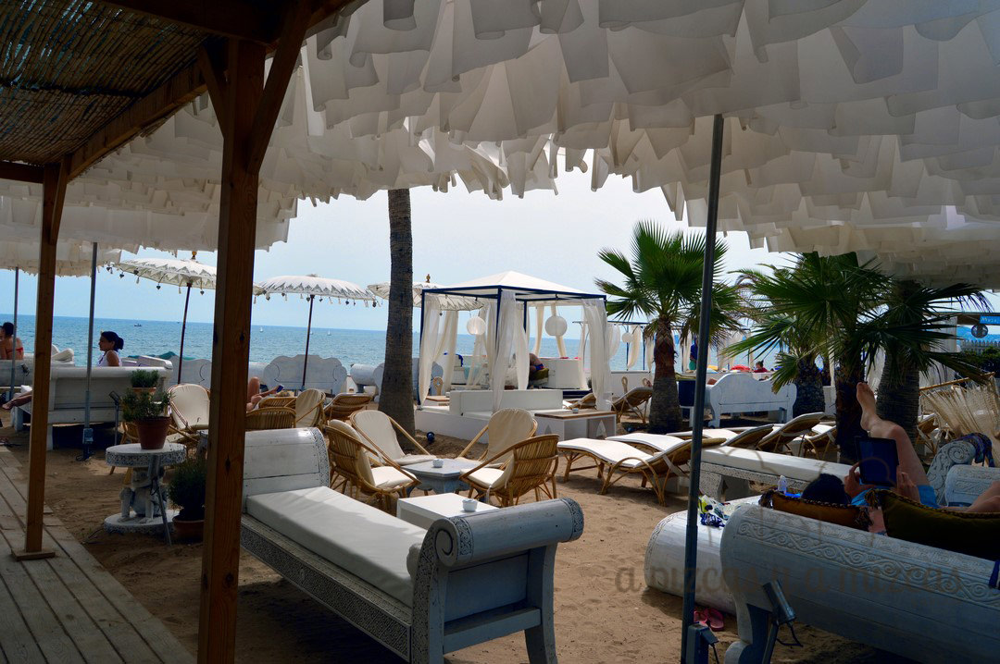

Este año las vacaciones las hemos pasado por la Costa Blanca, en otro post os haremos un resumen de los días de nuestras vacaciones... así de paso recordamos todos los buenos momentos vividos... ohhh. Una de las primeras paradas de nuestros vacaciones fue en Jávea y uno de los sitios que nos gustó fue [La Siesta](http://www.siestajavea.com/). Un paraíso que está muy cerquita y al que ya estamos pensando cuándo escaparnos...

Llegamos a La Siesta Jávea a la hora del almuerzo y buscamos una sombrita y encantados nos quedamos allí un rato. Situado en la playa en la Avenida Mediterráneo, 27, Jávea. Justo en la playa Primer Muntanyar o Benissero es una playa semiurbana y abierta de grava y roca que se extiende desde la desembocadura del río Gorgos hasta la playa del Arenal.

Y en nuestra opinión es "EL CHIRINGUITO DEL VERANO" al lado del mar, con hamacas, sombrillas y camas estilo balinés. Con buen ambiente en el que puedes comer , tomar el sol o tomarte un cocktail en la zona chill - out ... todo está pensado para disfrutar del momento y desconectar!

A la sombra mejor

Vistas espectaculares

## Nuestra valoración de La Siesta Jávea

- **Comida**: ⭐⭐⭐
- **Local**: ⭐⭐⭐⭐⭐
- **Servicio**: ⭐⭐⭐

Para ser un chiringuito de playa la comida es correcta. Nosotros pedimos para compartir:

\- Aperitivos libaneses. Hummus, crema de berenjenas, pico de gallo y una especie de pisto. Acompañado de pan de pita calentito.

\- Ceviche de calamar, lubina y gambas, manzana verde y frambuesa.

\- Calamar a la plancha

\- Patatas  bravas

Y así empezamos nuestras vacaciones... ohhh... qué buenos recuerdos, nos iríamos ahora mismo, menos mal que está cerquita y podemos acercarnos en cualquier momento.

Relaxxx

Repetiremos pronto! Ha sido uno de los descubrimientos del verano.
