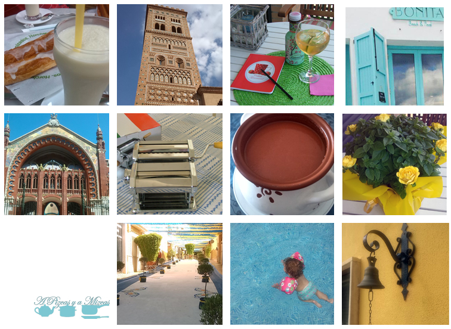

Hemos estado toda la tarde afilando [lapiceros](http://www.staedtler.es/es/la-empresa/tradicion-e-innovacion/el-lapiz/ "Lápiz, esencial para la vuelta al cole"), preparando los cuadernos, buscando la goma [Milan Nata](http://www.milan.es/es/default.aspx?ACCIO=PORTALENC&NIVELL=6579D32CB08575F9FCF4AE36493CC854995DB4A2CB1DA74397AFC26AFAC29C6E581A0509D52F2F8B "La goma Milan Nata, para la vuelta al cole") nueva, que al final no ha aparecido, ni siquiera en nuestro [plumier](http://www.google.es/imgres?um=1&client=firefox-a&sa=N&rls=org.mozilla:es-ES:official&hl=es&biw=1525&bih=716&tbm=isch&tbnid=8q0-ip08c-Uj_M:&imgrefurl=http://www.todocoleccion.net/plumier-estuche-escolar-pinocho-sin-usar-ver-fotos-anos-80~x35674419&docid=z7Htlm8i7AmgDM&imgurl=http://pictures2.todocoleccion.net/tc/2013/01/22/35674419.jpg&w=550&h=410&ei=1twqUr3cMOmu0AXA7YD4Dg&zoom=1&ved=1t:3588,r:10,s:0,i:112&iact=rc&page=1&tbnh=180&tbnw=236&start=0&ndsp=18&tx=73&ty=40 "Nuestro plumier de la vuelta al cole pasada") del curso pasado. Tenemos todos los síntomas, estamos, de lleno, en la vuelta al cole. Es una sensación compleja. Por un lado, todavía tenemos muy vivos los recuerdos de las vacaciones. Además, el verano aún nos está ofreciendo momentos muy agradables. Por el otro, arrancamos el nuevo curso de A Pizcas y A Mizcas (y Trizcas...) con mucha ilusión, ideas, recetas pendientes de publicar y, sobre todo, ganas de compartirlo con vosotros. Así que ya sabéis, todos de vuelta al cole, que pasamos lista.

## La vuelta al cole de A Pizcas y A Mizcas

La horchata ha sido una constante este verano y, ¿por qué no va a seguir siéndolo estos meses? Tenemos la suerte de vivir en Valencia y aquí la podemos disfrutar todos los días del año. Tenemos varios sitios estratégicos para tomarla y prepararemos una amplia entrada sobre todos esos templos horchateros, con altares en forma de fartons, coca de llanda, coca de carabassa (calabaza...) Les rendiremos tributo. Es una tarea para nuestra vuelta al cole. La que aparece en las imágenes corresponde a [Subíes](/los-fartons-de-subies-almassera/ "Los fartons de Subíes (Almàssera)").

Mirando por la ventana de clase, la mente se nos ha ido a la escapada que hicimos este verano a Teruel. Grandísimos amigos, muchas risas y complicidad. Desde arriba de la Torre de San Martín la vista es espectacular. Si nos veis por ahí, preguntadnos por la historia de las dos torres mudéjares de la ciudad del torico, que es de lo más curiosa. Uy! que la profe nos pilla despistados...

Somos muy aplicados y tenemos un cuaderno nuevo que nos encanta. En él hemos hecho una redacción con las cosas que queremos ir haciendo en el blog.

"Este año en el blog:

Este año en el blog queremos ir un poco más allá de lo que son las meras recetas (parte esencial de esta aventura y de las que tenemos un montón nuevas). Así que intentaremos ir dejando entradas sobre las tiendas que más nos gustan, los locales y establecimientos que nos han llamado la atención y los libros de cocina que utilizamos o que hemos apuntado en nuestra lista de deseos.

En definitiva, escaparnos un poco de la cocina y ponernos el chándal los días de gimnasia para ir a ver sitios nuevos, para que los conozcáis todos."

Mientras cumplíamos con la tarea de la redacción, nos refrescamos en la terraza con un buen té frío ([Original green tea Arizona](http://www.drinkarizona.com/ "Drink Arizona en la vuelta al cole de Pizcas y Mizcas")). Nos encantó su diseño y su sabor es muy agradable, con una miel bastante presente. Muy refrescante.

Otra deber que nos hemos impuesto es ir a desayunar a [La Más Bonita](http://www.lamasbonita.es "La Más Bonita"), en la playa de la Patacona. A ver si podemos tenerlo listo antes de que se vaya del todo el buen tiempo. Os contamos [hace unos días](/la-mas-bonita-en-la-playa-de-la-patacona/ "‘La más bonita’ en la playa de la Patacona") que fuimos a cenar, pero sus desayunos dicen que son antológicos.

La primera excursión programada será a los lugares más bonitos de Valencia. Trizcas tiene que descubrir su ciudad y, de paso, podremos coger ideas de locales nuevos e imaginativos.

En clase de pretecnología (práctica) nos han puesto como tarea preparar nuestra propia pasta fresca. Tenemos ya el material listo, la máquina montada... sólo falta encontrar tiempo para poner las manos en la masa. También deberemos perfeccionar el empleo de la batidora, para hacer un gazpacho como el de Mati, que nos encanta. Ya lo hemos hecho varias veces en casa, pero todavía no lo hemos fotografiado como toca para el blog.

Se acerca la hora del recreo y nuestro patio todavía huele a albahaca (alfàbega). Y eso que la que tenemos nosotros es pequeñita, no como las que sacan en procesión en Bétera todos los años, que llega a los 2,5 metros de alto!!!

Uy!!!, ya se oye la campana del recreo y Trizcas está ya en la piscina. Quiere aprovechar los últimos coletazos del verano, aunque ya estemos de pleno en la vuelta al cole!!
