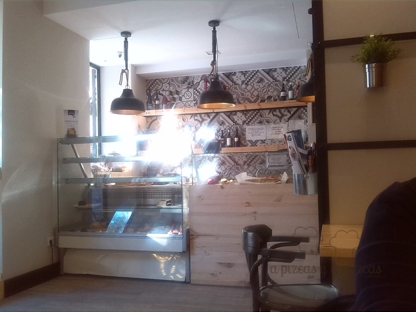

El fin de semana pasado aprovechamos para seguir [descubriendo Ruzafa](/tag/ruzafa/ "Ruzafa")... así que nos fuimos la familia al completo a pasear aprovechando que era el fin de semana que se celebraba el [Ruzafa loves kids.](http://ruzafaloveskids.com/ "Festival Ruzafa loves kids") Aunque al final no pudimos ir a ninguna obra de teatro, ni ningún taller... pero bueno valió la pena pasear y ver el ambientillo y un montón de peque seres con sus papis por el barrio. Nuestra intención era tomar el brunch en alguno de los locales de moda que ya teníamos fichado anteriormente... pero Pizcas se encontró con un amigo y nos recomendó que fuéramos al [Lala Land](https://www.facebook.com/lalalandruzafa?fref=ts "Pastelería, cafetería Lala Land") (Calle Puerto Rico número 34) y allá que nos fuimos.

## Nuestro almuerzo en Lala Land pastelería, cafetería Valencia

Nada más entrar en Lala Land nos fascinó su letrero con bombillas y la decoración del local. Es un local amplio y acogedor y en el mostrador una vitrina de bollería dulce y salada, nos comentaron que tienen unas tartas espectaculares pero a primera hora aún no estaban en la vitrina. Así que ya tenemos la escusa para volver otro día.

Nuestro almuerzo en Lala Land fue zumo de naranja natural, un sandwich mixto con pan casero que compartimos Pizcas y Mizcas porque es hermoso  y un trocito de quiche lorraine que estaba increíble. Ah! se nos olvidaba un mini croissant recién hecho que se tomó Trizcas que no dejó ni las migas.

Luego terminamos nuestro paseo con un vinito con amigos en [Espacio 40 Vino de Chile](https://www.facebook.com/pages/espacio40-vinosdechilees/620321867982835?ref=ts&fref=ts "Espacio 40 Vinos de Chile") (tienda- sala de catas) un espacio muy peculiar rodeado de arte, buenos vinos y mejor compañía. Que por cierto, tenemos pendiente un post para contaros un poquito más sobre todo lo que pasa en ese espacio 40.

Nos encanta pasear por Rufaza, cada vez que vamos descubrimos un nuevo motivo por el que queremos volver. Creo que es uno de nuestros barrios preferidos de Valencia, ¿Cuál es el vuestro?
