Ya estamos de vuelta... los días de las vacaciones de A Pizcas y a Mizcas se han pasado volando y es que cuando te diviertes el tiempo corre. Este año no hemos viajado, pero tampoco hemos parado y hemos difrutado de todos y cada uno de los días que hemos estado juntitos.

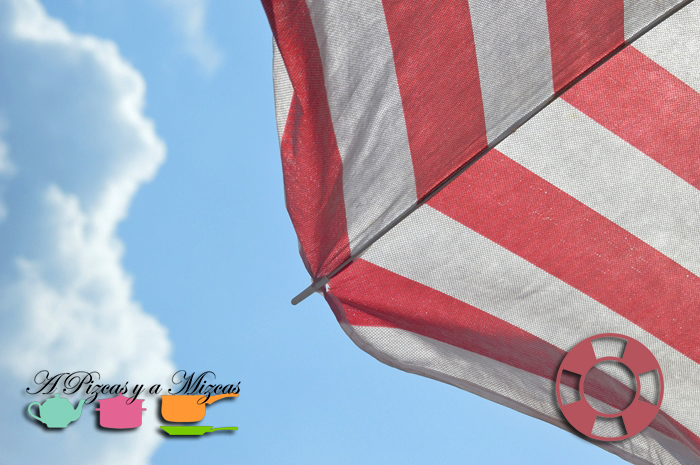

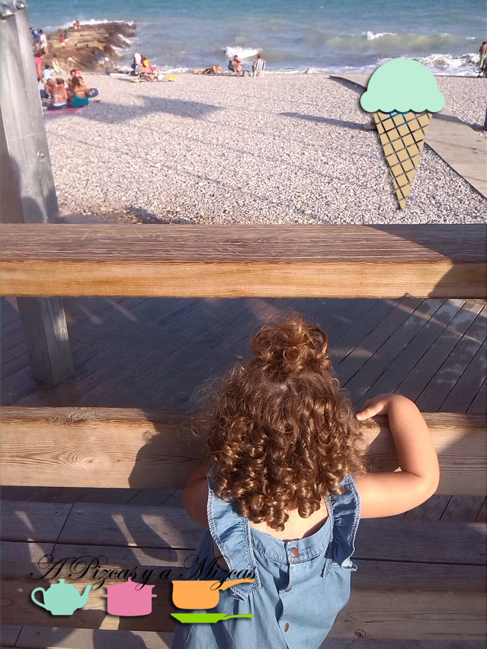

## Un resumen de las vacaciones de A Pizcas y a Mizcas

Estos días hemos dejado los zapatos a un lado y hemos sacado nuestros piececitos a descubrir mundo: hemos pisado las piedras, la arena, el cesped y nos hemos remojado. Cómo nos gusta cuando la ola llega y nos cubre los piececillos. Hemos descubierto que a Trizcas le encanta la arena, el agua del mar, el agua dulce... y eso que el año pasado no hubo forma de que tocara la arena, je je je

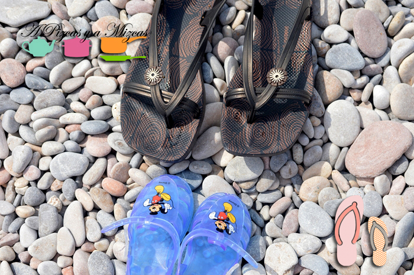

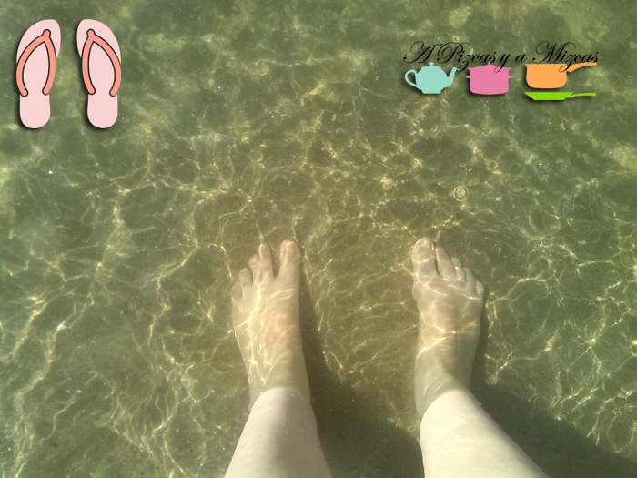

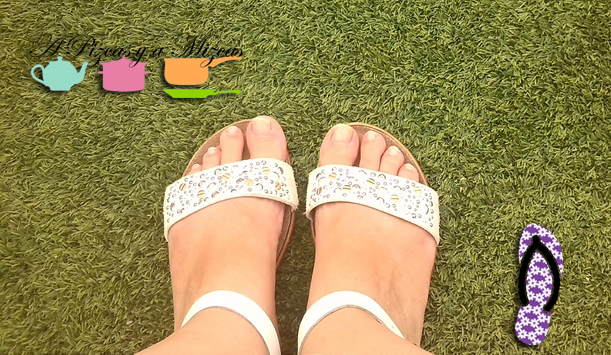

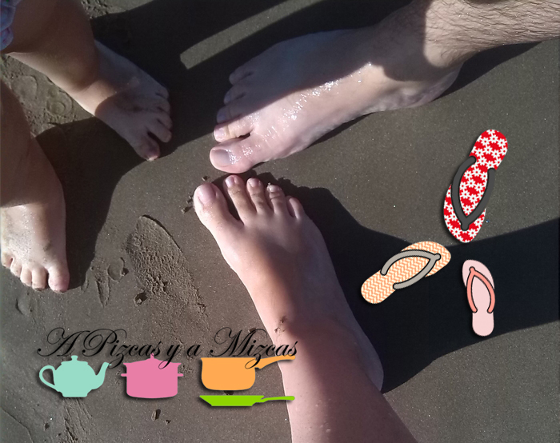

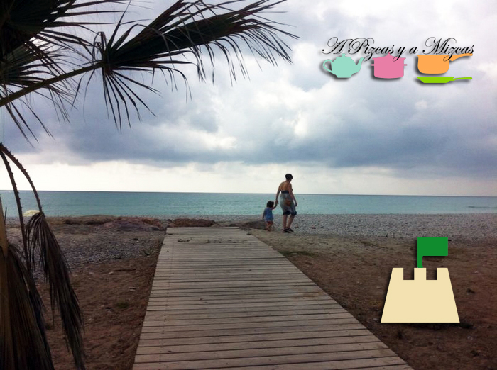

Hemos disfrutado de la leche merengada de Aquilino sentados en el paseo escuchando las olas ir y venir. Hemos disfrutado con el [arròs al forn](/arroz-al-horno/ "Arroz al horno") de la yaya Pizcas, la fiesta del jamón improvisada, los dulces de Susana, de la horchata... Es que nos encanta juntarnos con amigos y familia y celebrar alrededor de una buena comida/cena/merienda...

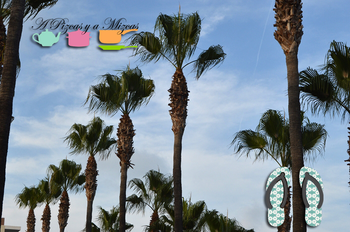

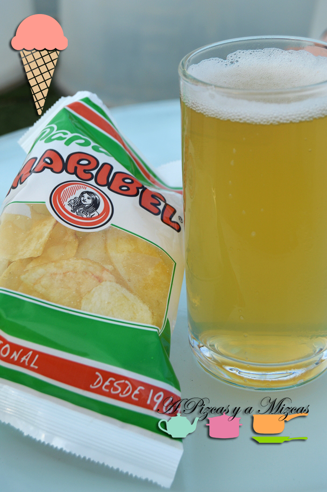

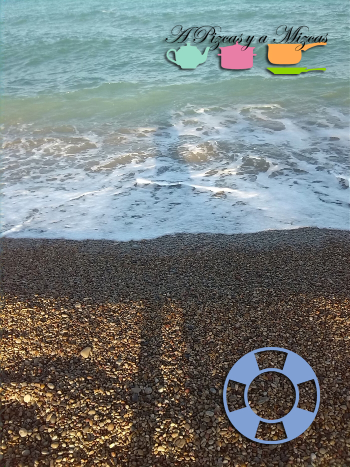

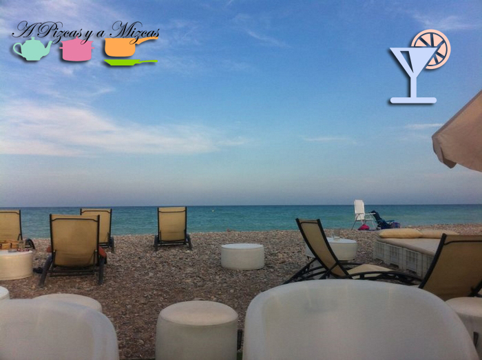

Y cómo no, hemos jugado a todas horas con Trizcas... guerra de globos de agua, peque fiestas, canciones, bailes... ufff... qué bien nos lo hemos pasado! Ya estamos mirando el calendario para volver a repetir las vacaciones.

Ahora volvemos al 100% con todos vosotros que os echábamos de menos... y durante estos días también hemos tenido tiempo para cocinar y traeros nuevas recetas, y también para actualizar la imagen del blog... que dentro de muy poco podréis ver. Bienvenidos a tod@s los que ya estaís de vuelta y a disfrutar a los que empezáis.... nosotros nos quedamos por aquí que tenemos muchas cosas que contaros.

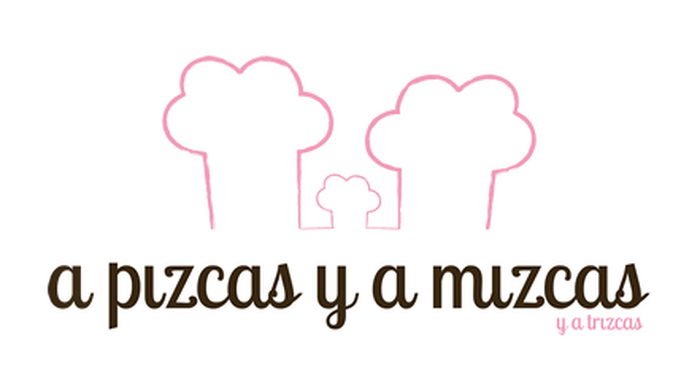

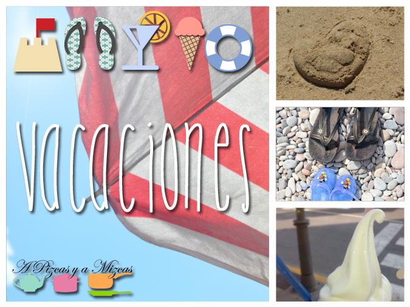

Por cierto, os habeís fijado en los detallitos que hemos puesto en las fotos de nuestras vacaciones. Si os han gustado son del blog de [Miss Lavanda](http://www.misslavanda.es/ "Miss Lavanda") , os lo recomendamos!
