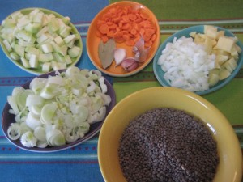
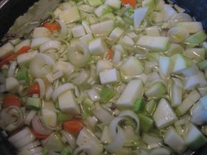
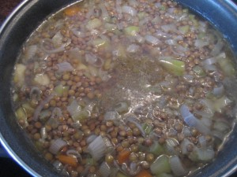
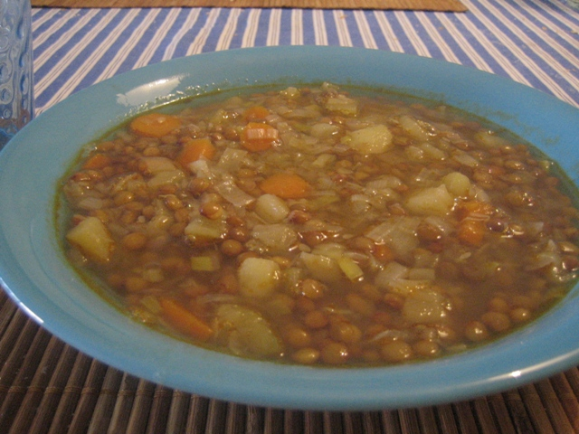

Ahora que ha empezado el frío ya nos apetecen los platos de cuchara calentitos. Y siguiendo la receta de **Mati**, que ella misma heredó de su madre, hemos hecho lentejas de verduras al estilo tradicional. Además estas son ligeritas... rico, rico, sano, sano!!

Ingredientes para 4 personas:

- 1 calabacín
- 2 zanahorias
- 2  patatas
- 2 puerros
- 1 cebolla
- 4 ajos
- 2 hojas de laurel
- 350 gr lentejas pardinas
- Aceite
- Sal

 

Pelamos y troceamos a daditos todas las verduras. Añadimos las hojas de laurel, los ajos pelados, las lentejas, sal (al gusto) y aceite (aproximadamente 3 cucharadas soperas).

    

Añadimos agua fría  hasta cubrir todo el contenido. Ponemos el fuego al máximo hasta que empiece a hervir. Una vez que haya llegado a ebullición poner a fuego lento durante media hora. Transcurrido ese tiempo comprobar el estado de las lentejas, si no estuvieran blandas, dejaríamos otros 10 minutos más. Removemos de vez en cuando.

Comprobar el punto de sal y servir.

A nosotros nos gusta con estas verduras pero también se puede añadir pimiento rojo o verde. Depende de gustos.

