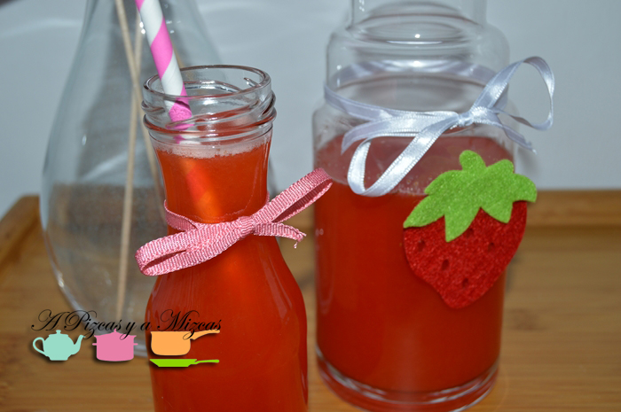
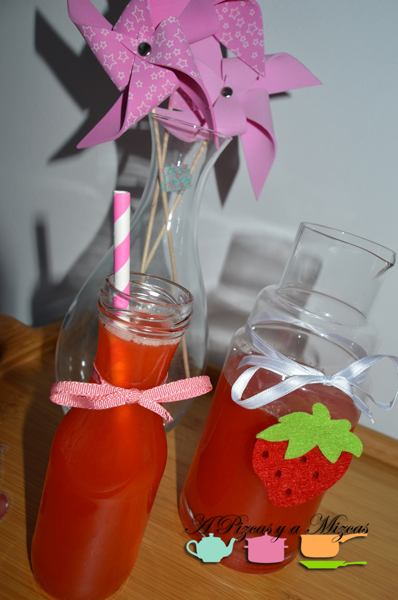
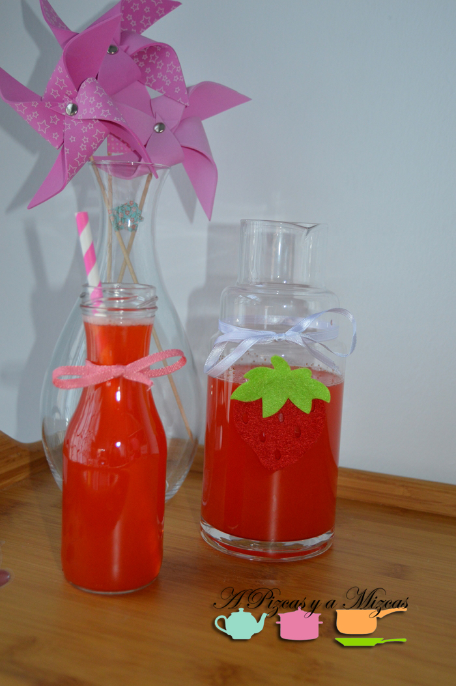

Ahora que ya hemos entrado en el horario de verano, aunque el tiempo parece que no nos acompaña... a nosotros nos apetece sentir el calor, veranito... Así que leyendo hace unos días el [blog de Papá - Moscas](http://papa-moscas.com/blog "Papá Moscas") (que si no los conocéis os recomendamos que echeís un vistazillo: los babos son geniales y las papastillas cargadas de ingenio) donde proponían una receta sencilla de [limonada de fresa freshquita](http://papa-moscas.com/limonada-de-fresa-freshquita.html "Limonada de fresa freshquita")  a nosotros nos dio un poquito de envidia (de la buena ) y nos animamos a preparar nuestra limonada de fresa.

Y tenían mucha razón... una receta que se hace en un pis-pas y nos traslada al veranito

## Ingredientes para preparar la limonada de fresa (con estas cantidades sale un litro de limonada)

- 300 gramos de fresas
- 2 limones
- 1 lima
- 140 gramos de azúcar
- 4 vasos de agua

Limpiamos y quitamos la parte verde de las fresas y las trituramos, a continuación añadimos el azúcar. Si queréis que quede más fino, os recomendamos que lo paséis por el colador o por el chino.

Exprimimos los limones y la lima y lo colamos para que no caiga ningún huesecillo y lo añadimos a las fresas. Por último añadimos el agua fresquita y ya tenemos lista la limonada de fresa.

Ideal para una tarde primaveral, para una fiesta infantil o para un sábado noche con un chorrito de ron. Nosotros ya estamos pensando hacer esta limonada de fresa en granizado. O también se nos ha ocurrido sustituir el zumo de limón por zumo de naranja.... ya os contaremos. Ya véis hay opciones para todos.

Seguro que repetimos muchas tardes primaverales esta limonada de fresa. Porque es un refresco 100% natural sin colorantes ni conservantes... ja ja ja...

