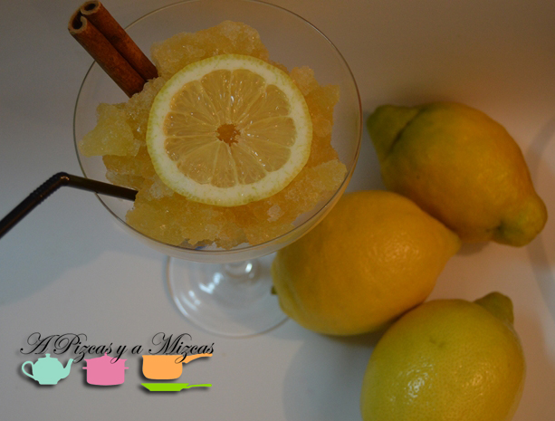
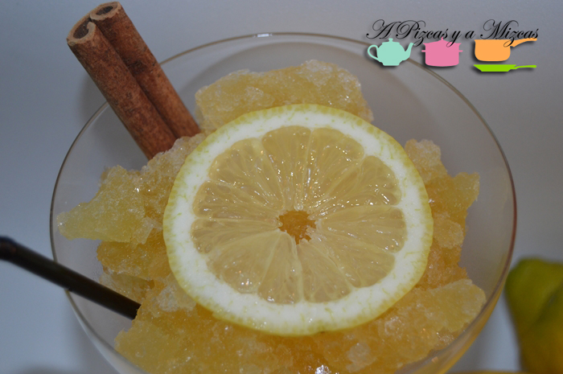

El verano ya está aquí... y parece que el calorcito va a ser nuestro compañero durante mucho días! Así que tenemos que buscar opciones para llevar estos calores mejor. Hoy os proponemos la limonada de la Ribera que refrescará muuchas tardes o noches de este veranito.

Muchos ya sabréis que el yayo Mizcas es de un pueblo de la Ribera (de Alginet) así que es un peque homenaje a los sabores de la infancia del yayo Mizcas. Que nos ha contado que él recuerda que está limonada la vendían en verano en la horchatería de la plaza. Tendremos que ir un día de este verano a la horchatería de la plaza para saber si la siguen preparando.

## Ingredientes para preparar la limonada de la Ribera

- un litro de agua
- la cáscara de un limón
- 1 vaso de azúcar
- 1 rama de canela

La forma de prepararlo es muy facilito. En primer lugar echaremos el vaso de azúcar en una cacerola y añadiremos un poquito de agua. Removeremos a fuego lento hasta que el azúcar se convierta en caramelo.

A continuación añadimos el litro de agua caliente a la cacerola, la cáscara de un limón muy fina y la rama de canela, lo dejaremos herviendo a fuego lento durante unos 15 minutos aproximadamente.

Dejamos que pierda calor y lo metemos en el congelador. Lo tendremos unas 4 o 5 horas aproximadamente. Removemos y lo serviremos granizado.

A refrescar el verano! Seguro que si lo probáis lo váis a repetir muchas veces este verano!

