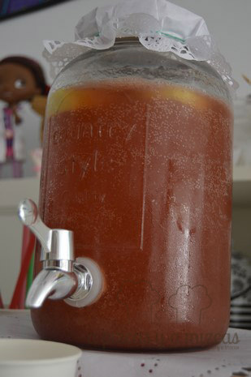
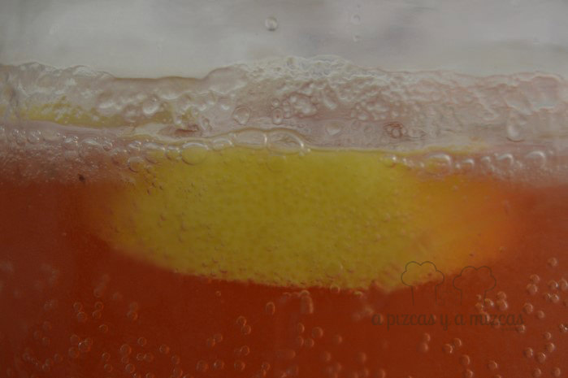
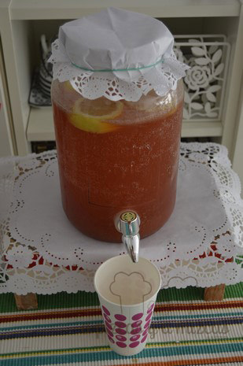

A quién no le apetece una limonada refrescante? y si encima estás al lado de la piscina o en la playa más aún. Pues está se prepara en nada. Y cuando decimos nada es nada de tiempo

La idea nos la dio David de Jorge en su programa de Telecinco [Robin Food - Atracón a mano armada](http://www.telecinco.es/robinfood/) un día que preparó un par de bebidas refrescantes. La primera que preparó fue [limonada ‘Robin Food’](http://www.telecinco.es/robinfood/temporada-01/t01xp125/David-limonada-Robin-Food-frambuesa_2_1964580036.html), hecha con genjibre, menta y agua con gas y después preparó otra más rápido de hacer aún con gaseosa y mermelada de frambuesa.... y fue con esa con la que nos quedamos

## Ingredientes para preparar la limonada refrescante

Nosotros preparamos la limonada refrescante en un dispensador de limonada mason jar de una capacidad de tres litros y estos son los ingredientes que utilizamos

- 3 litros de gaseosa
- un tarro de mermelada de fresa
- hielo
- un limon en rodajas

Como os hemos dicho la preparación es muy rápida. Vertemos en el dispensador la gaseosa bien fresquita y añadimos la mermelada de fresa, nosotros utilizamos de fresa porque es la que tenáimos pero podeís utilizar la que tengáis por la nevera. Removemos con la ayuda de una cuchara de palo para que se disuelva bien la mermelada.

Limpiamos bien el limon y lo cortamos en rodajas. Añadimos bastante hielo para que esté bien fresca y ya está lista nuestra limonada refrescante.

Ya tenemos la limonada preparada...puede empezar la fiesta!

Nosotros creemos que va a ser la bebida del verano en casa de A Pizcas y a Mizcas, a nosotros nos ha encantado!

Limonada fresquita fresquita

Limonadaaaaa

Animaros a preparar la vuestra... y cuéntanoslo!
