Hola a todos. No se nos ocurre mejor forma de empezar 2013 que haciendo un repaso a lo mejor de 2012 en A Pizcas y a Mizcas. De esta forma cogeremos fuerzas para que el nuevo año sea fantástico para todos.

En primer lugar hemos seleccionado las que creemos que han sido las mejores recetas de cada mes. Muchas se han quedado en el tintero, puesto que queríamos escoger sólo una por mes. A ver qué os parece nuestra selección.

## Nuestra selección de 2012

**Enero 2012**

- [Pannacotta de milkybar](/pannacotta-de-milkybar/ "Pannacotta de milkybar")

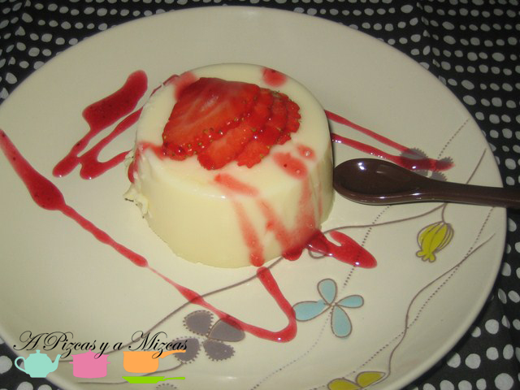

**Febrero 2012**

- [Calçotada en casa](/calcotada-en-casa/ "Calçotada en casa")

**Marzo 2012**

- [Mini tartitas de queso](/mini-tartitas-de-queso/ "Mini tartitas de queso")

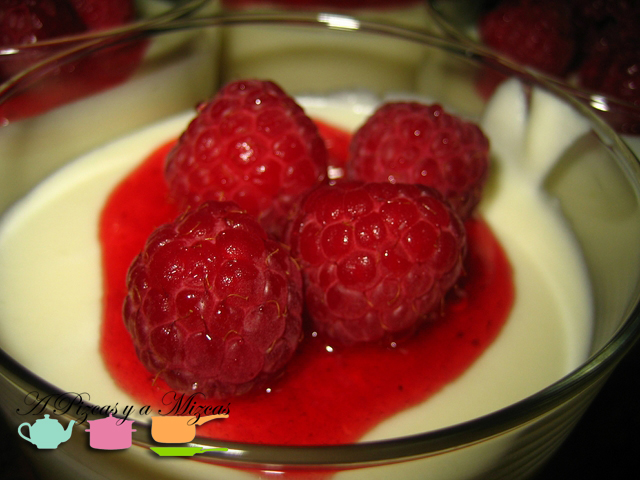

**Abril 2012**

- [Guiso de ternera con cerveza negra](/guiso-de-ternera-con-cerveza-negra/ "Guiso de ternera con cerveza negra")

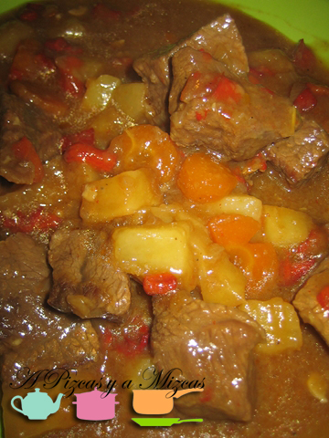

**Mayo 2012**

- [Ensaladilla rusa](/ensaladilla-rusa-pizcas-3/ "Ensaladilla rusa Pizcas")

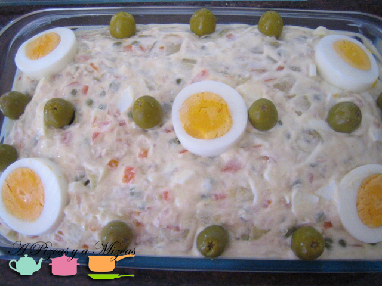

**Junio 2012**

- Descanso en el blog por ampliación familiar con la llegada de Trizcas.

**Julio 2012**

- [Pasta con salmón fresco y champiñones](/pasta-con-salmon-fresco-y-champinones/ "Pasta con salmón fresco y champiñones")

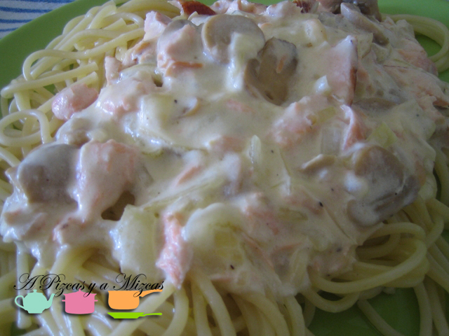

Agosto 2012

- [Bollit de peix](/bollit-de-peix/ "Bollit de peix")

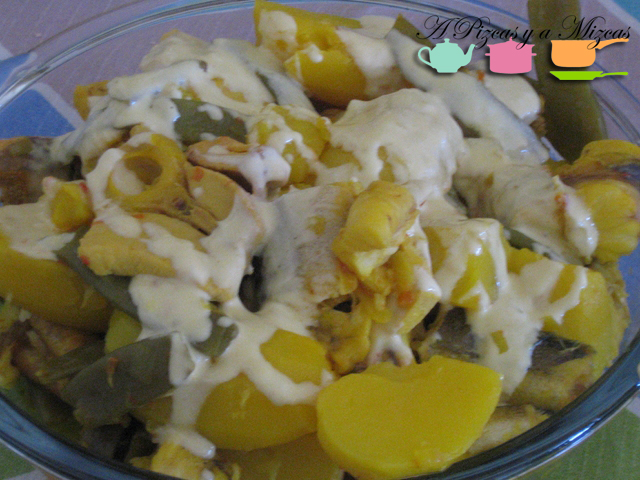

**Septiembre 2012**

- [Limón granizado casero](/limon-granizado-casero/ "Limón granizado casero")

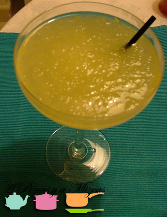

**Octubre 2012**

- [Cuando las magdalenas no eran muffins](/cuando-las-magdalenas-no-eran-muffins/ "Cuando las magdalenas no eran muffins")

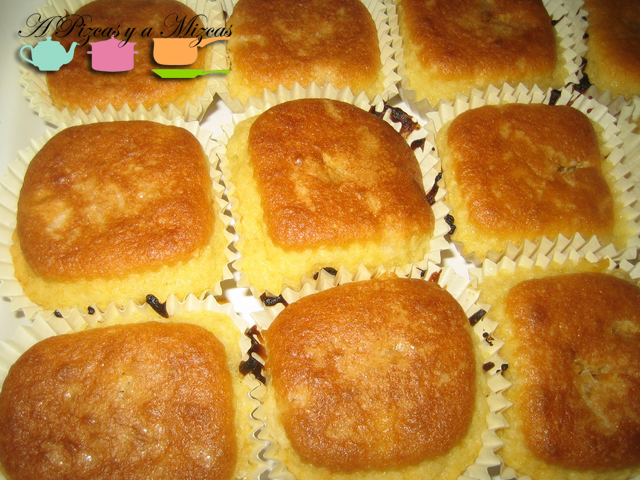

**Noviembre 2012**

- [Calamares al moscatel](/calamares-al-moscatel/ "Calamares al Moscatel")

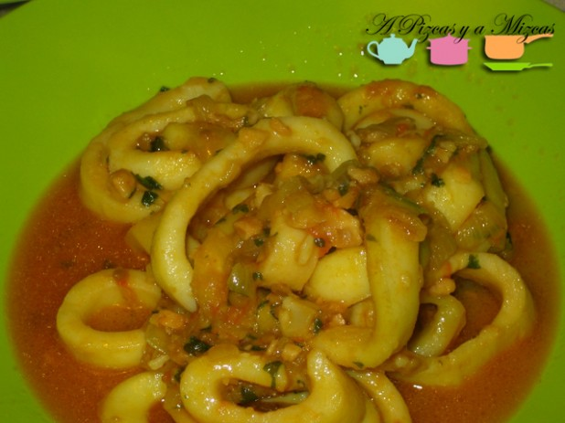

**Diciembre 2012**

- [Tartaletas de manzana](/tartaletas-de-manzana-apple-pies/)

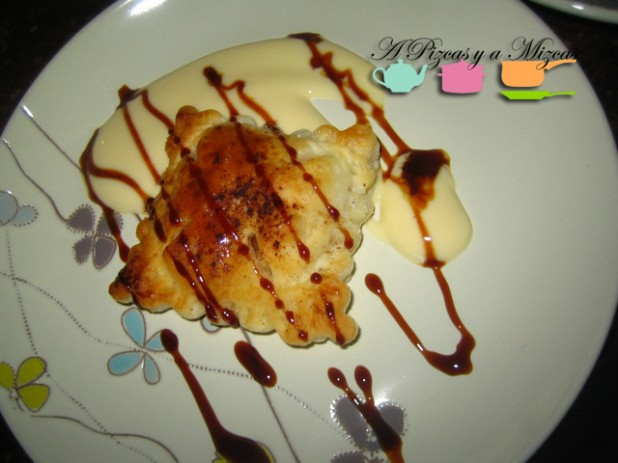

Además, hemos recopilado lo que más os ha gustado en nuestro perfil de Facebook ([https://www.facebook.com/apizcasyamizcas](https://www.facebook.com/apizcasyamizcas)), aquí lo tenéis.

## Lo que más os ha gustado en 2012 en Facebook

- 1 Rigatoni a la carbonara (Nos lo dieron hecho José Luis y Marta)

- [2 Tarta de chocolate y galleta](/tarta-de-chocolate-y-galletas/ "Tarta de chocolate y galletas, el postre preferido de Pizcas")

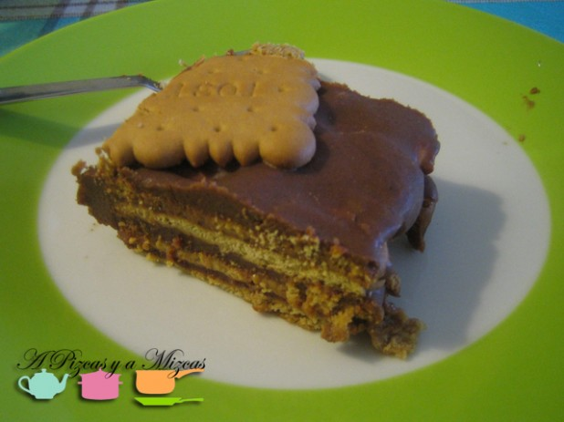

- [3 Bizcocho marmolado](/bizcocho-marmolado/ "Bizcocho marmolado")

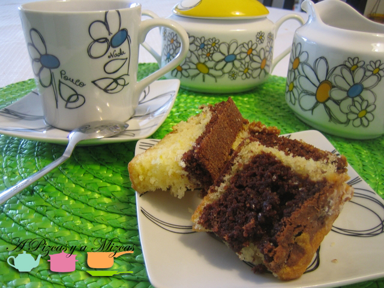

- [4 Magdalenas](/cuando-las-magdalenas-no-eran-muffins/ "Cuando las magdalenas no eran muffins")

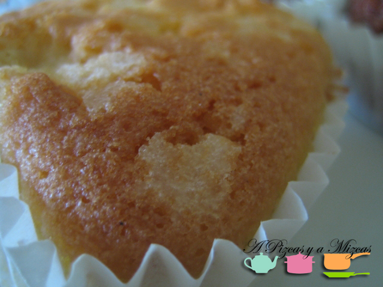

- [5 Palmeritas](/palmeritas-de-hojaldre-las-de-toda-la-vida/ "Palmeritas de hojaldre, las de toda la vida") [de hojaldre](/palmeritas-de-hojaldre-las-de-toda-la-vida/ "Palmeritas de hojaldre, las de toda la vida")

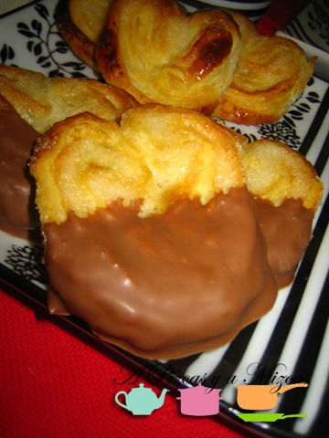

- [6 Sandwich con queso edam, manzana y bacon](/sandwich-con-queso-edam-manzana-y-bacon/ "Sandwich con queso edam, manzana y bacon")

- [7 Carpaccio de calabacín](/carpaccio-de-calabacin/ "Carpaccio de calabacín")

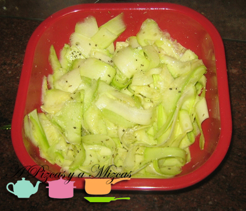

- [8 Quiche de pechuga de pavo y queso](/quiche-o-tarta-salada-de-pechuga-de-pavo-y-queso/ "Quiche o tarta salada de pechuga de pavo y queso")

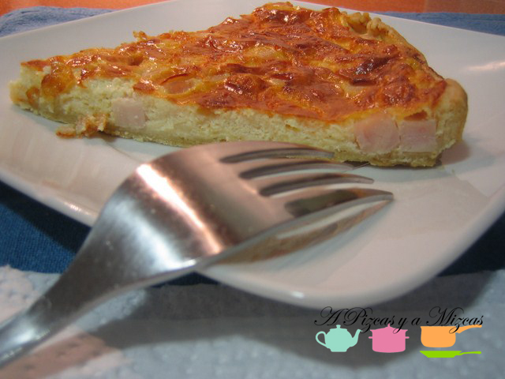

- [9 Caramelos de hojaldre relleno](/caramelos-de-hojaldre-relleno/ "Caramelos de hojaldre relleno")

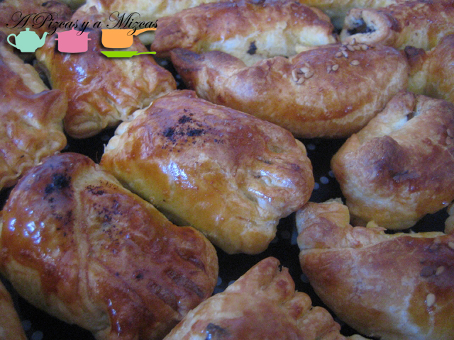

- [10 Papilla de Trizcas](/primera-papilla-de-verduras/ "Papilla de verduras de Trizcas")

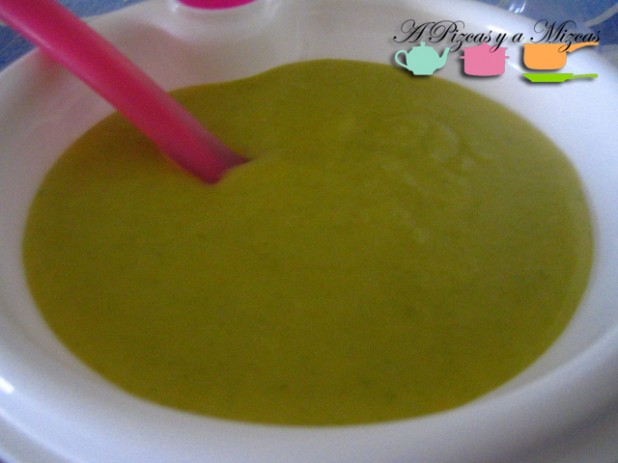

Nos vemos en 2013!!

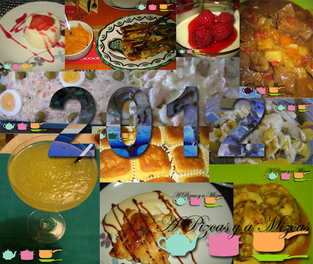
