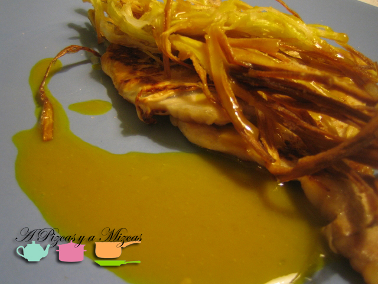

Seguimos ampliando la categoría de cenas rápidas con esta receta de lomo con puerro crujiente, acompañado de una vinagreta de miel y mostaza dulce. Es un plato muy económico y asequible pero que cuenta con varios contrastes interesantes, como el crujiente del puerro, con la carne y la temperatura de la vinagreta con la del resto de ingredientes, el punto dulce de la vinagreta con el lomo... Una receta que repetimos en varias ocasiones en casa de A Pizcas y a Mizcas y que estamos seguros que os gustará a todos los pizqueros.

## Ingredientes para el lomo con puerro crujiente (dos personas)

- Cuatro cortadas de lomo de cerdo
- Un puerro
- Harina
- Aceite de oliva virgen extra
- Sal en escamas
- Mostaza dulce
- Miel

Lo primero para elaborar el lomo con puerro crujiente es dejar preparado el puerro, para que así la carne salga caliente a la mesa. Para ello, limpiamos el puerro, eliminando las capas exteriores y la tierra que pueda quedar en su interior. Lo cortamos en juliana muy fina, lo pasamos por agua y lo enharinamos bien, retirando el exceso de harina. Dejamos preparado para freir.

Por otra parte, preparamos la vinagreta con tres cucharadas de aceite de oliva virgen extra, una cucharadita de miel y otra de mostaza. Emulsionamos y probamos. Rectificamos según la proporción que más nos guste de miel/mostaza. Dejamos reservado.

Calentamos aceite en una sartén y cuando esté a temperatura de freir, vamos añadiendo puñados de puerro. Se harán muy rápido. Conforme vayan estando fritos, los retiramos a una fuente con papel absorbente.

En una plancha asamos la carne y cuando esté lista la salpimentamos.

Montamos nuestro plato de lomo con puerro crujiente con dos cortadas de carne por plato, cubiertas del puerro crujiente y lo acompañamos de la vinagreta.

Rápido, rico y diferente. ¿Se os ocurre alguna cena alternativa parecida?
