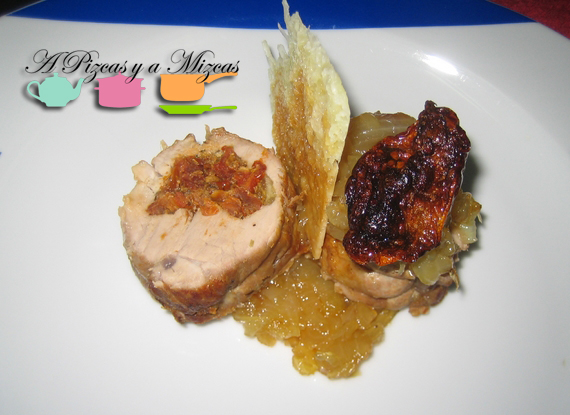

El lomo de cerdo es una carne que admite muchas preparaciones: a la plancha, en guisos, al horno... La receta que os proponemos hoy es un lomo relleno de tomates secos y mozzarella, acompañado de cebolla caramelizada y crujiente de parmesano. La mayor elaboración la supone el rellenar el lomo de cerdo y embridarlo, ya que luego la carne va al horno y la guarnición se prepara muy rápidamente. Además, tiene una presentación muy efectiva, con varios volúmenes, que quedan genial en el plato.

## Ingredientes para el lomo relleno de tomates secos y mozzarella (4 personas)

- Un lomo de cerdo.
- Unos 10 tomates secos (cuatro serán para decorar)
- Dos bolas de mozzarella
- Sal y pimienta
- Albahaca
- Dos cebollas dulces
- Queso parmesano
- Aceite de oliva virgen extra

El primer paso para elaborar nuestro lomo relleno de tomates secos y mozzarella es preparar el lomo para que pueda ser rellenado. Limpiamos la carne de cualquier grasa que veamos (no debería tener mucha), luego, con un cuchillo afilado vamos haciendo cortes longitudinales sin llegar al final del lomo, de esta forma podremos ir extendiendo el lomo.

Mientras, podemos tener los tomates rehidratándose. Para ello, los colocamos en un recipiente con agua caliente y aceite de oliva virgen durante unos 20 minutos. Transcurrido ese tiempo, apartamos cuatro tomates, que utilizaremos para decorar, y el resto lo picamos muy finamente, teniendo cuidado de apartar los peciolos que pudieran quedar.

Picamos también la mozzarella y lo mezclamos con el tomate, sal y un poco de alhabaca picada. Lo removemos bien. Vamos con el rellenado de nuestro lomo relleno de tomates secos y mozzarella. Extendemos la carne y la salpimentamos por ambos lados. Con ayuda de una cuchara, vamos añadiendo relleno a la carne, más hacia un extremo. Cuando hayáis cubierto toda la longitud del lomo, con cuidado vamos enrollando hacia adentro y con un poco de cuerda alimentaria lo embridamos para que no se deshaga.

Lo introducimos al horno durante 20 o 30 minutos a unos 190 grados.

En un cazo cocinamos los tomates secos con aceite de oliva virgen extra a baja temperatura.

Mientras, picamos la cebolla dulce en juliana. En una sartén la pochamos a fuego lento con una pizca de sal, cuando ya esté prácticamente cocinada totalmente, subimos el fuego al máxiimo y añadimos una cucharada de las de café colmada de azúcar y removemos constantemente. De esta manera, el azúcar caramelizará rápidamente con los jugos de la cebolla.

Asimismo, rallamos el parmesano. En un plato apto para microondas, lo colocamos extendido y lo calentamos hasta que se deshaga el queso. Lo cubrimos con papel de hornear y ponemos otro plato encima. Dejamos que se enfríe.

Cuando esté listo nuestro lomo relleno de tomates secos y mozarrella, lo cortamos en rodajas y emplatamos. Colocamos dos cortadas por ración, y las acompañamos de cebolla caramelizada, un pedazo del crujiente de parmesano en vertical y un tomate seco de los que hemos glaseado.

