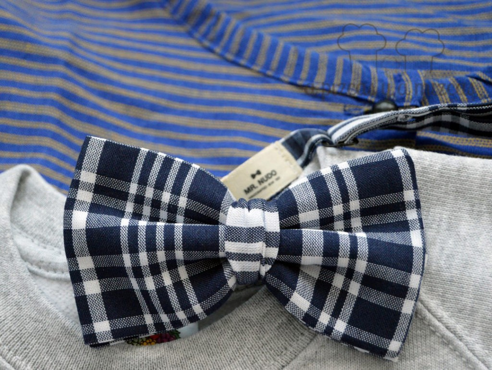

Ya estamos en Fallas! Y en casa de A Pizcas y a Mizcas ya hace días que tenemos preparado nuestro look fallero para disfrutar estos días falleros. Lo más importante durante estos días es ir bien cómodos... así que sin renunciar a la comodidad éste va a ser nuestro traje fallero!

Vamos con lo principal, que es salir de casa con el atuendo fallero (no de fallero, ni de fallera, sino el atuendo para vivir la fiesta). Si hay un invento que iguala a todos, a ricos y pudientes con personas más humildes, éste es, sin duda, el blusón fallero. Debajo de esta prenda (que afortunadamente ya va poco a poco abandonando el negro) da igual lo que haya: una camisa de Armani o un chándal. Así, que todos con el blusón puesto. Y como este año parece que van a ser unas fallas fresquitas. Mejor algo abrigadito debajo del blusón que luego cogéis frío...

El complemento indispensable para las Fallas  es el pañuelo, que puede ir al cuello con el cachirulo a la espalda (modo tradicional), o al pecho (en plan bandolero del Far West). Otras alternativas son en la cabeza… Con esto y unas buenas zapatillas deportivas (los taconazos dejadlos o acabaréis quemadas) ya estamos preparados para tomar las calles de la capital del Turia.

## El look fallero de A Pizcas y a Mizcas:

Así este año Pizcas ha elegido para su look fallero blusón azul de rallas y la [pajarita Amparo](https://mrnudo.com/products/pajarita-amparo) (la pajarita fallera) de [Mr. Nudo](https://mrnudo.com/). En cuanto la vimos supimos que iba a ser el complemento indispensable para estas fallas.

 El blusón de Pizcas y Amparo (la pajarita fallera) de Mr. Nudo

Para Mizcas y Trizcas hemos elegido una [sudadera muy fallera y calentita](https://www.facebook.com/mug.photocalleando/photos/pb.117679605101406.-2207520000.1457953565./523427541193275/?type=3&theater) de [Mug](https://www.facebook.com/mug.photocalleando/?fref=ts), que a Mizcas le enamoró nada más verla con la frase "Ja estem en falles"... aunque nosotras también tenemos preparados nuestros blusones... ji ji. Ademas en el blusón de Trizcas colocaremos las [chapas molonas](http://patadepirata.blogspot.com.es/2014/01/galeria-chapas-pata-de-pirata-3.html) de [Pata de Pirata](http://patadepirata.blogspot.com.es/)! Que a Trizcas le encanta ir acompañada por los falleros piratas... ji ji.

 La sudadera de Mug: "Ja estem en falles"

Y por último... la mantita fallera con tela morellana que nos hizo la iaia Mizcas con sus manitas y que nos viene fenomenal cuando el fresquito aprieta. Y la fallereta que bordé yo con mis manitas a punto de cruz.

 Mantita morellana y chapitas de piratas falleros de Pata de Pirata

Nos vemos entre falla y falla!

 El look fallero de A Pizcas y a Mizcas
