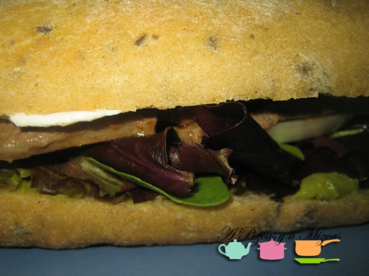
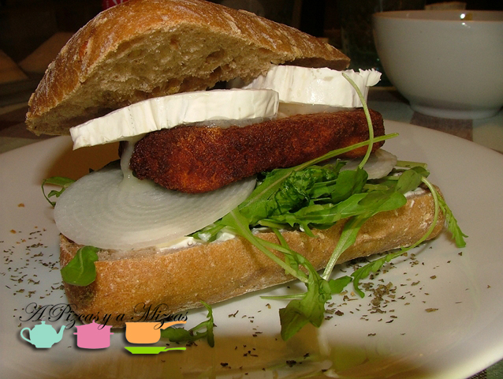
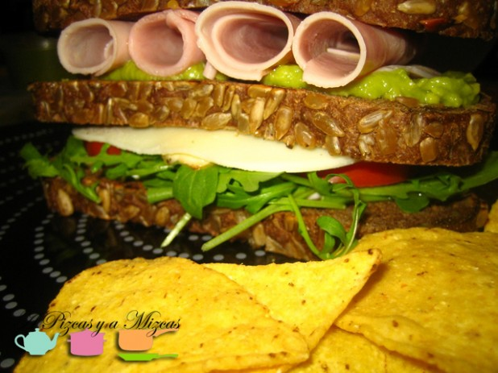
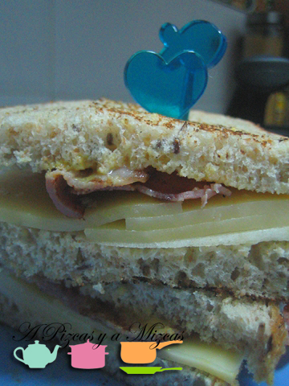
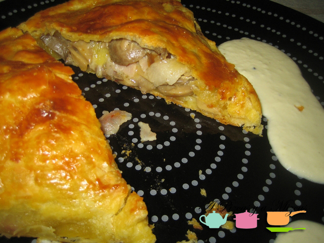
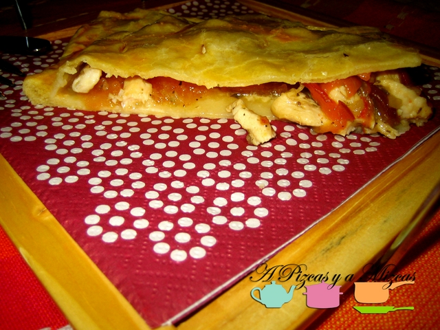
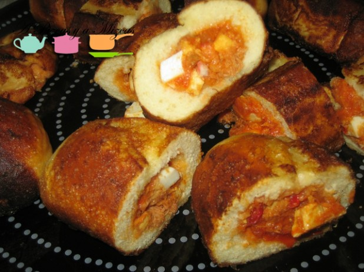

Lo prometido es deuda... durante este mundial vas a tener todos los días que juegue España tú casa llena de amigos. Porque hemos hecho una selección de los mejores bocadillos de A Pizcas y a Mizcas. También hemos incluído algunos sandwiches y empanadas. Ya sabéis que nos gusta daros varias opciones... porque como se suele decir "en la variedad está el gusto". Así que ahora os toca decidir a vosotros con qué bocadillo queréis sorprender a vuestros invitados.

## La selección de los mejores bocadillos de A Pizcas y a Mizcas

Empezamos por los bocadillos:

\- [Tosta de lomo con alcachofas](/tosta-de-lomo-con-alcachofas/ "Tosta de lomo con alcachofas").Podemos preparar esta tosta tanto para compartir junto una ensaladita o como una tapita cuando tenéis invitados en casa… Ya veis es una receta con la filosofía Pizcas.Como veréis no es ninguna receta elaborada es una alternativa al bocadillo de lomo.

\- [Pepito de ternera y guacamole](/pepito-de-ternera-y-guacamole/ "Pepito de ternera y guacamole"): es posible que el pepito sea uno de los bocadillos más tiernos que existen, ya desde su mismo nombre. En esta ventana a la cocina de A Pizcas y a Mizcas os traemos una versión un poco actualizada, un pepito de ternera y guacamole, con pan de aceitunas, mix de brotes tiernos y queso especiado. Una cena rápida de las que nos gustan.

\- [Bocadillo de pollo, rúcula y salsa de yogur](/bocadillo-de-pollo-rucula-y-salsa-de-yogur/ "Bocadillo de pollo, rúcula y salsa de yogur"): una parte del pan la untamos con la salsa de yogur. Ponemos una camita de rúcula y las láminas muy finas de cebolleta fresca, después la pechuga rebozada y por último dos trocitos de queso de cabra. En la otra parte del pan ponemos un chorrito de aceite de oliva virgen extra.

Seguimos con los sanwiches:

\-  [Sandwich club pizcas](/sandwich-club-pizcas/ "Sandwich club pizcas"): Cuando Pizcas se mete en la cocina y se inventa algo rápido y bueno el resultado es un sandwich club auténtico y perfecto para una cena completa.

\- [Sandwich con queso edam, manzana y bacon](/sandwich-con-queso-edam-manzana-y-bacon/ "Sandwich con queso edam, manzana y bacon"): Nos apetecía probar un sandwich diferente… y al final lo encontramos! Es super rápido de preparar… en menos de cinco minutos tienes preparada una cena super apañada… Seguro que si lo probáis os sorprende el resultado…

Ahora le toca el turno a las empanadas. Las puedes dejar preparadas el día de antes y disfrutar cuando lleguen tús invitados.

\-[Empanada de setas y bacon](/empanada-de-setas-y-bacon/ "Empanada de setas y bacon"):

\- [Empanada de pollo](/empanada-de-pollo/ "Empanada de pollo"): Es otra forma distinta de hacer empanada… cambiamos el huevo y el  atún por el pollo, el pimiento y la cebolla. Seguro que os animáis a prepararla, ya nos contaréis los resultados.

Y por último... si preparáis [ximos](/ximos-panecillos-rellenos/ "Ximos") : son unos panecillos rellenos de pisto que se suelen hacer en Semana Santa y son perfectos para llevarlos de excursión donde vayáis. Seguro que cuando los probéis querréis prepararlos otra vez!

