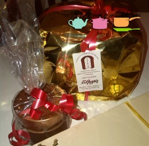

Como ya sabréis hemos estado unos días con el blog en "reposo". Hemos aprovechado para cambiar de ciudad y después de todo el jaleo de la mudanza nos hemos tomado unos días de descanso coincidiendo con las navidades. Parece que este año hemos sido muy buenos y Papá Noel y los Reyes Magos han cumplido con los regalos de A Pizcas y a Mizcas.

Os los presentamos brevemente y de paso aprovechamos para ir retomando nuestra actividad bloguera.

Desde Milán llegó el Papo Natale con un panettone clásico de pasas y fruta de la [pasticceria S. Gregorio](http://www.pasticceriasangregorio.it/index.html), junto con un tarro de crema gianduja (la abuela de la Nutella) que según nos explicaron es originaria de Turín. Del panettone ya no queda ni una miga y la crema de chocolate espera su ocasión (ya os lo contaremos). Muchas gracias Lore y Max!

Desde les terres de l´Ebre nos llegó una cestita de productos típicos del Delta. En su interior encontramos dos tipos de arroces de los que daremos cuenta en futuras recetas junto a dos cervezas artesanas y un rico licor de arroz. Lo recomendamos con hielo picado y canela molida. Gràcies Diana i Pere!

El mismo día de Nochebuena y directo desde el corazón de Teruel nos llegó un paquete de la [confitería Muñoz](http://www.dulcesdeteruel.es/) con una fantástica trenza mudéjar, un turrón de almendra artesano y mazapán de nata y nueces. Todo riquísimo. Que ganas tenemos de ver a Javi y a  Almu, mil gracias!

Papá Noel también se acordó de Pizcas y debajo del árbol apareció un ejemplar de "La comida de la familia" de Adrià. Estas navidades ya nos hemos atrevido con alguna receta.

Desde Castellón hemos "importado" la tradicional noche del Roscón, en la que nos reunimos con la familia para cenar y probar este postre típico con sus sorpresas. Desde el año pasado los preparamos nosotros mismos y este año han salido riquísimos. Aprovechamos para realizar un peculiar juego de entrega de regalos. A nosotros nos correspondió: un termometro para carne, unas cucharas medidoras, un sello para galletas y un cucharón de madera. Estos Reyes sí que saben!

Estos han sido los regalos de A Pizcas y a Mizcas
