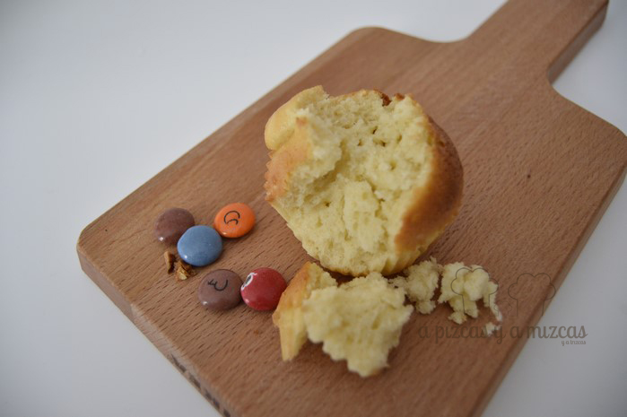
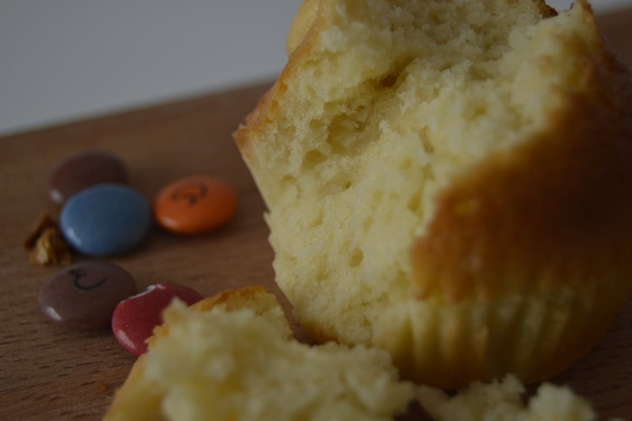

Una solución muy rápida para preparar una merienda perfecta como las de antes. Una receta de magdalenas caseras con el sabor de siempre.

Parece mentira que se pueda preparar una merienda tan rica en tan poquito tiempo... y que no tiene nada que ver con las que venden en los supermercados.... así que todos a preparar magdalenas caseras para el desayuno o la merienda.

## Ingredientes para preparar las magdalenas caseras

- 3 huevos
- 200 gr. de harina
- 125 gr. de azúcar
- 50 ml. de leche (nosotros hemos utilizado leche desnatada)
- 100 ml. de aceite de oliva extra virgen suave
- ½ sobre de levadura química (8 gramos)
- Moldes de papel rizado para magdalenas

Con estas cantidades nos han salido unas 24 magdalenas que repartimos entre la familia. En un bol batimos los huevos con la ayuda de unas varillas. A continuación echamos el azúcar y seguimos batiendo. Ahora añadimos el aceite y lo vamos mezclando con el resto de ingredientes. Después agregamos la leche, la harina y la levadura química.

Sobre un molde para hornear ponemos las cápsulas de magdalenas y a continuación agregamos la mezcla hasta 3/4 partes y horneamos durante 15 minutos a 200º c. Cuando veamos que la parte de arriba de las magdalenas esté dorada ya están listas nuestras magdalenas caseras.

Y si compartimos unos lacasitos con la magdalena?

Ya tenemos la merienda de toda la vida preparada lo acompañamos con un batido.

Magdalenas para todos

Mmmm
