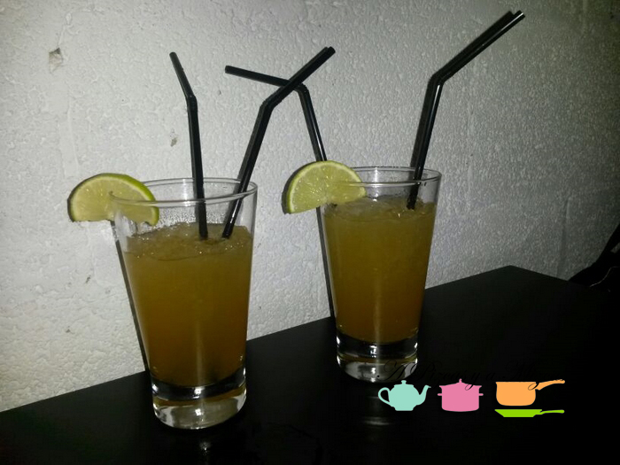

Seguimos con nuestras sugerencias de locales que vamos descubriendo en Valencia. Hoy os proponemos hacer un viaje a la gastronomía latinoamericana de mano del restaurante [Maíz Bistró](http://www.maizbistro.com/ "Maíz Bistró"), en pleno corazón del [barrio de Ruzafa](/tag/ruzafa/ "Ruzafa"), uno de barrios más "vivos" hoy en día en Valencia y que guarda tesoros por descubrir. Maíz Bistró está en la calle Sueca 46, Bajo-Derecha y la experiencia merece la pena. Fuimos a cenar con unos amigos y, cómo no, también llevamos detrás a Trizcas. Nos acomodaron en una mesa larga al final del local y estuvimos muy cómodos. El local es bastante amplio y la peque pudo corretear sin molestar a los otros comensales ni al servicio.

## Nuestra cena en Maíz Bistró

Nuestra experiencia en Maíz Bistró fue muy especial, pues una de nuestras amigas es originaria de Ecuador, de Guayaquil, por lo que para ella fue una especie de "reencuentro" con los sabores con los que creció. Un detalle que nos sorprendió gratamente: cuando pedimos que nos calentaran la cena para Trizcas, nos comentaron que lo tendrían que hacer al baño maría, pues la cocina no tiene microondas. A nuestro juicio una garantía de calidad de la comida que sirven, ¿no os parece? Os contamos lo que probamos en este viaje que nos ofreció Maíz Bistró por los sabores de Latinoamérica:

Para beber os recomendamos los vinos chilenos que tienen en carta. Nosotros probamos el **Sepia Reserva Sauvignon Blanc**, servido por copas y que estaba riquísimo. Como algo más exótico, también probamos el papelón, bebida a base de panela de azúcar de caña, dulce y refrescante.

**Papas huancaína**: Serían la versión latinoamericana de las patatas bravas. En Maíz Bistró las preparan muy ricas, con las patatas tiernas, en su punto y un poco de salsa a base de queso fresco, ají amarillo, aceituna kalamata y huevo de codorniz.

Dos **degustaciones de arepitas**: Cada una venía con cuatro rellenos diferentes: ternera mechada, guiso de cazón, nata criolla y guacamole con pollo. Las arepitas son bastantes contundentes, pero muy entretenidas de comer. Además cada uno puede hacer sus mezclas con los rellenos. La que menos nos gustó fue la arepita con el guiso de cazón, el resto exquisitas.

**Ceviche Maíz Bistró**: No podíamos irnos sin probar este plato a base de pescado marinado en cítricos. En este caso pescado blanco marinado con lima y una salsa especial de pimiento y ají. Llegó también con cebolla morada, cilantro, boniato, maíz tostado y aguacate. Nos gustó mucho.

**Tiradito de ternera**: Consiste en finas lonchas de ternera braseada, sobre rodajas de patatas cocidas y aderezada con lima y cilantro. Otro plato que nos apuntamos para repetir. Muy bueno.

Para los postres tomamos un **quesillo** (flan de leche condensada y queso fresco) y un **pudding de coco con helado de maracuyá**.

