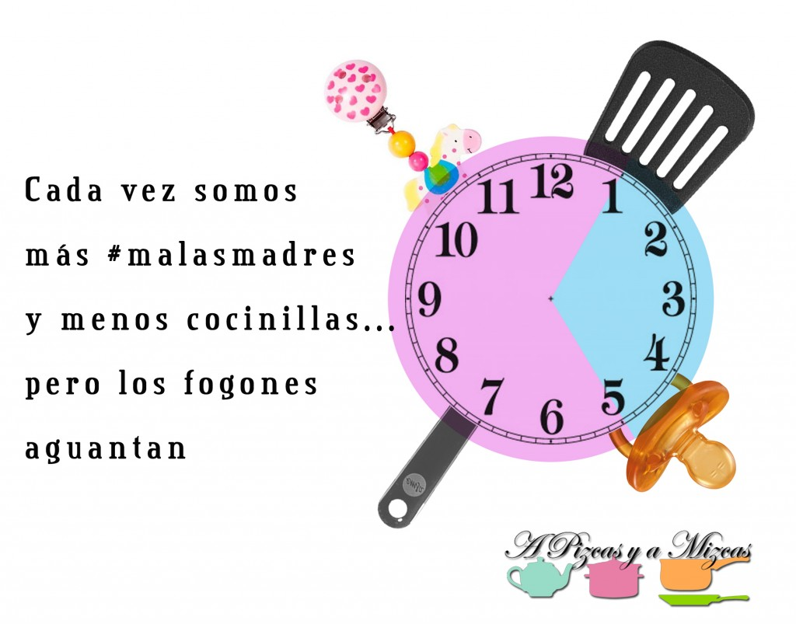
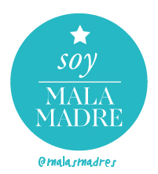
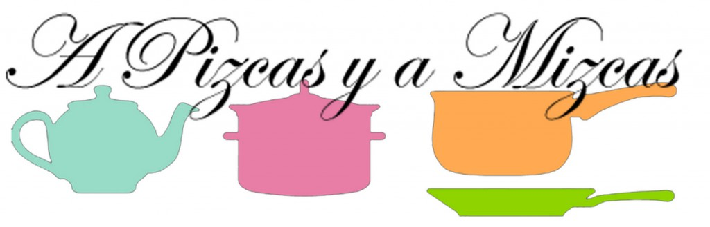

Es cierto. Cada vez somos más malasmadres (malospadres también) y menos cocinillas. Nuestro tiempo de dedicación a la cocina y al blog se ha visto fuertemente reducido. Ahora tenemos que "compartirlo" con Trizcas y con el genio que tiene, casi siempre gana ella. Por eso nos hemos sumado al club de #malasmadres!! Cada noche, su tip del día es como un reflejo de nuestra realidad. Os animamos a todos a seguirlos en twitter (@malasmadres) o en facebook ([https://www.facebook.com/malasmadres](https://www.facebook.com/malasmadres "Malasmadres")), especialmente si tenéis pequeñajos por casa. Mizcas ya había descubierto hace tiempo las biutifulzins de [La Niña sin Nombre](http://www.laninasinnombre.com/ "La niña sin nombre malasmadres") y las historias que contaba en su blog y nada más surgió la comunidad de malasmadres, no lo dudamos ni un minuto.

