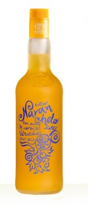
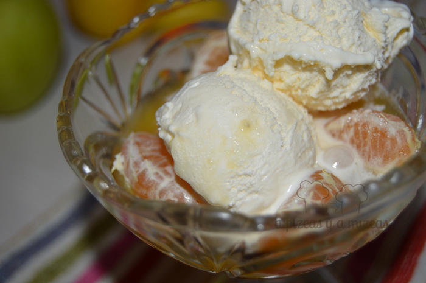
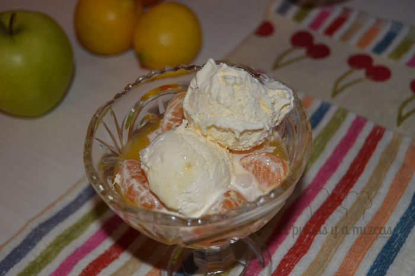

Este es uno de esos postres que le gusta a todos: a los más golosos, a los que pasan del dulce... que triunfarás fijo! Además es muy rápido de de preparar y no es necesario cocinar nada. Así que podemos decir que la mandarina con naranchelo y helado de vainilla es el postre perfecto.

Además el frescor de la mandarina lo convierte en un postre ligerito. Nos inspiramos en una receta de Ferran Adrià (La Comida de la familia de Ferran Adrià y el equipo de El Bulli). La receta original es con Cointreau nosotros la adaptamos con algo más de la terreta con Naranchelo.

> El Naranchelo es único y completamente natural, con auténtico zumo de naranjas valencianas. Su penetrante aroma a naranja recien exprimida, el sabor suave y a la vez hondo, intenso y duradero, hacen de este licor una bebida muy especial con profundo arraigo en las tierras de Valencia.

## Ingredientes para preparar la mandarina con licor y helado de vainilla (para seis personas)

- Seis mandarinas
- Dos bolitas de helado de vainilla por persona
- Un chorrito de licor en
- Zumo de 3 naranjas
- Una cucharadita de café de azúcar para cada comensal

Vamos con la preparación... fácil, fácil. Pelamos las mandarinas y colocamos los gajos en un bol. Exprimimos el zumo de tres naranjas que repartimos en los seis bols. Ahora le toca el turno al licor, ponemos un chorrito en cada bol y una cucharadita de azúcar en cada uno. Reservamos y nos vamos a cenar tranquilamente.

Mientras Pizcas recoge los platos de la mesa.... vamos poniendo las bolitas de helado de vainilla a cada uno de los bols. Y a disfrutar de un postre rico rico.

A mi me encantó la mezcla de la naranja y la vainilla... mmmm me rechifló. Este postre lo incorporamos a nuestro recetario diario... más fácil imposible. Además en plena temporada de mandarinas y naranjas... ya no tenéis excusa para preparar este postre. Esperamos fotitos vuestras disfrutando de las mandarinas con licor y helado de vainilla... no os olvidéis!

