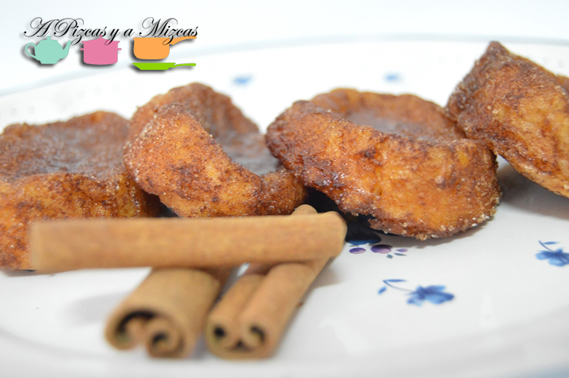

Sabemos que os encanta la respostería pascuera y muchos de vosotros nos habiaís pedido una recopilación de todas las recetas que hemos preparadao de respostería pascuera.

Así que hemos reunido todas las recetas en este post para que os animeís a prepararlo y lo tengaís más fácil. Queremos ver vuestras fotos de monas, pan quemado, cocas d´anous, torrijas o coca de mostatxó.... Esperamos vuestras fotos de respostería pascuera

## La respostería pascuera de A Pizcas y a Mizcas

\- [Coca d´anous o coca de nueces](/coca-danous-coca-de-nueces/ "coca de nueces"). Uno de los dulces más típicos de Valencia es la coca d’anous i panses, o coca de pasas y nueces. Es una coca baja hecha con masa como la del panquemao o la mona de pascua, con nueces y pasas y cubierta de azúcar

\- [Mona de pascua](/mona-de-pascua/ "Mona de pascua"). Aquí, en la Comunitat Valenciana, la mona de pascua es generalmente un dulce hecho con masa de panquemao con forma de animal u otra, con un huevo duro, que se suele tomar para merendar y que compran los abuelos o los padrinos a los niños

\- [Pan quemado](/pan-quemado/ "Pan quemado").Otro de los dulces típicos de la Semana Santa o pascua. Un poquito de la historia del pan quemado.

"**Panou, mona, toña, fogaseta o panquemado**. Hay muchas formas populares de llamar a este **dulce** según la zona. Sin embargo, a la hora de relacionarlo con una localidad en concreto, todos coinciden en que la cuna del panquemado es **Alberic**. Incluso hemos descubierto, gracias al horno miguelín, que tiene su particular leyenda, la cual nos cuenta cómo la hija enferma del jeque morisco que dominaba Alberic logró sanar gracias a los **panquemados** que una pastelera le preparaba. El jeque le otorgó la condición de pastelera real y, de hecho, hay constancia de documentos oficiales de principios del siglo XX en los que figura un panadero de Alberic como proveedor real de Alfonso XIII." (Alberic: cuna del panquemado[Valencia Terra i Mar](http://blog.valenciaterraimar.org/index.php/2013/11/alberic-cuna-del-panquemado/ "Alberic: cuna del pan quemado"))

\- [Torrijas](/torrijas/ "Torrijas").Las torrijas es un dulce típico de Semana Santa muy sencillo… pero deliciosoooo. ¿Por qué comemos torrijas en Semana Santa?

“Su asociación a la cuaresma  se debe tal vez a la necesidad de aprovechamiento del pan sobrante, que, durante el tiempo en que no se podía comer carne, era por ello menos consumido, aunque las familias elaboraban la misma cantidad.” ([Torrija – Wikipedia](http://es.wikipedia.org/wiki/Torrija "Torrija - Wikipedia"))

\- [Coca de mostatxó](/coca-de-mostatxo/ "Coca de mostatxó"). Mostatxó:Peça de pasta dolça, de forma circular, composta de farina, oli, sucre i ou, i cuita al forn. L’àvia sempre ens feia mostatxons per berenar i esmorzar. Quan tornava de l’escola i pujava a al pis, ja sentia la olor i corrents entrava a la cuina, on els mostatxons estàven ja a punt per menjar. Una presa de xocolata, un parell de mostatxons.Uns moments del dia que molt sovint em vénen a la memòria. ([Diccionari afectiu de la llengua catalana](http://diccionariafectiu.blogspot.com.es/2008/12/mostatx.html "Mostatxó"))

