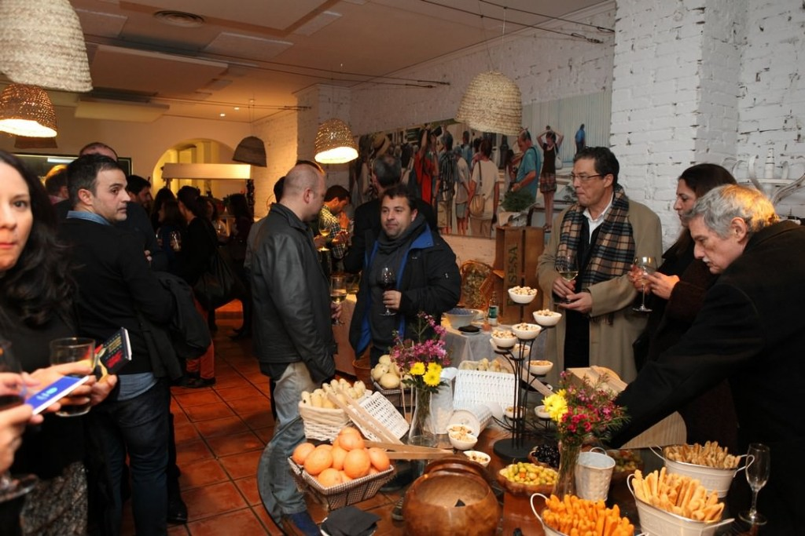
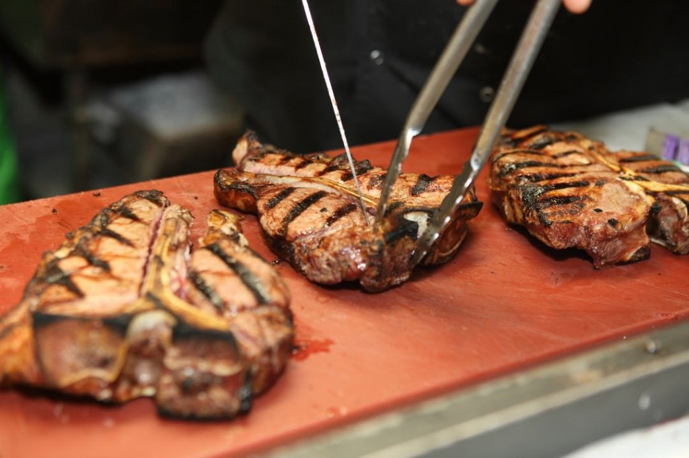
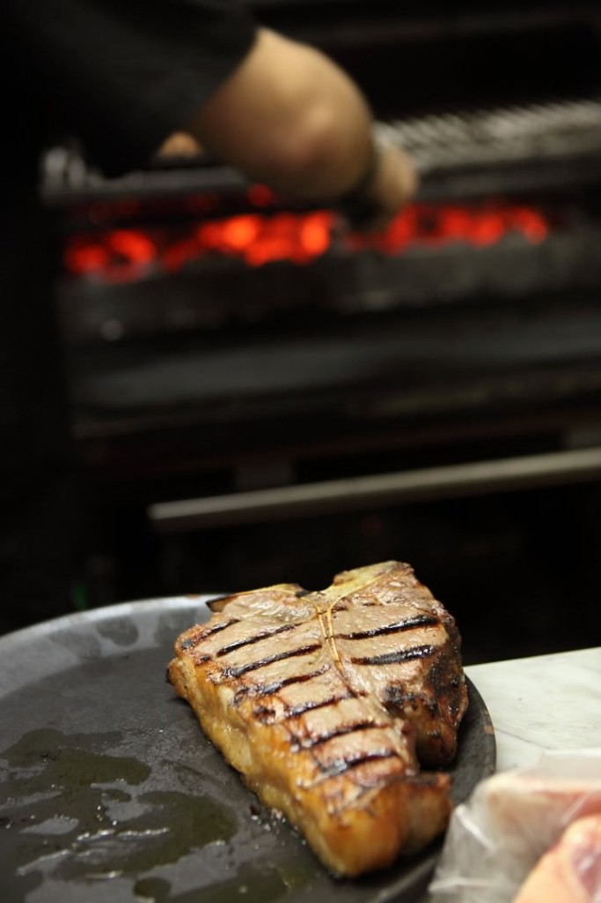

Hace una semana que se celebró el primer aniversario de Meat Market y todavía nos acordamos. Fue un festín carnívoro que vivimos junto con más de 100 invitados bajo el lema #YesWeCow. Para quien a estas alturas no conozca Meat Market, solo decir que es un proyecto gastronómico nacido de la necesidad de un "carnívoro empedernido" de comer buena carne en Valencia, que desarrolló una idea en base al mejor producto y servicio, y que ya se ha posicionado como lugar de referencia en la ciudad.

## Aniversario de Meat Market Restaurante en Valencia

[Meat Market Restaurante](http://www.meatmarketrestaurante.com/) se encuentra en la céntrica calle Burriana, 38 de Valencia, y abrió sus puertas hace un año con una filosofía muy clara: la apuesta por el producto de calidad. Tanto el propietario, Edgar Betoret, como su encargado, Juan Carlos Marín apuestan por ofrecer la máxima calidad en su materia prima principal (la carne), que buscan entre pequeños productores nacionales. A ello suman el tratamiento de cocina más sencillo para no estropearla, y el servicio personalizado a sus clientes. Funciona como un auténtico mercado, vas, eliges la carne que quieres y te la cocinan a la perfección y a tu gusto. Ya es uno de los asadores más recomendables de la ciudad.

El evento del aniversario, sirvió además para dar a conocer las nuevas propuestas gastronómicas de Meat Market Restaurante: tres menús exclusivos con las mejores piezas de carne exóticas. Durante la noche del 29 de enero se servirá el “Menú Safari” donde los asistentes podrán adentrarse en un viaje por la sabana africana a través de las chips de patata morada, plátano macho y yuca, una selección de patés de caza, perdiz escabechada servida en una ensalada templada, así como dos hamburguesas de caza mayor de carnes de animales como la cebra o el cocodrilo.

Será el 5 de febrero en horario de cena donde el “Menú Caza” será el protagonista con migas de matanza, calçotada con romescu, canelón de rabo y trufa, y carne de caza mayor con su reducción y pastel de patata al ajillo.

Pero además, para todos aquellos que quieran celebrar el Primer Aniversario de la Carne en Valencia, Meat Market Restaurante ha creado el “Menú Aniversario”, (disponible hasta el 28 de febrero, tanto en comidas como en cenas). Compuesto de los mejores platos de estos doce meses, como el caviar de berenjena, la cebolleta con panceta ibérica crujiente, el lomito de rib eye de Tudanca o su inigualable steak tartare cortado a cuchillo.

Toda la información de los menús y la reserva online está disponible en la web del restaurante, en el siguiente enlace: [Menús Exclusivos: Safari, Caza, Aniversario](http://www.meatmarketrestaurante.com/disfruta-ya-de-nuestros-tres-nuevos-menus-safari-caza-aniversario/)

Felicidades equipo!
